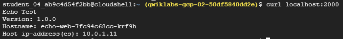
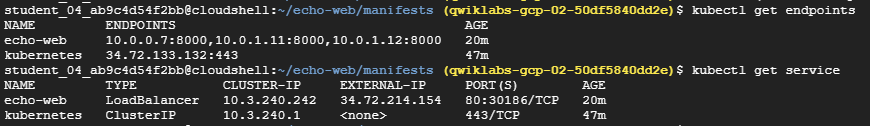
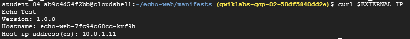
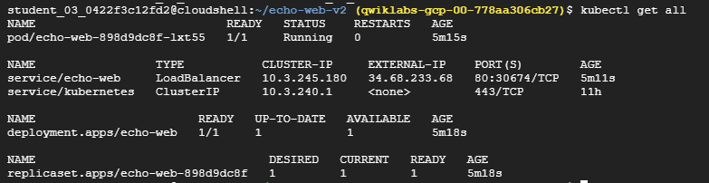
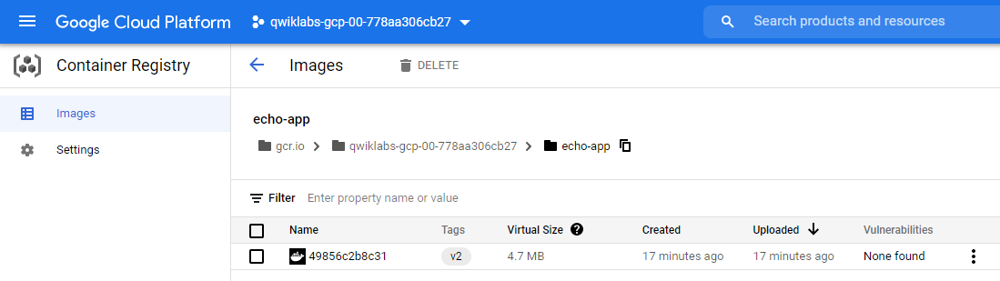
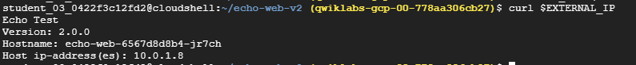

# 10. Cloud Architecture - Design, Implement, and Manage (Qwiklabs Quest)

## Table of Contents

1. Google Cloud Essential Skills: Challenge Lab
2. Deploy a Compute Instance with a Remote Startup Script
3. Configure Secure RDP using a Windows Bastion Host
4. Build and Deploy a Docker Image to a Kubernetes Cluster
5. Scale Out and Update a Containerized Application on a Kubernetes Cluster
6. Migrate a MySQL Database to Google Cloud SQL

## 1. Google Cloud Essential Skills: Challenge Lab

## 2. Deploy a Compute Instance with a Remote Startup Script

## 3. Configure Secure RDP using a Windows Bastion Host

## 4. Build and Deploy a Docker Image to a Kubernetes Cluster

- use `echo-app` as the container repository image name
- call your Kubernetes cluster `echo-cluster`
- create the Kubernetes cluster in `us-central1-a` zone and
- use `echo-web` for the deployment name

### Create a Kubernetes Cluster

```shell
gcloud container clusters create echo-cluster \
    --machine-type=n1-standard-2 \
    --zone=us-central1-a \
    --num-nodes=2
```

### Push the image to the Google Container Registry

The sample application, including the Dockerfile and the application context files, are contained in an archive called echo-web.tar.gz. The archive has been copied to a Cloud Storage bucket belonging to your lab project called gs://[PROJECT_ID]. You must deploy this with a tag called v1.

```shell
gsutil -m cp -r gs://$DEVSHELL_PROJECT_ID/* .
tar -xvf echo-web.tar.gz -C .
cd echo-web
```

```DOCKERFILE
FROM golang:1.8-alpine
ADD . /go/src/echo-app
RUN go install echo-app

FROM alpine:latest
COPY --from=0 /go/bin/echo-app .
ENV PORT 8000
EXPOSE 8080/tcp
CMD ["./echo-app"]
```

```shell
gcloud builds submit --tag=gcr.io/$DEVSHELL_PROJECT_ID/echo-app:v1 .

# file size = 4.7 MB
```

### Deploy the application to the Kubernetes Cluster

```yaml
# echoweb-deployment.yaml

apiVersion: apps/v1
kind: Deployment
metadata:
  name: echo-web
  labels:
    app: echo
spec:
  replicas: 3
  selector:
    matchLabels:
      app: echo
  template:
    metadata:
      labels:
        app: echo
        tier: web
    spec:
      containers:
      - name: echo-app
        image: gcr.io/PROJECT_ID/echo-app:1.0
        ports:
        - containerPort: 8000
```

```shell
sed -ie "s/PROJECT_ID/$DEVSHELL_PROJECT_ID/" echoweb-deployment.yaml
kubectl apply -f echoweb-deployment.yaml
kubectl port-forward echo-web-7fc94c68cc-krf9h 2000:8000
curl localhost:2000
```



```yaml
# echoweb-service.yaml

apiVersion: v1
kind: Service
metadata:
  name: echo-web
  labels:
    app: echo
spec:
  selector:
    app: echo
    tier: web
  ports:
  - port: 80
    targetPort: 8000
  type: LoadBalancer
```

```shell
kubectl apply -f echoweb-service.yaml
kubectl get endpoints
kubectl get servcies
```



```shell
EXTERNAL_IP=$(kubectl get services echo-web -o json | jq -r '.status.loadBalancer.ingress[0].ip')
curl $EXTERNAL_IP
```



## 5. Scale Out and Update a Containerized Application on a Kubernetes Cluster

You will first deploy the initial version of a test application, called `echo-app` to a Kubernetes cluster called `echo-cluster` in a deployment called `echo-web`.

```shell
gcloud container clusters get-credentials echo-cluster --zone=us-central1-a
kubectl create deployment echo-web --image=gcr.io/qwiklabs-resources/echo-app:v1
kubectl expose deployment echo-web --type=LoadBalancer --port 80 --target-port 8000
kubectl get all
```



### Build and deploy the updated application with a new tag

```shell
gsutil -m cp -r gs://$DEVSHELL_PROJECT_ID/* .
mkdir echo-web-v2
tar -xvf echo-web-v2.tar.gz -C ./echo-web-v2
cd echo-web-v2
```

### Push the image to the Container Registry

```shell
gcloud builds submit --tag=gcr.io/$DEVSHELL_PROJECT_ID/echo-app:v2 .
```



### Update the deployment with the new image

```shell
kubectl set image deployment/echo-web echo-app=gcr.io/$DEVSHELL_PROJECT_ID/echo-app:v2
```

### Scale deployment to 2 replicas

```shell
kubectl scale deployment echo-web --replicas=2
```

### Test the service

```shell
EXTERNAL_IP=$(kubectl get services echo-web -o json | jq -r '.status.loadBalancer.ingress[0].ip')
curl $EXTERNAL_IP
```



## 6. Migrate a MySQL Database to Google Cloud SQL

Your WordPress blog is running on a server that is no longer suitable. As the first part of a complete migration exercise, you are migrating the locally hosted database used by the blog to Cloud SQL.

The existing WordPress installation is installed in the /var/www/html/wordpress directory in the instance called blog that is already running in the lab. You can access the blog by opening a web browser and pointing to the external IP address of the blog instance.

The existing database for the blog is provided by MySQL running on the same server. The existing MySQL database is called wordpress and the user called blogadmin with password Password1*, which provides full access to that database.
