# 11. Preparing for the Professional Cloud Architect Exam

## Table of Contents

1. Welcome to Preparing for the Professional Cloud Architect Exam
2. Sample Case Studies
3. Designing and Implementing
4. Optimizing and Operating
5. Resources and next steps
6. Course Resources

## 1. Welcome to Preparing for the Professional Cloud Architect Exam

## 2. Welcome to Preparing for the Professional Cloud Architect Exam

### TerrramEarth

Bigquery for analytics
Bigtable for storage

Data Replication:

- Stream critical data from vehicles to Cloud Bigtable to drive analytics in real time.
- Sensor devices -> HTTPS Gateway devices -> Pub/Sub -> Cloud Dataflow -> Cloud Bigtable -> GKE
- BigQuery partitioning by timestamp for Home base upload and unified analytics

Data processing:

- Cloud Dataflow for serverless unified (batch and stream) ETL (Extract, Transform, Load)

ML Engine or AutoML Tables:

- Use Vertex AI for ML lifecycle to forecast anticipated stock needs

Vehicles - Home Base Connected:

- Cloud IoT Core
- IoT devices -> Cloud Pub/Sub
- Cloud Dataflow -> Cloud Storage

Cloud Operations:

- Managed and Serverless
- Network Intelligence Center for monitoring and optimization
- Network Connectivity Center & Security Command Center for holistic security view
- Cloud Monitoring
- Google Cloud KMS for key management

APIs:

- Apigee to manage and monitor APIs
- Apigee Developer Portal
- Build and deploy APIs on GKE

Ci/CD:

- Cloud Source Repo, cloud build, Artifact Repository
- Spinnaker - blue/green, canary

Remote:

- Cloud IAM
- Connecterd Sheets with BigQuery

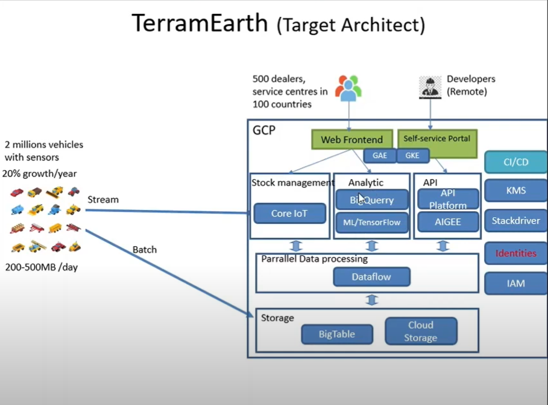

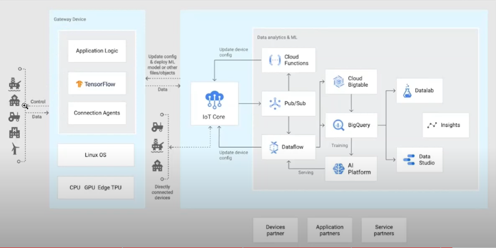

### MountKirk Games

- Cloud Spanner
- GKE + GPUs
- Global LB

- VMs for legacy games

- CI/CD pipeline

- Datastore (Bigtable) - for transactional game state
- Cloud Storage - for storing game activity logs and analytics used by BigQuery

- Pub/Sub - for buffering live and late data
- Dataflow - for bulk and stream processing
- BigQuery - for storage and analytics

- Stackdriver

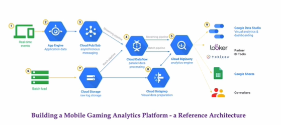

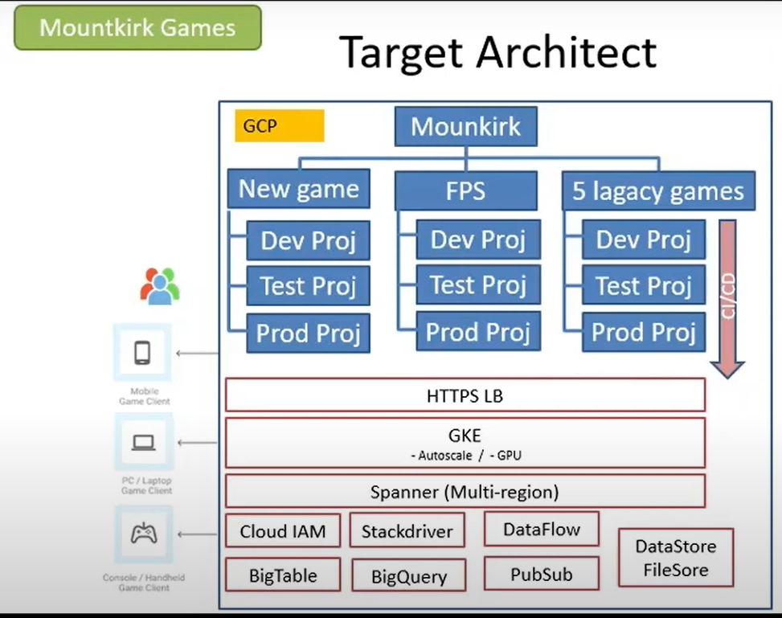

### Helicopter Racing League

Stream = Data processing - PubSub, Dataflow
Prediction = ML

Transcoding:

- Use pre-empties
- GKE or MIG

TC Box Telemetry:

- App Engine, Cloud Pub/Sub, Dataflow, BigQuery, and Cloud Monitoring increase telemetry and create additional insights

Live Video Latency:

- Cloud VPN HA for interconnectivity b/w mobile data center and Google Cloud
- Cloud CDN
- Multi-regional Cloud Storage buckets
- Network Intelligence Center for insights in network latency

AI & ML:

- AI platform (VErtexAI)
- TensorFlow Deep Learning VMs

Analytics:

- BigQuery is a data mart
- Looker for analytics
- BigQuery streaming API

Object Storage -> Cloud Storage
VMs -> MIG
TensorFlow -> TensorFlow /CloudML -> Cloud Endpoints

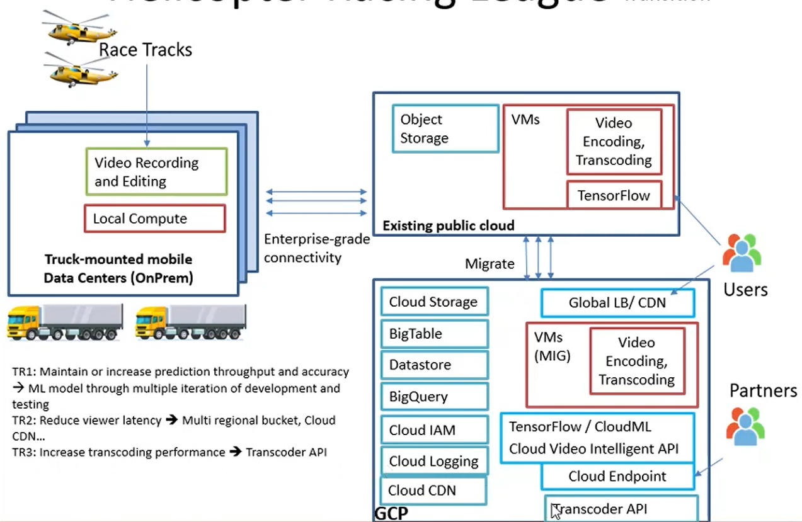

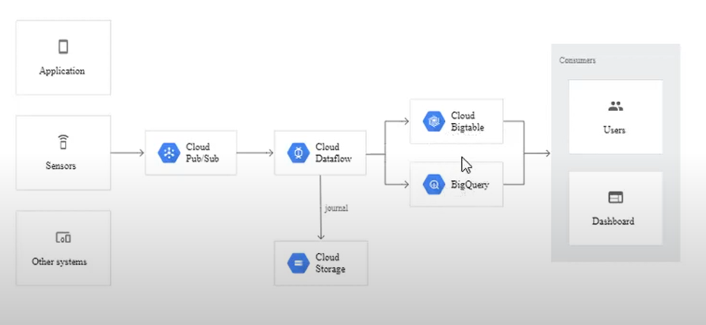

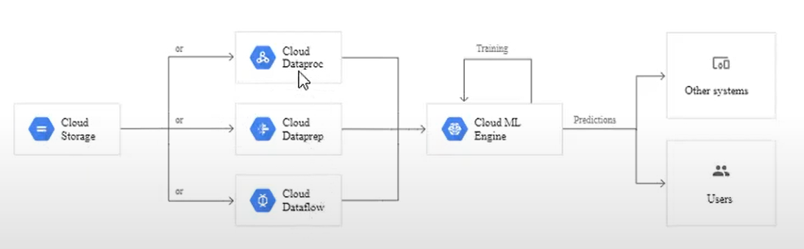

### EHR Healthcare

Infrastructure:

- Google's IaaS and PaaS solutions for data centers, global VPV
- multi-regional replication for DR
- Hybrid Connectivity - cloud Interconnect, Cloud VNP
- Dedicated Interconnect

Apps:

- GKE
- Anthos (for Cloud and on-prem container solutions)
- Integrations - Apigee for APIs
- Predictions - AI platform, Vertex AI
- Data ingestions - Pub/Sub, Cloud Storagge
- Process - Dataflow

DBs:

- MySQL, MS SQL -> Cloud SQL
- Redis - Cloud Memorystore
- MangoDB - Cloud Firestore

Monitoring:

- Cloud Monitoring
- Cloud Logging

CI/CD platform

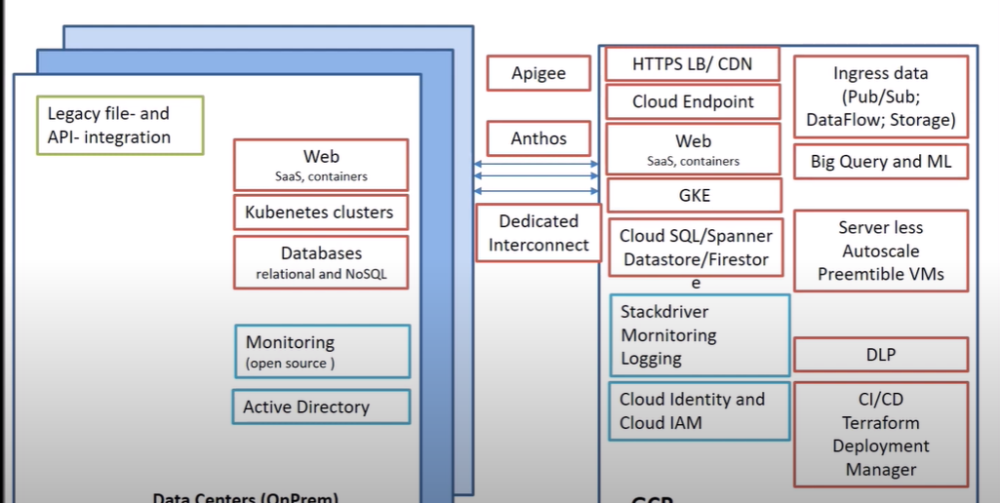

## 3. Designing and Implementing

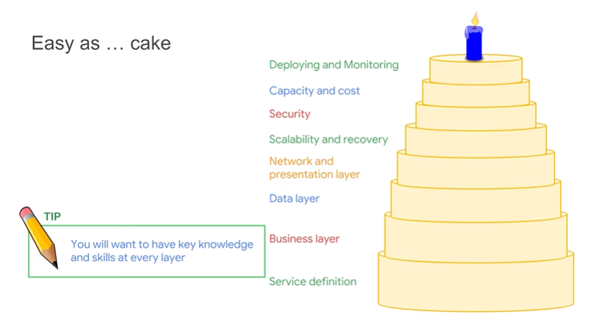

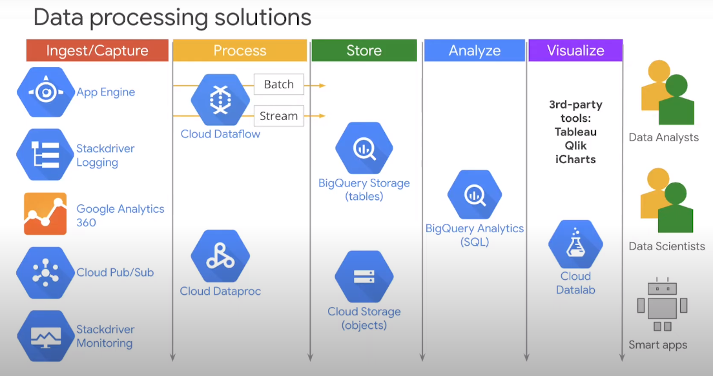

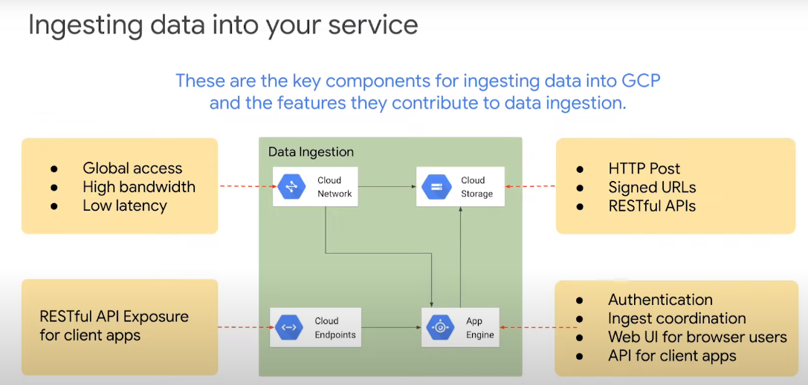

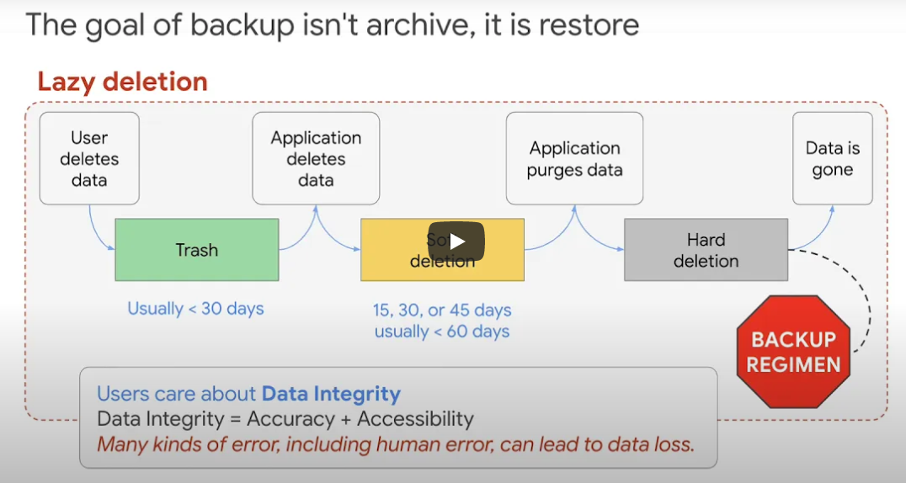

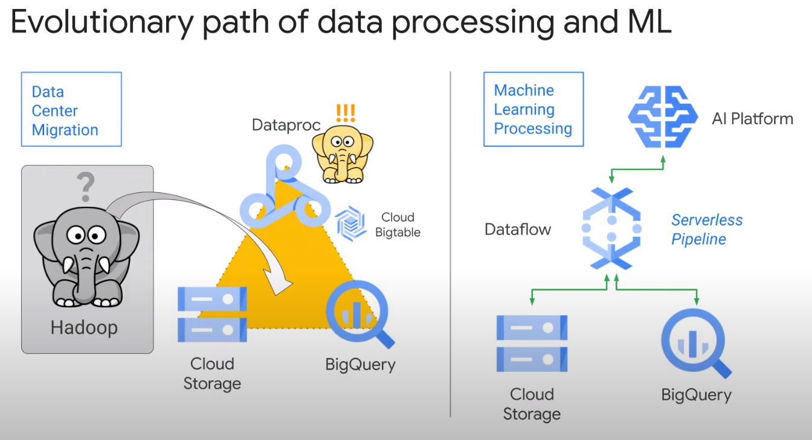

## 4. Optimizing and Operating

## 5. Resources and next steps

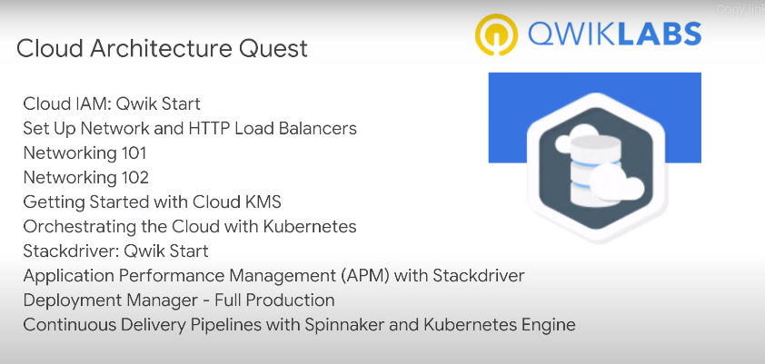

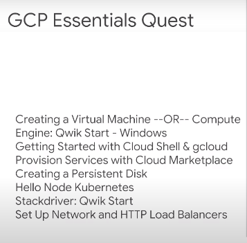
