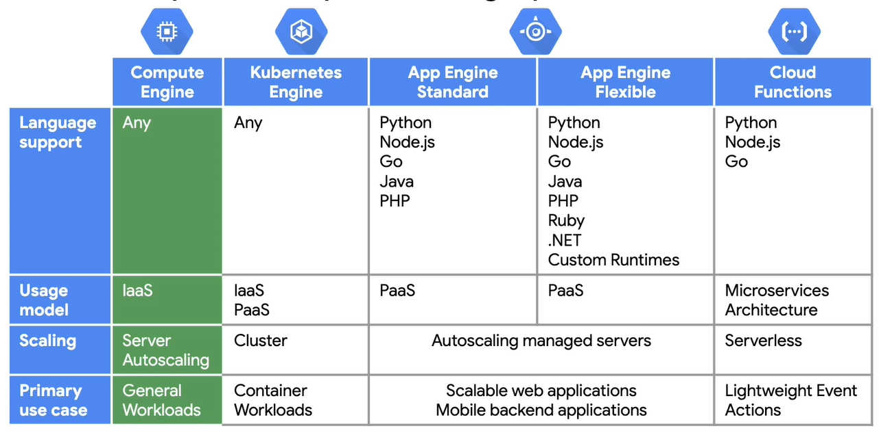

# 2 Essential Google Cloud Infrastructure -  Foundation

## Table of contents

1. Introduction
2. Introduction to GCP
3. Virtual Networks
4. Virtual Machines

## 2. Introduction to GCP

### 2.1. Overview

### 2.2. Using GCP

Four ways to interact with GCP:

- GCP Console - Web user interface - console.cloud.google.com
- SDK - Command-line interface - gcloud compute instances list
  - Cloud Shell - temporary VM with 5 GB persistent disk with Cloud SDK preinstalled
  - gcloud - for working with Compute Engine and many Google Cloud services
  - gsutil - for working with Cloud Storage
  - kubectl - for working with Google Kubernetes Engine and Kubernetes
  - bq - for working with BigQuery
  - cloudshell - to work with Cloud Shell utility
- REST-based API - For custom applications (in: get, post, put, delete, out: JSON) -  OAuth 2
- Mobile App - iOS & android- manage VMs, manage App Engine, manage billing

### 2.3. Lab Intro: Console and Cloud Shell

### 2.4. Getting Started With GCP And Qwiklabs

### 2.5. Lab: Working with GCP Cloud Console and Cloud Shell

```sh
gsutil mb gs://<BUCKET_NAME>
gsutil cp ‘my file.txt' gs://[BUCKET_NAME]
```

```sh
# Create a persistent state in the Cloud shell
# Every time you close Cloud Shell and reopen it, a new VM is allocated, and
# the environment variable you just set disappears.

INFRACLASS_REGION=europe-west1
echo $INFRACLASS_REGION

mkdir infraclass
touch infraclass/config
echo INFRACLASS_REGION=$INFRACLASS_REGION >> ~/infraclass/config
INFRACLASS_PROJECT_ID=qwiklabs-gcp-01-6b3d5788ca14
echo INFRACLASS_PROJECT_ID=$INFRACLASS_PROJECT_ID >> ~/infraclass/config

echo "source infraclass/config" >> .profile
```

### 2.6. Lab Review: Console and Cloud Shell

### 2.7. Lab Intro: Infrastructure Preview

### 2.8. Lab: Infrastructure Preview

Open Jenkins in the marketplace:
Marketplace -> Jenkins Certified by Bitnami -> Launch -> Deploy
Deployment Manager -> jenkins-1 is being deployed

Visit the site
ssh into service

```sh
sudo /opt/bitnami/ctlscript.sh restart
```

### 2.9. Lab Review: Infrastructure Preview

### 2.10. Demo: Projects

Projects isolate related resources from one another

1. Create a project in the Cloud Console
IAM & Admin -> Manage Resources -> New Project
Enter a project name -> Create

2. Shut down a project in the Cloud Console
IAM & Admin -> Manage Resources -> Delete
Project is deleted 30 days after shut down

3. List active project ID in Cloud Shell
`gcloud config list | grep project`

4. Change project_id in Cloud Shell
`gcloud config set project $PROJECT1_ID`

5. delete project in Cloud Shell
`gcloud project delete $PROJECT1_ID`

### 2.11. Review

## 3. Virtual Networks

### 3.01. Overview

Virtual Network = GCP uses a software-defined network that is built on global fiber infrastructure. Thinking about resources as services, instead of hardware, will help you understand the available options.

GCP consists of:

- Regions (specific geographic location, where you can run your resources) are divided smaller into zones.
- Points-of-Presence (PoPs) are where Google's network is connected to the rest of the internet.
- Global private network
- Services

### 3.02. Virtual Private Cloud

Virtual Private Cloud (VPC) - managed networking functionality for your cloud platform resources.

VPC networks are by default isolated private networking domains. Therefore, no internal IP address communication is allowed between networks, unless you set up mechanisms such as VPC peering or VPN.

With GCP you can:

- provision your resources
- connect them and
- isolate them from each other in a virtual private cloud.

VPC is a comprehensive set of Google-managed networking objects:

- Projects - encompass every single service, including networks
- Networks - default, auto, or custom mode
- Subnetworks - allow you to divide or segregate your environment
- Regions & Zones- represents Google’s data centers
- IP addresses - internal, external, range
- VMs - configuring VM instances from a networking perspective
- Routes & Firewall rules

### 3.03. Projects, networks, and subnetworks

#### 3.03.1. Project

- Associates objects and services with billing
- Contains networks (up to 5), that can be shared/peered

#### 3.03.2. Networks

- Has no IP address range, but instead are simply a construct of all individual IP addresses and services within the network
- Is global and spans all available regions
- Contains regional subnetworks
- Is available as the default, auto, or custom mode.

VPC Network Types:

- Default:
  - Every project
  - **One Subnet per region**
  - Default firewall rules
- Auto Mode:
  - Default network
  - **One subnet per region**
  - Regional IP allocation
  - Fixed /20 subnetwork per region
  - Expandible up to /16
- Custom Mode:
  - **No default subnets created**
  - Full control of IP ranges
  - Regional IP allocation
  - Expandible to any RFC 1918 size


#### 3.03.3. Subnetworks


Four reserver IP addresses in the subnet:

- .0 - reserved for network
- .1 - reserved for subnet’s gateway
- Second to last address - broadcast address (?)
- Last address - broadcast address


### 3.04. Demo: Expand a Subnet

1. Custom subnet with /29 mask, which provides you with 8 addresses, but from those wight four are reserved by GCP.
2. When you create the 5th VM, you will get an error msg - “IP Space is exhausted”, so you need to increase subnet capacity.
3. To do that: Open either VPC Network in Navigation Menu or click on nic0 -> subnet -> edit /23 (500+ instances) save.
4. Retry on Compute Engine instances

### 3.05. IP addresses

Internal IP:

- Allocated from subnet range to VMs by DHCP
- DHCP lease is renewed every 24 hours
- VM name + IP is registered with network-scope DNS

External IP:

- Assigned from the pool (ephemeral)
- Reserved (static)
- VM does not know external IP, it is mapped to the internal IP

### 3.06. Demo: Internal and external IP

Compute Engine -> Create -> management, security, disc, networking (...) -> Networking:

- Tags
- Hostname
- Network Interfaces:
  - Network
  - Subnet:
    - /20 = over 4 000 IP addresses
    - /23 = 500 (510) IP addresses
    - /29 = 8 IP addresses

### 3.07. Mapping IP addresses

The external IP is mapped to VMs internal IP by VPC. `sudo /sbin/ifconfig` only shows the internal IP address

DNS resolution for internal addresses

Each instance has a hostname that can be resolved to an internal IP address:

- The hostname is the same as the instance name
- FQDN is [hostname].[zone].c.[project-id].internal
- Example: my-server.us.cental1-a.c.guestbook-151617.internal

Name resolution is handled by an internal DNS resolver:

- Provided as part of Compute Engine (169.254.169.254)
- Configured for use on instance via DHCP
- Provided answer for internal/external addresses

DNS resolution for external addresses:

- Instances with external IP addresses can allow connections from hosts outside the project
  - Users connect directly using an external IP address
- DNS records for external address can be published using existing DNS servers
- DNS zones can be hosted using Cloud DNS

#### 3.07.1. Cloud DNS

- Google’s DNS server
- Translate domain names into IP addresses
- Low latency
- High availability (100% uptime !!!)
- UI, command line, or API

#### 3.07.2. Alias IP ranges

Let you assign a range of IP addresses as aliases to a VM’s network interface, using alias IP ranges. Useful, if you have multiple services running on VM and you want to assign a different IP address to each service.

You can configure multiple IP addresses, representing containers or applications hosted in a VM, without having to define a separate network interface.
You just draw the alias IP range from the local subnets primary or secondary CIDR ranges.


### 3.08. Routes and firewall rules

#### 3.08.1. Routes

A route is a mapping of an IP range to a destination.

Every network has:

- Routes, that let instances in a network send traffic directly to each other, even across subnets
- A default route that directs packets to destinations that are outside the network
Firewall rules must also allow the packet.

Routes map traffic to destination networks:

- Apply to traffic egressing a VM
- Forward traffic to the most specific route
- Are created when subnets are created
- Enable VMs on the same network to communicate
- The destination is in CIDR notation
- Traffic is ONLY delivered if it also matches a firewall rule


Firewall rules protect your VM instances from unapproved connections:

- VPC network functions as a distributed firewall
- Firewall rules are applied to the network as a whole
- Connections are allowed or denied at the instance level
- Firewall rules are stateful
- Implied deny all ingress (inbound connections) and allow all egress (outbound connections)

### 3.09. Pricing

Use GCP Pricing Calculator

### 3.10. Lab Intro: VPC Networking

### 3.11. Lab: VPC Networking

In this lab, you create an auto-mode VPC network, with firewall rules and two VM instances, then you convert the VPC network from auto-mode to custom-mode network, and create other custom-mode networks + explore connectivity across networks.


#### 3.11.1. Explore the default network

Navigation Menu -> Networking -> VPC Network, Routes, Firewall rules
Every Project has a default network unless your Org. policy prevents it.

#### 3.11.2. Delete existing Firewall rules, VPC Networks & Routes

Firewall -> Select all -> Delete
VPC networks -> default -> Delete VPC network

Without a VPC network, you will not be able to create any VM instance, containers, or App Engine apps.

#### 3.11.3. Create auto-mode network

Networking -> VPC Network -> Create:

- Add VPC Network name: mynetwork
- Subnet creation mode: Automatic
- Firewall rules: select all to apply
- Create

#### 3.11.4. Create 2 VM instances in Console

One called mynet-us-vm in us-central1-c, other called mynet-eu-vm in europe-west1-c
Click on nic0, to see that instances are part of the auto-network created earlier
Check connectivity b/w instances

#### 3.11.5. SSH in one of the machines and ping other machine’s hostname, internal, external IP address

Instances are in 2 separate regions but in the same VPC network/subnet, so should be able to ping these addresses.

```sh
ping -c 3 10.132.0.2
ping -c 3 35.205.212.243
ping -c 3 mynet-eu-vm.europe-west1-c
```

#### 3.11.6. Convert auto-mode to custom-mode

Networking -> VPC Network -> mynetwork -> Edit -> subnet creation mode: Custom

#### 3.11.7. Create managementnet VPC Network using Console

Networking -> VPC Network -> Create:

- Add name: managementnet
- Subnet creation mode: custom
- Add subnet name: managementsubnet-us
- Add region: us-cental1
- Add IP address range: 10.130.0.0/20
- Create

#### 3.11.8. Create another VPC Networks using Cloud Shell

```sh
gcloud compute networks create privatenet --subnet-mode=custom
gcloud compute networks subnets create privatesubnet-us --network=privatenet --region=us-central1 --range=172.16.0.0/24
gcloud compute networks subnets create privatesubnet-eu --network=privatenet --region=europe-west1 --range=172.20.0.0/20
```

#### 3.11.9. List networks/subnets in Cloud Shell

```sh
gcloud compute networks list
gcloud compute networks subnets list --sort-by=NETWORK
```

#### 3.11.10. Create Firewall rule in Console

Networking -> VPC Network -> Firewall Rules -> Create firewall rule:

- Add Name: managementnet-allows-icmp-ssh-rdp
- Select network: managementnet
- Targets: all instances in the network
- Source IP Range: 0.0.0.0/0 to select all addresses
- Allow protocols and ports:
  - tcp: 22, 3389
  - Other protocols: icmp

#### 3.11.11. Create Firewall rule in Cloud Shell

```sh
gcloud compute firewall-rules create privatenet-allow-icmp-ssh-rdp --direction=INGRESS --priority=1000 --network=privatenet --action=ALLOW --rules=icmp,tcp:22,tcp:3389 --source-ranges=0.0.0.0/0

```

#### 3.11.12. List firewall rules in Cloud shell

```sh
gcloud compute firewall-rules list --sort-by=NETWORK
```

#### 3.11.13. Create some more VM instances, 1st in console, 2nd in Cloud Shell

vm1 name: management-us-vm, network = managementnet

```sh
gcloud compute instances create privatenet-us-vm --zone=us-central1-c --machine-type=f1-micro --subnet=privatesubnet-us --image-family=debian-10 --image-project=debian-cloud --boot-disk-size=10GB --boot-disk-type=pd-standard --boot-disk-device-name=privatenet-us-vm
```

#### 3.11.14. List VM instances in Cloud Shell

```sh
gcloud compute instances list --sort-by=ZONE
```

#### 3.11.15. Check connectivity b/w machines

- You can ping the external IP address of all VM instances, even though they are in either a different zone or VPC network. This confirms that public access to those instances is only controlled by the ICMP firewall rules that you established earlier.
- You cannot ping the internal IP address of managementnet-us-vm and privatenet-us-vm because they are in separate VPC networks from the source of the ping (mynet-us-vm).

### 3.12. Lab Review: VPC Networking

### 3.13. Common network designs


  


Cloud NAT or managed  Network Address Translation service. Provision VM machines without public IP addresses, while allowing access to the internet in a controlled manner. Cloud NAT is a regional resource. You can configure it to allow traffic from all ranges of all subnets in a region, from specific subnets in the region only, or from specific primary and secondary CIDR ranges only. The Cloud NAT gateway implements outbound NAT, but not inbound NAT. In other words, hosts outside of your VPC network can only respond to connections initiated by your instances; they cannot initiate their own, new connections to your instances via NAT.


To allow VM instances that only have internal IP to access to reach external IP addresses of Google’s APIs and services. For example, you need to enable Private Google access to access Storage Bucket contents
Google Private Access has no effect on instances with external P addresses.

### 3.14. Lab Intro: Implement Private Google Access and Cloud NAT

### 3.15. Lab: Implement Private Google Access and Cloud NAT

Implement Private Google Access and Cloud NAT for a VM instance that doesn't have an external IP address. Then, you verify access to public IP addresses of Google APIs and services and other connections to the internet.

VM instances without external IP addresses are isolated from external networks. Using Cloud NAT, these instances can access the internet for updates and patches, and in some cases, for bootstrapping. As a managed service, Cloud NAT provides high availability without user management and intervention.

#### 3.15.1. Create a VPC network

Navigation menu -> networking -> VPC network -> VPC Networks -> Create VPC Network

- Name: privatenet
- Subnet creation mode: custom
- Subnet: privatenet-us
- Region: us-central1
- IP address range: 10.130.0.0/20
- Private Google Access: off
- Done, Create

#### 3.15.2. Create a Firewall rule, To allow ssh to the instance

Navigation menu -> networking -> VPC network -> Firewall rules -> Create Firewall rule

- Name: privatenet-allow-ssh
- Network: privatenet
- Targets: all instances in the network
- Source IP ranges: 25.235.240.0/20 # we are gonna give it a very specific range. And that is because we are using the Cloud IAP tunnel.  And because of that, we can limit the CIDR range.
- Specific  protocols and ports: tcp: 22
- Create

#### 3.15.3. Create VM instance

Navigation menu -> Compute -> Compute Engine -> VM instances -> Create

- Name: vm-internal
- Region: us-central1
- Zone: us-central1-c
- Network interfaces: privatenet
- External IP: None
- Done, Create

#### 3.15.4. SSH into Instance, check connectivity to the internet

When instances do not have external IP addresses, they can only be reached by other instances on the network via a managed VPN gateway or via a Cloud IAP tunnel. Cloud IAP enables context-aware access to VMs via SSH and RDP without bastion hosts.

Open Cloud Shell -> Continue:

```sh
gcloud compute ssh vm-internal --zone us-central1-c --tunnel-through-iap
```

```sh
ping -c 3 www.google.com
sudo apt-get update

# No connection
```

#### 3.15.5. Create Bucket in Cloud Storage, copy the file into it

Navigation Menu -> Storage -> Storage -> Browser -> Create Bucket

- Name: Project ID
- Create

```sh
gsutil cp gs://cloud-training/gcpnet/private/access.svg gs://[my_bucket]
```

#### 3.15.6. Check access Cloud Storage bucket from Cloud Shell

```sh
gsutil cp gs://[my_bucket]/*.svg .

# success
```

#### 3.15.7. Check access Cloud Storage bucket from VM

```sh
gsutil cp gs://[my_bucket]/*.svg .

# Fail
```

#### 3.15.8. Enable Private Google access for privatenet-us subnet

Navigation menu -> networking -> VPC network -> VPC Networks -> privatenet -> privatenet-us -> Edit

- Private Google access: On
- Save

#### 3.15.9. Check access Cloud Storage bucket from VM

```sh
gsutil cp gs://[my_bucket]/*.svg .

# success
```

#### 3.15.10. Configure Cloud Gateway to access the internet

Navigation menu -> Networking -> Network Services -> Cloud NAT -> Get Started

- Gateway Name: nat-config
- VPC Network: privatenet
- Region: us-central1
- Cloud Router: create a new router
  - Name: nat-router
  - Create
- NAT mapping allows you to choose subnets to map to the NAT gateway
- Create

#### 3.15.11. Check VM access to the internet

```sh
sudo apt-get update

# success
```

### 3.16. Lab Review: Implement Private Google Access and Cloud NAT

### 3.17. Review

## 4. Virtual Machines

### 4.01. Overview

VMs are the most common infrastructure component and consist of:

- vCPU
- Memory
- Disk Storage
- IP address

### 4.02. Compute Engine



Compute Engine is a GCP service to create VMs.

Predefined or custom machine types:

- vCPU (Cores) and Memory (RAM)
- Persistent disks: HDD, SSD, and local SSD
- Networking
- Linux/Windows

Compute Engine features:

- Availability policies:
  - Live Migrate
  - Auto Restart
- Discounts:
  - Per second billing
  - Sustained use discounts
  - Committed use discounts
- Preemptible
  - Up to 80% discounts
  - No SLA
- Global Load balancing:
  - Multiple regions for availability
- Machine rightsizing:
  - Recommendation engine for optimums machine size
  - Stackdriver statistics
  - New recommendation 24 hrs after VM create or resize
- Features:
  - Instance metadata
  - Startup scripts

Several machine types:

- Network throughput scales 2 Gbps per vCPU
- Theoretical max of 32 Gbps with 16 vCPU or 100 Gbps for T4 or V100 GPUs
A vCPU is equal to 1 hardware hyper-thread

Networking - robust networking features:

- default / custom networks
- inbound/outbound firewall rules:
  - IP based
  - instance/group tags
- Regional HTTPs load-balancing
- Network-load balancing
  - Does not require pre-warming
- Global and multi-regional subnetworks

### 4.03. Demo: Create a VM

Navigation menu -> Compute -> Compute Engine -> VM instances -> Create
Command-line with parameters you selected
VM instances -> Columns, more columns available

### 4.04. VM access and lifecycle

#### 4.04.1. VM access

The creator or VM instance has full root privileges for that instance.

- Linux: SSH:
  - SSH = secure shell
  - SSH from GCP Console or Cloud Shell via Cloud SDK
  - SSH from a computer or third-party client and generate key-pair
  - Requires firewall rule to allow tcp:22
- Window: RDP:
  - RDP = Remote Desktop Protocol
  - RDP clients
  - Powershell terminal
  - Requires setting the Windows password
  - Requires firewall rule to allow tcp:3389

#### 4.04.2. VM Lifecycle


1. Provisioning - when you define all the properties of the instance and click Create, instance enters Provisioning state, resources are being reserved, the instance is not running:
    - vCPUs + Memory
    - Root disk / Persistent Disk
    - Additional Disks
2. Staging - Resources have been acquired, and the instance is prepared for launch:
    - IP addresses Virtual Private Cloud: Internal / external
    - System Image in Cloud Storage
    - Boot
3. Running - After the instance starts running:
    - Startup script
    - Access SSH/RDP
    - Modify/ Use
      - Live Migrate your VM to another host, in the same zone
      - Move VM to another zone, take a Snapshot of the persistent disk, export the system image, reconfigure metadata
4. Stopping - To upgrade your machine by adding more CPU:
    - Shutdown script
5. Terminated:
    - Delete
    - Availability policy

#### 4.04.3. Changing VMs state from running

actions | methods | Shutdown script time | state
--- | --- | --- | ---
reset | console, gcloud, API, OS | no | remains running
restart | console, gcloud, API, OS | no | terminated -> running
reboot | OS: sudo reboot | ~90 sec | running -> running
stop | console, gcloud, API | ~90 sec | running -> terminated
shutdown | OS: sudo shutdown | ~90 sec | running -> terminated
delete | console, gcloud, API | ~90 sec  | running -> N/A
preemption | automatic | ~30 sec | running -> N/A

#### 4.04.4. Availability policy: automatic changes - called scheduling options in SDK/API

1. Automatic Restart
    - Automatic VM restart due to crash or maintenance event
2. On host maintenance
    - Determines whether the host is love-migrated or terminated due to maintenance event
3. Live Migration
    - During the maintenance event, VM is migrated to different hardware without interruption
    - Metadata indicates the occurrence of live migration

#### 4.04.5. Stopped (terminated) VM

No charge for stopped VM:

- Charges for attached disks

Actions:

- Change the machine type
- add/remove attached disks, change auto-delete settings
- Modify instance tags
- Modify custom CM or project-wide metadata
- remove/set new static IP
- Modify VMs availability policy
- **Cannot change the image of a stopped VM**

### 4.05. Lab Intro: Creating virtual machines

### 4.06. Lab: Creating Virtual Machines

Lab: creating VMs
Navigation menu -> Compute -> Compute Engine -> VM instances -> Create -> Create VM
VM instance details:

- CPU platform
- Firewall rules
- Network Tags
- Availability policies
- Logs -> Stackdriver logging
- etc.

```sh
#  To see Linux machine parameters

free -h # for available Memory
sudo dmidecode -t 17 # additional information about memory
nproc # number of processors
lscpu # information about CPUs
```

### 4.07. Lab Review: Creating virtual machines

### 4.08. Compute options

Compute Options - 3 ways how to create a VM:

- console
- $ gcloud
- API

Machine Types:

- Predefined machine type: Ratio of GB of Memory per vCPU:
  - Standard: 3.75 GB per vCPU;
  - High-memory: 6.5 GB per vCPU;
  - High-CPU: 0.9 GB per vCPU;
  - Memory-optimized: > 14 GB per vCPU
  - Compute-optimized: > highest performance per vCPU (3.8 Ghz)
  - Shared-Core: < 1 vCPU
- Custom machine type: (more expensive):
  - when requirements s fit b/w the predefined types
  - when more memory or more vCPUs is needed
  - you specify Memory & vCPUs
  - Nr. of vCPUs = 1 or even
  - Default Memory 0.9 GB - 6.5 GB pe vCPU, use Extend Memory to change that
  - Total Memory must be a multiple of 256 MB

### 4.09. Compute pricing

- Per-second billing, minimum of 1 minute:
  - vCPUs, GPUs, and GB of Memory
- Resource-based pricing:
  - Each vCPU and each GB on Mem is billed separately
- Discounts (types cannot be combined):
  - Sustained use (for running VMs for a specific length of the month, up to 30% off, if the instance is run for the whole month)
  - Committed use
  - Preemptible VM instances:
    - up to 80% off
    - VM might be terminated at any time, 30 sec. terminate warning for shutdown script
    - No live-migrate, no auto restart
- Recommendation Engine:
  - Notifies for underutilized instances
- Free usage limits

### 4.10. Special compute configurations

Special Compute Config:

- Sole-tenant nodes physically isolate workloads b/w customers
  
Shielded VMs offer **verifiable integrity**:

- Secure Boot
- Virtual trusted platform module (vTPM)
- Integrity monitoring
- Requires a shielded image!

### 4.11. Images

What is an image:

- Boot loader
- Operating system
- File system structure
- Software
- Customization

> A snapshot reflects the contents of a persistent disk in a concrete instant in time. An image is the same thing, but includes an operating system and boot loader and can be used to boot an instance.
> Snapshots are stored as diffs (a snapshot is stored relative to the previous one, though that is transparent to you) while images are not. They are also cheaper (\$0.03 per GB/month vs $0.085 for images).
> <https://stackoverflow.com/questions/27290731/google-compute-engine-what-is-the-difference-between-disk-snapshot-and-disk-ima#:~:text=An%20image%20is%20the%20same,can%20be%20public%20or%20private.&text=Snapshots%20are%20stored%20as%20diffs,you)%20while%20images%20are%20not>.

- Public base images:
  - Google, third-party vendors, community, Premium images (p)
  - Linux (Ubuntu, Debian, Red Hat(p), etc)
  - Windows (Windows Server 2019 (p), 2016 (p), 2012 (p), SQL Server(p))
- Custom images:
  - Create new images from VM, pre-configured and software
  - Import from an on-prem, workstation or another cloud service
  - Management features: image sharing, image family, depreciation

### 4.12. Disk options

#### 4.12.1. Boot disk

- VM comes with a single root persistent disk
- Image is loaded onto the root disk during the first boot
  - Bootable: you can attach to a VM and oot from it
  - Durable: can survive VM terminate
- Some OS images are customized for Compute Engine
- Can survive VM deletion if “Delete boot disk when an instance is deleted” is disabled

#### 4.12.2. Persistent disk

Networking storage appearing as a block device:

- Attached to a VM through the network interface
- Durable: storage can survive VM terminate
- Bootable: you can attach to a VM and boot from it
- Snapshots: incremental backups
- Performance: Scales with size

Features:

- HDD or SSD
- Disk-resizing: even running and attached
- Can be attached in read-only mode to multiple VMs
- Encryption keys

#### 4.12.3. Persistent diskLocal SSDs are physically attached to a VM

- More IOPS, lower latency, higher throughput
- 375 GB disk up to 8 per VM, total 3 TB
- Data survives at reset, but not at VM stop or terminate
- VM-specific, cannot be reattached to a different VM

#### 4.12.4. RAM disk

- tmpfs
- Faster than local disk, slower than memory
  - Use when your application expects a file system structure and cannot directly store its data in memory
  - Fast scratch disk, or fast cache
- Very volatile, erase on stop or restart
- May need a larger machine type if RAM was sized for the application
- Use persistent disks to back up RAM disk data


Persistent disk management differences:

- A Single file system is best
- Resize (grow) disks
- Resize file system
- **Built-in snapshot service**
- Automatic encryption

### 4.13. Common Compute Engine actions


startup-script-url=URL
shutdown-script-url=URL

Move an instance to a new zone, automatically (within a region):

- `gcloud compute instance move`
- Update references to VM, not automatic

Move an instance to a new zone, manually (b/w regions):

1. Snapshot all Persistent Disks the source VM
2. Create new Persistent Disks in the destination zone, restored from snapshots
3. Create a new VM in the destination zone, and attach new persistent disks
4. Assign static IP to new VM
5. Update references to VM
6. Delete snapshot, original Persistent Disks, and original VM


Persistent disk snapshots:

- Snapshot is not available for local SSD
- Snapshot != Image
- Creates *an incremental backup* to Cloud Storage
  - Not visible in your buckets, managed by the snapshot service
  - Consider cron jobs for periodic incremental backup
- Snapshots can be restored to new persistent disks
  - A new disk can be in another region or zone in the same project
  - Basis of VM migration: “moving” a VM to a new zone
    - Snapshot does not back up VM metadata, tags, etc

Snapshots are different from custom images, which are used to create instances or configure instance templates. Snapshots are useful for periodic backup of the data on your persistent disks. Snapshots are incremental and automatically compressed, so you can create regular snapshots on a persistent disk faster and at a much lower cost than if you regularly created a full image of a disk.


### 4.14. Lab Intro: Working with Virtual Machines

### 4.15. Lab: Working with Virtual Machines

#### 4.15.1. Create a VM instance

Navigation menu -> Compute -> Compute Engine -> VM instances -> Create:

- Name: mc-server
- Region/Zone: us-central1/us-central1-a
- Access scopes: set access for each API
  - Storage: Read Write #to allow VM instance to write to a Cloud Storage bucket
- Disks -> Additional Disks -> Add new disk:
  - Name: minecraft-disk
  - Type: SSD persistent disk
  - Size (GB): 50
  - Done
- Networking-> Network tags: minecraft-server # allow us to create specific firewall rules
- Networking -> Network interface -> External IP -> Create IP address -> Name:  mc-server-ip
- Create

#### 4.15.1.2. Ssh and prepare data disk (create dir, format, and mount disk)

```sh
sudo mkdir -p /home/minecraft

# format the disk
sudo mkfs.ext4 -F -E lazy_itable_init=0,\
lazy_journal_init=0,discard \
/dev/disk/by-id/google-minecraft-disk

# mount the disk
sudo mount -o discard,defaults /dev/disk/by-id/google-minecraft-disk /home/minecraft
```

#### 4.15.1.3. Install and run the application

```sh
sudo apt-get update
sudo apt-get install -y default-jre-headless
cd /home/minecraft
sudo apt-get install wget
sudo wget https://launcher.mojang.com/v1/objects/d0d0fe2b1dc6ab4c65554cb734270872b72dadd6/server.jar
```

```sh
# initialize the Minecraft server
sudo java -Xmx1024M -Xms1024M -jar server.jar nogui
# edit the eula.txt, Change the last line of the file from eula=false to eula=true

# initialize the Minecraft server x2
sudo java -Xmx1024M -Xms1024M -jar server.jar nogui
```

#### 4.15.1.4. Allow client traffic

Add Minecraft server port to firewall rules
Navigation Menu -> Networking -> VPC Network -> Firewall Rules -> Create Firewall rule

- Name: minecraft-rule
- Target tags: minecraft-server
- IP ranges: 0.0.0.0/0
- Specified protocols and ports: tcp: 25565
- Create

#### 4.15.1.5. Schedule regular backups

```sh
export YOUR_BUCKET_NAME=<Enter your bucket name here>
echo $YOUR_BUCKET_NAME
gsutil mb gs://$YOUR_BUCKET_NAME-minecraft-backup
sudo nano /home/minecraft/backup.sh
```

```sh
cat backup.sh

#!/bin/bash
echo '/save-all\n/save-off\n'
/usr/bin/gsutil -m cp -r ${BASH_SOURCE%/*}/world gs://${YOUR_BUCKET_NAME}-minecraft-backup/$(date "+%Y%m%d-%H%M%S")-world
echo '/save-on\n'
```

```sh
# make the script executable
sudo chmod 755 /home/minecraft/backup.sh

# run the backup script. To verify that the backup file was written, on the Navigation menu, click Storage > Browser.
. /home/minecraft/backup.sh

# open cron table for editing
sudo crontab -e

# paste the following line. That line instructs cron to run backups every 4 hours.
0 */4 * * * /home/minecraft/backup.sh

```

#### 4.15.1.6. Server maintenance

Stop VM instance -> Click on instance -> Custom metadata:

- startup-script-url: <https://storage.googleapis.com/cloud-training/archinfra/mcserver/startup.sh>
- shutdown-script-url: <https://storage.googleapis.com/cloud-training/archinfra/mcserver/shutdown.sh>

```sh
cat startup.sh

#!/bin/bash
mount /dev/disk/by-id/google-minecraft-disk /home/minecraft
cd /home/minecraft
sudo screen -S mcs java -Xmx1024M -Xms1024M -jar server.jar nogui
```

```sh
cat shutdown.sh

#!/bin/bash
sudo screen -r -X stuff '/stop\n'
```

### 4.16. Lab Review: Working with Virtual Machines

### 4.17. Review

### 4.18. Course Review
