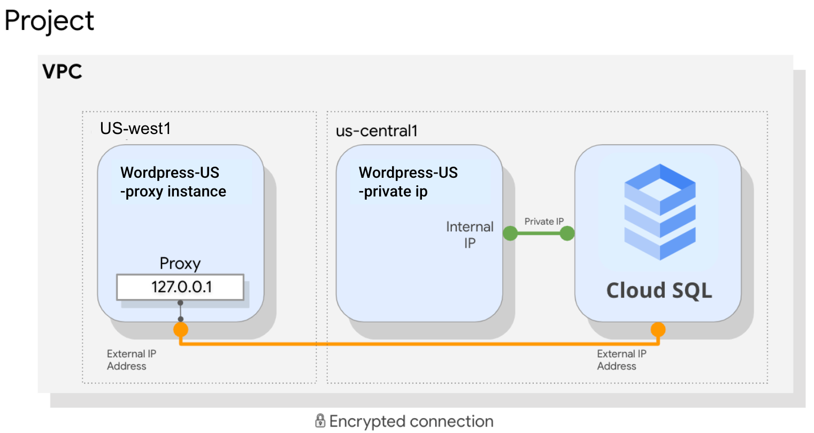

# 3 Essential Google Cloud Infrastructure - Core Services

## Table of contents

1. Introduction
2. Cloud IAM
3. Storage and Database Services
4. Resource Management
5. Resource Monitoring

## 2. Cloud IAM

### 2.01. Overview

Overview
Cloud Identity and Access Management (IAM). A sophisticated system, built on top of e-mail like address names, job type roles, and granular permissions.

### 2.02. Cloud IAM

Who - what - where

- Who - person, group, or application
- Can do what - specific privileges or actions
- On which resource - service

For example, I have the privilege of Compute viewer - read-only access to get and list Compute resources w/o being able to read the data stored on them.

#### 2.02.1. Cloud IAM objects
  
- Organization - root node, represents your company. Roles at this level are inherited by all resources under the organization.
  - Folders - could represent your department
    - Projects - represent a trust boundary within your company, services within the same project have a default level of trust.
      - Resources - each resource has exactly one parent

Policies (Roles, Members) - can be set at any level.

Child policies cannot restrict access granted at the parent level. Therefore it is a best practice to follow the principle of least privilege. Always select the smallest scope that is necessary for the task to reduce your risk exposure.

If you change the resource hierarchy, the policy hierarchy also changes. For example, moving a project to a different organization will update the project's IAM policy to inherit from the new organization’s Cloud IAM policy.

### 2.03. Organization

- Organization node is a root node for GCP resource
- Org. roles:
  - Organization Admin: control over all cloud resources, useful for admin
  - Project Creator: controls project creation, control over who can create projects

#### 2.03.1. Creating and managing organizations

- Created when a **Google Workspace** or **Cloud Identity** account creates a GCP project
- **Google Workspace** or **Cloud Identity** super administrator:
  - Assign **organization admin** role to some users
  - Be a point of contact in case of recovery issues
  - Control the lifecycle of Google Workspace or Cloud Identity account and Organization resource
- **Organization admin**:
  - Define IAM policies
  - Determine the structure of the resource hierarchy
  - Delegate responsibility for components such as networking, billing, and Resource Hierarchy through IAM roles
- Does not include roles for other actions, such as creating folders, org. Admin must assign additional roles to their account

#### 2.03.2. Folders
  
Additional grouping mechanism and isolation boundaries b/w projects:

- Diff. legal entities
- Departments
- Teams
- Products
- etc.

Folders allow delegation of administration rights

#### 2.03.3. Resource manager roles

Policies are inherited top to bottom

- Organization:
  - Admin - full control over all resources
  - Viewer - view access over all resources
- Folder:
  - Admin - full control over folders
  - Creator - Browse hierarchy and create folders
  - Viewer - View folders/resources below a resource
- Project:
  - Creator - create new projects and migrate new projects into an organization
  - Deleter - deletes projects

### 2.04. Roles

Define “Can do what” and “on which resources” part of Cloud IAM.

Three types of rules:

- Primitive (basic)
- Predefined
- Custom

#### 2.04.1. Primitive role (basic)

 are original roles available in the GCP console. Broad roles, affect all resources in that project. Offer fixed, coarse-grained levels of access:

- **Owner**
  - Add/remove members
  - Delete projects
  - And ...
- **Editor**
  - Deploy apps
  - Modify code
  - Configure server
  - And ...
- **Viewer**
  - Read-only access

- Billing administrator
  - Manage billing
  - add/remove administrators

#### 2.04.2. Predefined roles

Apply to a particular GCP service in a project. Offer more fine-grained permissions on particular services

- InstanceAdmin Role:
  - Compute.instances.delete
  - Compute.instances.get
  - Compute.instances.list
  - Compute.instances.setMachineType
  - Compute.instances.start
  - Compute.instances.stop

The permissions themselves are classes and methods in APIs.

- Compute Engine IAM roles:
  - Compute Admin - Full control of all Compute Engine resources (compute.*)
  - Network Admin - Permissions to create, modify, and delete networking resources, except for firewall rules and SSL certificates
  - Storage Admin - permissions to create, modify and delete disks, images, and snapshots

#### 2.04.3. Custom roles

Let you define a precise set of permissions.

- Instance Operator Role:
  - Compute.instances.get
  - Compute.instances.list
  - Compute.instances.start
  - Compute.instances.stop

### 2.05. Demo: Custom roles

Specify instance Operator Role

1. Navigation menu -> Products -> IAM & admin -> Roles -> Create Role:
    - Title: Instance Operator
2. Add permissions -> Filter permissions by role: compute.instances.*
    - Compute.instances.get
    - Compute.instances.list
    - Compute.instance.reset
    - Compute.instance.resume
    - Compute.instances.start
    - Compute.instances.stop
    - Compute.instances.suspend
    - Create

### 2.06. Members

Define the “who” part of Cloud IAM.

Five different types of members:

- **Google Account** - Developer, administrator, or any other person that interacts with GCP. Any email address that is associated with the Google account ban be an identity.
- **Service Account** - An account that belongs to your application, instead of the individual end-user. You can create as many service accounts as needed.
- **Google Group** - Named collection of Google accounts and/or Service accounts. Every group has a unique email address, associated with the group. Google Groups are a convenient way to apply an access policy to a collection of users. You can add/change access controls for a whole group at once, instead of changing access control one at a time for individual users or service accounts.
- **G Suite Domain** - Represent your organization’s internet domain name, for example, example.com. When you add a user to your G Suite Domain, a new account is created for the user, for example, user@example.com.
- **Cloud Identity Domain** - GCP customers that are not G Suite customers, can get the same capabilities through **Cloud Identity**. Cloud Identity lets you manage users and groups, using the Google Admin console, without benefits like Gmail, docs, calendar, etc. Cloud Identity is available in free and premium editions. Premium adds features for mobile device management. You can not use Cloud IAM to manage users or groups, instead, you can use Cloud Identity for that.
  - If you have an existing Active Directory or LDAP, you can use **Google Cloud Directory Sync** to get users and groups in GCP.

### 2.07. Service Accounts

#### 2.07.1. Service Accounts provide an identity for carrying out **server-to-server** interactions

- A service account is a special kind of account used by an application or a virtual machine (VM) instance. For example, a Compute Engine VM can run as a service account, and that account can be given permissions to access the resources it needs. This way the service account is the identity of the service, and the service account's permissions control which resources the service can access.
- Programs running with Compute Engine instances can automatically acquire tokens with credentials
- Tokens are used **to access any service API** in your project and any other services that granted access to that service account
- Service accounts are convenient when you are not accessing user data

#### 2.07.2. Service accounts are identified by an email address

- service-account-name@project-id.iam.gserviceaccount.com

- Three types of accounts:
  - User-created (custom):
  - Built-in:
    - Compute Engine and Application Engine default service accounts
    - App Engine default service account - project-id@appspot.gserviceaccount.com
    - Compute Engine default service account - project-number-compute@developer.gserviceaccount.com
  - Google APIs service account:
    - Runs internal Google processes on your behalf.  For example, when you use Cloud Run to run a container, the service needs access to any Pub/Sub topics that can trigger the container.
    - project-number@cloudservices.gserviceaccount.com

Default Compute Engine service account:

- Automatically created per project with automatically generated name and email address
- The name has -compute suffix: 39xxx0964-compute@developer.gserviceaccount.com
- Automatically added as project Editor
- By default, enabled on all instances created using gcloud or GCP console

Customizing scoped for a VM:

- Scopes can be changed after an instance is created: Service Account + Access Scopes in VM settings/
- For user-created service accounts, use Cloud IAM roles instead

Service Account permissions:

- Default service accounts: primitive and predefined
- User-created service accounts: predefined roles
- Roles for service account can be assigned to groups or users


Service accounts authenticate with keys:

- GCP-managed: cannot be downloaded and are automatically rotated
- User-managed: create, manage and rotate yourself

### 2.08. Cloud IAM best practices

Leverage and understand the resource hierarchy:

- Use projects to group resources that share the same trust boundary
- Check the policy granted on each resource & make sure that you understand the inheritance
- User principle of least privilege when granting roles
- Audit policies in Cloud audit logs: ‘setiampolicy’
- Audit membership of groups used in policies

Granting roles to Google groups instead of individuals:

- Update group membership instead of changing Group IAM policy
- Audit membership of groups used in policies
- Control the ownership of the Google Group used in IAM policies

Service Accounts:

- Be very careful granting serviceAccountUser role, as it provides access to all the resources that the service account has access to.
- When you create a service account, give it a display name that identifies its purpose
- Establish a naming convention for service accounts
- Establish key rotation policies and methods
- Audit with service.account.keys.list() method

Cloud Identity-Aware Proxy (Cloud IAP):

- Enforces access control policies for applications and resources:
  - Identity-based access control
  - Central authorization layers for applications access by HTTPS
- Cloud IAM is applied after authentication. So you can use application-level access control, instead of relying on network-level firewalls.

### 2.09. Lab Intro: Cloud IAM

### 2.10. Getting Started With GCP And Qwiklabs

### 2.11. Lab: Cloud IAM

#### 2.11.3. Prepare a resource for access testing

Username 1: create a bucket and upload a file:

- Navigation Menu -> Storage -> Cloud Storage -> Create bucket
- Upload file in the bucket

Username 2: Check Cloud Storage bucket via CGP Console:

- Success

#### 2.11.4. Remove project access

Remove Project Viewer role for Username 2:

- Navigation Menu -> IAM & Admin -> IAM ->  find username2 -> edit -> remove access -> save

Username 2: Check Cloud Storage bucket via CGP Console:

- `You do not have sufficient permissions to view this page. You are missing at least one of the following required permissions: storage.buckets.list`

#### 2.11.4.5. Add storage access

Navigation Menu -> IAM & Admin -> IAM -> add:

- New members: username 2
- Select a role: Storage Object Viewer
- Save

Username 2: check Cloud Storage via Cloud Shell

```sh
gsutil ls gs://[YOUR_BUCKET_NAME]

# Success
```

#### 2.11.4.6. Set up the Service Account User

Create a service account:

- Navigation Menu -> IAM & Admin -> Service accounts -> Create a service account:
- Service account name: read-bucket-objects
- Service account permissions: Storage Object Viewer
- Create

Add the user to the service account:

- Navigation Menu -> IAM & Admin -> IAM-> Select read-bucket-objects@...iam.gserviceaccount.com:
- New members: altostrat.com
- Role: service.account.user
- Save

Grant Compute Engine access:

- Navigation Menu -> IAM & Admin -> IAM-> Add:
- New members: altostrat.com
- Role: compute.instance.admin(v1)
- Save

#### 2.11.4.7. Explore the Service Account User role

Create a new VM using the service account:

- Service Account: read-bucket-objects
- Create

```sh
# SSH into VM and check permissions

gloud compute instances list
# ERROR: (gcloud.compute.instances.list) Some requests did not succeed: - Required 'compute.instances.list' permission for 'projects/qwiklabs-gcp-01-84b0fd26f560'
```

```sh
# Copy the sample.txt file from the bucket you created earlier

gsutil cp gs://[YOUR_BUCKET_NAME]/sample.txt .
# Operation completed over 1 objects/2.7 KiB.
```

```sh
# To copy the renamed file back to the bucket
gsutil cp sample.txt gs://bucket_name/sample2.txt
# Copying gs://qwiklabs-gcp-01-84b0fd26f560/sample.txt [Content-Type=text/plain]...
# AccessDeniedException: 403 read-bucket-objects@qwiklabs-gcp-01-84b0fd26f560.iam.gserviceaccount.com does not have storage.objects.create access to the Google Cloud Storage object.
```

Because you connected via SSH to the instance, you can "act as the service account," essentially assuming the same permissions.
The service account the instance was started with had the Storage Viewer role, which permits downloading objects from GCS buckets in the project.
To list instances in a project, you need to grant the compute.instance.list permission. Because the service account did not have this permission, you could not list instances running in the project.
Because the service account did have permission to download objects, it could download an object from the bucket.
It did not have permission to write objects, so you got a "403 access denied" message.

### 2.12. Lab Review: Cloud IAM

### 2.13. Review

## 3. Storage and Database Services

### 3.01. Overview

Every application needs to store data. Whether it is business data, media to be streamed, or sensor data from devices.

From an application point technology stores and retrieves the data, whether it is a database or object store is less important than whether that service supports application requirements for efficiently storing and retrieving the data given its characteristics.


Scope

- Infrastructure track:
  - Service differentiators
  - When to consider using each system
  - Setup and connect to a service
- Data engineering track:
  - How to use a DB system
  - Design, organization, structure, schema, and use for an application
  - Details about how to service stores and retrieves structured data

### 3.02. Cloud Storage

GCPs object storage service offers worldwide storage/retrieval of any amount of data at any time:

- Website content
- Distributing large data objects to users via direct download
- Storing data for archiving and disaster recovery

Features:

- Scalable to exabytes
- Time to the first byte in milliseconds
- Very high availability across all storage classes
- Single API across storage classes

Storage classes:

- Standard - "Hot" data and/or stored only brief period like data-intensive computations:
- Nearline – infrequently accessed data like a backup, long-tail multimedia content, and data archiving
- Coldline – infrequently accessed data that you read/modify at most 1x quarter
- Archive – Data archiving, online backup, and disaster recovery


Cloud Storage overview:

- Buckets:
  - Naming requirements
  - Cannot be nested
- Objects:
  - Inherit storage class of bucket, when created
  - No minimum size, unlimited storage
- Access:
  - Gsutil
  - APIs (JSON API, XML API)

Changing storage class:

- The default class is applied to new objects
- The regional bucket **can never** be changed to Multi-Regional
- The multi-Regional bucket **can never** be changed to Regional
- Objects can be moved from bucket to bucket
- Object Lifecycle Management (OLM) can manage the classes of objects

Access control:

- Project -> Bucket -> Object

- Cloud IAM- Cloud Identity and Access Management
- ACL - Access Control Lists (max 100 entries per bucket)
  - Scope - who has access, examples:
    - collab@gmail.com
    - allUsers (anyone on the internet)
    - allAuthenticatedUsers (anyone authenticated with a Google account)
  - Permission - what level of access (owner, write, read)
- Signed URL - Signed and Timed Cryptographic Key
  - “Valet key” access to buckets and objects via ticket
    - The ticket is a cryptographically signed URL
    - Time-limited
    - Operations specified in the ticket: HTTP GET, PUT, DELETE (not POST)
    - Any user with a URL can invoke permitted operations
  - Example using private account key and gsutil: `gsutil signurl -d 10m path/to/privatekey.p12 gs://bucket/object`
    - Signed Policy Document - Control File Upload Policy

### 3.03. Cloud Storage Features

- Customer supplied encryption key:
- Object Lifecycle Management (OLM) - specify actions to be performed on objects that meet certain rules:
  - Object inspection occurs in async batches
  - Changes can take up to 24 hrs to apply
  - Examples:
    - Downgrade storage class on objects older than 1 year
    - Delete objects created before specific data
    - Keep only the 3 most recent versions
- Object Versioning:
  - Objects are immutable
  - Object versioning allows maintaining a history of modification of objects
  - Lists archived versions of an object, restore an object to an older state, or delete a version
- Directory synchronization
- Object Change notification - can be used to notify an application, when an object is updated or added to a bucket, Cloud Pub/Sub Notifications for Cloud Storage
- Data Import
- Strong consistency

### 3.04. Choosing a storage class

### 3.05. Lab Intro: Cloud Storage

### 3.06. Lab: Cloud Storage

#### 3.06.1. Preparation

Create a new Cloud Storage bucket:

- Navigation menu -> Storage -> Cloud Storage -> Create:
- Project ID = bucket ID
- Choose a default storage class: Multi-region
- ACL: set object-level and bucket-level permissions
- Create

Download a sample file using CURL and make two copies:

```sh
# Store [BUCKET_NAME_1] in an environment variable

export BUCKET_NAME_1=<enter bucket name 1 here>
echo $BUCKET_NAME_1

# Run the following command to download a sample file
curl https://hadoop.apache.org/docs/current/\
hadoop-project-dist/hadoop-commom/\
ClusterSetup.html > setup.html

cp setup.html setup2.html
cp setup.html setup3.html
```

#### 3.06.2. Access control lists (ACLs)

Copy the file to the bucket and configure the access control list:

```sh
# copy the first file to the bucket

gsutil cp setup.html gs://$BUCKET_NAME_1/

# get the default access list that's been assigned to setup.html
gsutil acl get gs://$BUCKET_NAME_1/setup.html  > acl.txt
cat acl.txt
```

```JSON
// cat acl.txt
[
  {
    "entity": "project-owners-39682890413",
    "projectTeam": {
      "projectNumber": "39682890413",
      "team": "owners"
    },
    "role": "OWNER"
  },
  {
    "entity": "project-editors-39682890413",
    "projectTeam": {
      "projectNumber": "39682890413",
      "team": "editors"
    },
    "role": "OWNER"
  },
  {
    "entity": "project-viewers-39682890413",
    "projectTeam": {
      "projectNumber": "39682890413",
      "team": "viewers"
    },
    "role": "READER"
  },
  {
    "email": "student-03-40b456254f59@qwiklabs.net",
    "entity": "user-student-03-40b456254f59@qwiklabs.net",
    "role": "OWNER"
  }
]
```

```sh
# to set the access list to private and verify the results
gsutil acl set private gs://$BUCKET_NAME_1/setup.html
gsutil acl get gs://$BUCKET_NAME_1/setup.html  > acl2.txt
cat acl2.txt
```

```JSON
// cat acl2.txt
[
  {
    "email": "student-03-40b456254f59@qwiklabs.net",
    "entity": "user-student-03-40b456254f59@qwiklabs.net",
    "role": "OWNER"
  }
]
```

```sh
# update date the access list to make the file publicly readable
gsutil acl ch -u AllUsers:R gs://$BUCKET_NAME_1/setup.html
gsutil acl get gs://$BUCKET_NAME_1/setup.html  > acl3.txt
cat acl3.txt
```

```JSON
// cat acl3.txt
[
  {
    "email": "student-03-40b456254f59@qwiklabs.net",
    "entity": "user-student-03-40b456254f59@qwiklabs.net",
    "role": "OWNER"
  },
  {
    "entity": "allUsers",
    "role": "READER"
  }
]
```

Delete the local file and copy it back from Cloud Storage:

```sh
rm setup.html
ls
gsutil cp gs://$BUCKET_NAME_1/setup.html setup.html
```

#### 3.06.3. Customer-supplied encryption keys (CSEK)

Generate a CSEK key:

```sh

# un the following command to create a key, Copy the value
python3 -c 'import base64; import os; print(base64.encodebytes(os.urandom(32)))'
```

Modify the boto file:

```sh
# generate a new .boto file
gsutil config -n
sed -i -e "s/#encryption_key=/encryption_key=$CSEK/" .boto
```

Upload the remaining setup files (encrypted) and verify in the Cloud Console

```sh
gsutil cp setup2.html gs://$BUCKET_NAME_1/
gsutil cp setup3.html gs://$BUCKET_NAME_1/
```

In GCP Console You will see that files are encrypted `The target object is encrypted by a customer-supplied encryption key.`

Delete local files, copy new files, and verify encryption

```sh
rm setup*
gsutil cp gs://$BUCKET_NAME_1/setup* ./
cat setup.html
cat setup2.html
cat setup3.html
```

#### 3.06.4. Rotate CSEK keys

Move the current CSEK encrypt key to decrypt key:

- `nano .boto`
- Comment out the current encryption_key line by adding the # character to the beginning of the line.
- Uncomment decryption_key1 by removing the # character, and copy the current key from the encryption_key line to the decryption_key1 line.

Generate another CSEK key and add to the boto file:

- `python3 -c 'import base64; import os; print(base64.encodebytes(os.urandom(32)))'`
- `nano .boto`
- Uncomment encryption and paste the new key value for encryption_key=.

Rewrite the key for file 2 and comment out the old decrypt key:

- `gsutil rewrite -k gs://$BUCKET_NAME_1/setup2.html`
- `nano .boto`
- Comment out the current decryption_key1 line by adding the # character back in

Download setup2 and setup3:

```sh
gsutil cp  gs://$BUCKET_NAME_1/setup2.html recover2.html
# success

gsutil cp  gs://$BUCKET_NAME_1/setup3.html recover3.html
# No decryption key matches object gs://qwiklabs-gcp-00-e797fbc73c7e/setup3.html
```

#### 3.06.5. Enable lifecycle management

View the current lifecycle policy for the bucket:

```sh
gsutil lifecycle get gs://$BUCKET_NAME_1
```

Create a JSON lifecycle policy file:

- `nano life.json`

```json
// life.json
{
  "rule":
  [
    {
      "action": {"type": "Delete"},
      "condition": {"age": 31}
    }
  ]
}
```

Set the policy and verify:

```sh
gsutil lifecycle set life.json gs://$BUCKET_NAME_1
# Setting lifecycle configuration on gs://qwiklabs-gcp-00-e797fbc73c7e/...
gsutil lifecycle get gs://$BUCKET_NAME_1
# {"rule": [{"action": {"type": "Delete"}, "condition": {"age": 31}}]}
```

#### 3.06.6. Enable versioning

View the versioning status for the bucket and enable versioning:

```sh
gsutil versioning get gs://$BUCKET_NAME_1
# gs://qwiklabs-gcp-00-e797fbc73c7e: Suspended
# The Suspended policy means that it is not enabled.
gsutil versioning set on gs://$BUCKET_NAME_1
# Enabling versioning for gs://qwiklabs-gcp-00-e797fbc73c7e/...
gsutil versioning get gs://$BUCKET_NAME_1
# gs://qwiklabs-gcp-00-e797fbc73c7e: Enabled
```

Create several versions of the sample file in the bucket:

- `ls -al setup.html`
- `nano setup.html`
- Delete any 5 lines from setup.html to change the size of the file.
- `gsutil cp -v setup.html gs://$BUCKET_NAME_1`
- `nano setup.html`
- Delete another 5 lines from setup.html to change the size of the file.
- `gsutil cp -v setup.html gs://$BUCKET_NAME_1`

List all versions of the file:

- `gsutil ls -a gs://$BUCKET_NAME_1/setup.html`
- `export VERSION_NAME=<Enter VERSION name here>`

Download the oldest, original version of the file and verify recovery:

- `gsutil cp $VERSION_NAME recovered.txt`

#### 3.06.7. Synchronize a directory to a bucket

Make a nested directory and sync with a bucket:

```sh
# Make a nested directory structure
mkdir firstlevel
mkdir ./firstlevel/secondlevel
cp setup.html firstlevel
cp setup.html firstlevel/secondlevel

# To sync the firstlevel directory on the VM with your bucket
gsutil rsync -r ./firstlevel gs://$BUCKET_NAME_1/firstlevel
```

### 3.07. Lab Review: Cloud Storage

### 3.08. Cloud SQL

Should you build your DB solution or use a managed service?

Cloud SQL is a fully managed DB service (MySQL or PostgreSQL):

- Patches and updates automatically applied
- You administer MySQL users
- Cloud SQL supports many clients:
  - gcloud sql
  - Application Engine, Google Workspace scripts
  - Applications and tools:
    - SQL workbench, Toad
    - External apps using standard MySQL drivers

Cloud SQL services:

- Replica services - for automated failovers
- Backups services
- import/export
- Scaling:
  - Up - machine capacity
  - Out - replicas


  


### 3.09. Lab Intro: Cloud SQL

### 3.10. Lab: Implementing Cloud SQL



Tasks:

- Configured a Cloud SQL server,  
- learned how to connect an application to it via:
  - a proxy over an external connection (from another region).
  - a Private IP link that offers performance and security benefits

You can only connect via Private IP, if:

- The application and Cloud SQL are co-located in the same region and
- are part of the same VPC network.

If you can host your application in the same region and VPC connected network as your Cloud SQL, you can leverage a more secure and performant configuration using Private IP.
By using Private IP, you will increase performance by reducing latency and minimize the attack surface of your Cloud SQL instance because you can communicate with it exclusively over internal IPs.

If an application is hosted in another:

- region
- VPC
- project
use a Secure Proxy instead.

Two VM instances are created by default:

- wordpress-europe-proxy – for proxy for Cloud SQL
- wordpress-us-private-ip - for Private IP instances.

#### 3.10.1. Create a Cloud SQL database

Navigation menu -> Storage -> SQL -> Create Instance -> Choose MySQL:

- Instance ID: wordpress-db
- Root password: [ROOT_PASSWORD] - password1234
- Region/Zone: us-central1/Any
- Machine type: 1 vCPU, 3.75 GB.
- Storage type: 10GB
- Configuration Options -> Set Connectivity:
  - Private IP -> Enable Service Networking API
  - Allocate and Connect
- Create

Databases -> Create a database:

- Database name: wordpress
- Create

#### 3.10.2. Configure a proxy on a virtual machine

- SSH in wordpress-europe-proxy
- Download Cloud SQL Proxy `wget https://dl.google.com/cloudsql/cloud_sql_proxy.linux.amd64 -O cloud_sql_proxy && chmod +x cloud_sql_proxy`
- To start the proxy, you need the connection name of Cloud SQL instance: Navigation menu ->  Storage -> SQL -> wordpress-db -> Instance connection name -> copy
- In SSH define SQL_CONNECTION variable: `export SQL_CONNECTION=”Instance connection name”`
- Activate proxy connection to SQL database and send the process to the background: `./cloud_sql_proxy -instance=$SQL_CONNECTION=tcp:3306 &`
- `Listening on 127.0.0.1:3306 for [SQL_CONNECTION_NAME]` - The proxy will listen on 127.0.0.1:3306 (localhost) and proxy that connection securely to your Cloud SQL over a secure tunnel using the machine's external IP address.

#### 3.10.3. Connect an application to the Cloud SQL instance

- Find machine's external IP address `curl -H "Metadata-Flavor: Google" http://169.254.169.254/computeMetadata/v1/instance/network-interfaces/0/access-configs/0/external-ip && echo`, paste it in a browser window to configure, and press ENTER
- Run the Installation, specifying:
  - Username root
  - Password [ROOT_PASSWORD]
  - Database Host 127.0.0.1 - you are using 127.0.0.1, localhost as the Database IP because the proxy you initiated listens on this address and redirects that traffic to your SQL server securely.

#### 3.10.4. Connect to Cloud SQL via Internal IP
  
- Navigation menu -> SQL -> Click wordpress-db -> Copy the Private IP address of the Cloud SQL server
- Copy the external IP address of wordpress-us-private-ip, paste it in a browser window to configure, and press ENTER:
- Username  root
- Password  [ROOT_PASSWORD]
- Database Host [SQL_PRIVATE_IP] - Notice that this time you are creating a direct connection to a Private IP, instead of configuring a proxy.  That connection is private, which means that it doesn't egress to the internet and therefore benefits from better performance and security.

### 3.11. Lab Review: Cloud SQL

### 3.12. Cloud Spanner

Cloud Spanner combines the benefits of relational DB structure with a non-relational horizontal scale:

- Scale to petabytes
- Strong consistency
- High availability
- Used for financial/inventory apps
- Regional/multi-regional uptime 99,99%/99,999%


### 3.13. Cloud Firestore (Cl)

Highly scalable no-SQL document database. Cloud Firestore is a next-gen Cloud Datastore.

- Simplifies storing, syncing, and querying data
- Mobile, web, IoT at a global scale
- Live sync and offline support
- Security features
- ACID transactions (if any fail, whole fail)
- Multi-region replication
- Powerful query engine

Cloud Firestore is **the next generation of Cloud Datastore**

- Datastore mode (new server projects):
  - Compatible with Datastore applications
  - Strong consistency
  - No Entity group limit
- Native mode (new mobile/web apps):
  - Strong, consistent storage layer
  - Collection and document data model
  - Real-time updates
  - Mobile and Web client libraries

!

### 3.14. Cloud Bigtable

No SQL big data database service

- Petabyte-scale
- Consistent sub-10ms latency
- Seamless scalability for throughput
- Learns and adjusts to access patterns
- Ideal for Ad Tech, Fintech, and IoT
- Storage engine for ML applications
- Easy Integration with open source big data tools

Cloud Bigtable access patterns


### 3.15. Cloud Memorystore

Fully managed Redis service:

- In-Memory data store service
- Focus on building great apps
- High availability, failover, patching, and monitoring
- Sub-millisecond latency
- Instances up to 300 GB
- Network throughput of 12 Gbps
- Easy Lift-and-Shift

### 3.16. Review

## 4. Resource Management

### 4.01. Overview

As resources in GCP are billable, managing resources means controlling costs.

### 4.02. Cloud Resource Manager

Resource Manager lets you hierarchically manage resources.
GCP -> Organization -> Folders -> Projects -> Resources

- Identity and Access Management (Top -> Bottom approach):
  - child policies cannot restrict access granted at the parent level
- Billing and Resource Monitoring (Bottom -> Top approach):
  - A resource belongs to one and only one project (rate of use or time, nr of items or feature use)
  - Project is associated with one billing account
  - The organization contains all billing accounts

The project accumulates the consumption of all its resources:

- Track resource and quota usage:
  - Enable billing
  - Manage permissions and credentials
  - Enable services and APIs
- Projects use three identifying attributes:
  - Project Name or
  - Project Number or
  - Project ID


Resources are global, regional or zonal:

- Global:
  - Images
  - Snapshots
  - Networks
- Regional:
  - External IP address
- Zonal:
  - Instances
  - Disks

### 4.03. Quotas

All resources are subject to project quotas or limits

- How many resources per project: 5 VPC networks/project
- How many resources per region: 24 CPUs region/project
- Ho quickly you can make an API request in a project aka. rate limit: 5 admin actions/second for cloud Spanner
- To increase: Quotas page in GCP Console or a support ticket

Why quotas:

- Prevent runaway consumption in case of error or malicious attack
- Prevent billing spikes/surprises
- Forces sizing consideration and periodic review

### 4.04. Labels and names

Labels are a utility for organizing GCP resources
Projects and folders provide levels of segregation for resources, but what if you want more granularity? That is where labels and names come in.

Labels are a utility for organizing GCP resources, which are attached to resources:

- VM
- disk
- snapshot
- image

Each resource can have up to 64 labels, for example:

- Team or cost Center
- Components
- Environment or stage
- Owner or contact
- State

#### 4.04.1 Labels vs. Tags

Labels are a way to organize resources across GCP:

- User-defined stings in key-value format
- Propagated through billing

Tags are applied to instances only:

- User-defined strings
- Tags are primarily used for networking (applying firewall rules)

### 4.05. Billing

Consumption of all resources under a project accumulates into one billing account.

Setting a budget lets you track how your spending is growing towards that amount:

- First, you specify a **budget name** and select the project this budget applies to.
- Then you can set the **budget amount**, or match it to a previous month spent.
- Then you can set **budget alerts**, which sent emails to billing admins after the spend exceeds the alert amount.
- In addition to email, you can use Cloud Pub/Sub notifications to receive spend updates. You can even create a Cloud Function that listens to a specific topic to automate cost management.

Another way to optimize your GCP spend is to use labels. For example, you could label VM instances that are spread across diff. regions. Label your resources and export billing data to BigQuery to analyze your spending.

```SQL
SELECT
  TO_JSON_STRING(labels) as labels,
  sum(cost) as cost
FROM `project.dataset.table`
GROUP BY labels;
```

Visualize GCP spend with Data Studio
You can even visualize spend over time with Data Studio, which turns data into dashboards, which are easy to read, easy to share, and fully customizable.

### 4.06. Demo: Billing Administration

Navigate to Billing:

- Navigation Menu -> Billing -> Overview

Navigate to Budgets and alerts:

- Navigation Menu -> Billing -> Budgets & alerts -> Create a budget
- Name: My Budget Alert
- Projects: select one or all
- Budget Type: Amount, Last Month Spent
- Thresholds: 50/90/100
- Connect a Cloud Pub/Sub topic
- Finish

See all of the different charges:

- Navigation Menu -> Billing -> Transactions

Export data:

- Navigation Menu -> Billing -> Billing export
  - BigQuery Export -> Edit Settings -> create a BigQuery dataset -> go to BigQuery
  - FileExport -> Bucket Name, Report prefix -> Format (JSON, csv)

Review payment method:

- Navigation Menu -> Billing -> Payment method
- Review different payment account, payment profiles, payment methods, etc

### 4.07. Lab Intro: Examining Billing Data with BigQuery

### 4.08. Lab: Examining Billing Data with BigQuery

In this lab, you learn how to perform the following tasks:

- Sign in to BigQuery from the Cloud Console
- Create a dataset
- Create a table
- Import data from a billing CSV file stored in a bucket
- Run complex queries on a larger dataset

You then accessed a shared dataset, containing more than 22K records of billing information and run several queries on that dataset.

#### 4.08.1. Use BigQuery to import data

Sign in to BigQuery and create a dataset:

- Navigation Menu -> Big Data -> BigQuery -> Create dataset:
- Dataset ID: imported_billing_data
- Location: US
- Expire: 1 day
- Create

Create a table and import:

- Source: Google Cloud Storage
- Location: gs://cloud-training/archinfra/export-billing-example.csv
- File format: csv
- Table name: sampleinfotable
- Table type: auto-detect
- Header rows to skip: 1
- Create Table

#### 4.08.2. Examine the table

#### 4.08.3. Compose a simple query

Query

```SQL
SELECT * FROM `imported_billing_data.sampleinfotable`
WHERE Cost > 0
```

#### 4.08.4. Analyze a large billing dataset with SQL

```SQL
-- For New Query, paste the following in Query Editor
SELECT
  product,
  resource_type,
  start_time,
  end_time,
  cost,
  project_id,
  project_name,
  project_labels_key,
  currency,
  currency_conversion_rate,
  usage_amount,
  usage_unit
FROM
  `cloud-training-prod-bucket.arch_infra.billing_data`
```

```SQL
-- to find the latest 100 records where there were charges (cost > 0)
SELECT
  product,
  resource_type,
  start_time,
  end_time,
  cost,
  project_id,
  project_name,
  project_labels_key,
  currency,
  currency_conversion_rate,
  usage_amount,
  usage_unit
FROM
  `cloud-training-prod-bucket.arch_infra.billing_data`
WHERE
  Cost > 0
ORDER BY end_time DESC
LIMIT
  100
```

```SQL
-- to find all charges that were more than 3 dollars,
SELECT
  product,
  resource_type,
  start_time,
  end_time,
  cost,
  project_id,
  project_name,
  project_labels_key,
  currency,
  currency_conversion_rate,
  usage_amount,
  usage_unit
FROM
  `cloud-training-prod-bucket.arch_infra.billing_data`
WHERE
  cost > 3
```

```sql
-- To find the product with the most records in the billing data
SELECT 
product, resource_type, COUNT(*) as records
FROM 
`cloud-training-prod-bucket.arch_infra.billing_data`
GROUP BY
product, resource_type
ORDER BY 
product, resource_type
```


### 4.09. Lab Review: Examining Billing Data with BigQuery

### 4.10. Review

## 5. Resource Monitoring

### 5.01. Overview

Stackdriver (Google Cloud Operations Suite) dynamically discovers cloud resources and application services, based on deep integration with GCP and AWS.

### 5.02. Google Cloud's Operations Suite

Google Cloud Operations Suite:

- Integrated monitoring, logging, diagnostics
- Manage across platforms
  - GCP and AWS
  - Dynamic discovery of GCP with smart defaults
  - Open-source agents and integrations
- Access to powerful data and analytics tools
- Collaboration with third-party software

Google Cloud Operations Suite:

- Monitoring
- Logging
- Error reporting
- Trace
- Debugger

### 5.03. Monitoring

Monitoring is at the base of SRE, which is a discipline, which applies aspects of software engineering to operations to create scalable and reliable software systems.

Monitoring:

- Dynamic config and intelligent defaults
- Platform, system, and application metrics
  - Ingests data: metrics, events, metadata
  - Generates insights through dashboards, charts, alerts
- Uptime/health checks – uptime checks test the availability of your public services
- Dashboards – dashboards visualize utilization and network traffic
- Alerts - alerting policies can notify you of certain conditions

- Condition
- Notification
- Documentation
- Name of policy

Workspace is the root entity that holds monitoring and configuration information:


Hosts -> Workspace -> Projects

- Hosts – Hosting project Z (1st monitored project):
  - Monitoring
  - Dashboards
  - Uptime
  - Configuration
- Workspace Z:
  - Monitors: GCP project A
  - Monitors: GCP project B
  - Monitors: GCP project C <- AWS Connector <- AWS Account Nr1

Installing monitoring agent

- Compute Engine
- EC2 instances

```shell
curl –O https://repo.stackdriver.com/stack-install.sh  
sudo bash stack-install.sh --write-gcm
```

### 5.04. Lab Intro: Resource Monitoring

### 5.05. Lab: Resource Monitoring

#### 5.05.1. Create a Cloud Monitoring workspace

Verify resources to monitor:

- Navigation Menu -> Compute -> Compute Engine -> VM instances you will see three VMs up and running
- Navigation Menu -> Compute -> Deployment Manager to see deployment for creating these VMs. See config file, template files, etc

Create a Monitoring workspace:

- Navigation Menu -> Operations -> Monitoring
- The workspace is being built for you.

#### 5.05.2. Custom dashboards

Create a dashboard:

- Monitoring -> Dashboards -> Create Dashboard:
- Dashboard name: My Dashboard
- Confirm

Add Chart:

- Chart Title: Instance CPU utilization
- Resource Type: GCE VM Instance
- Metric: CPU utilization, Received bytes
- Save

Metrics Explorer:

#### 5.05.3. Alerting policies

Alerting policies are really important because they allow communication, based on certain metrics.

Monitoring -> Alerting -> Create a policy:

- Name: Test
- Add Condition:
  - Resource Type: GCE VM Instance
  - Metric: CPU utilization
  - The condition triggers if: Any time series violates
  - Condition: is above
  - Threshold: 20
  - For: 1 minute
  - Add
- Add Condition:
  - Resource Type: GCE VM Instance
  - Metric: Network traffic
  - The condition triggers if: Any time series violates
  - Condition: is above
  - Threshold: 1000 B
  - For: 1 minute
  - Add
- Triggers when: ANY condition is met
- Add notification channel:
  - Email:
    - Email address: xxx@xxx.xxx
    - Add
- Documentation: Enter optional documentation
- Save

#### 5.05.4. Resource groups

Groups allow us to combine specific resources and then allow us to create dashboards, alerts, and uptime checks on specific groups.

Monitoring -> Groups -> Create Group

- Name: VM instances
- Operator: contains
- Value: nginx
- Create

#### 5.05.5. Uptime monitoring

Monitoring -> Uptime Check -> Create Uptime Check:

- Title: My Uptime Check
- Protocol: HTTP
- Resource Type: Instance
- Applies to: Group
- Group: VM instances
- Check Frequency: 1 minute
- Save

### 5.06. Lab Review: Resource Monitoring

### 5.07. Logging

- Platform, systems, and applications logs
  - API to write logs
  - 30-day retention
- Log search/view/filter
- Log-based metrics
- Monitoring alerts can be set on log events
- Data can be exported to:
  - Cloud Storage,
  - BigQuery – analyze logs in BigQuery and visualize in Data Studio (for example, top IP addresses that have exchanged traffic to a web-server. To either relocate a web server or deny access to IP addresses)
  - Cloud Pub/Sub – to stream logs to apps or endpoints

Installing a logging agent:

- Compute Engine
- EC2 instances

```sh
curl –sSO https://dl.google.com/cloudagents/install-logging-agent.sh  
sudo bash install-logging-agent.sh
```

### 5.08. Error Reporting

Aggregates and displays errors for running cloud services:

- Error notifications
- Errors dashboards
- Go, Java, .NET, Node.js, PHP, Python, and Ruby
- App Engine, Apps script, Compute Engine, Cloud functions, Cloud run, GKE, Amazon EC2

### 5.09. Tracing

Tracing system:

- Displays data in near real-time
- Latency report
- Per URL latency sampling

Collects latency sampling:

- Application Engine
- Google HTTPS load balancers
- Applications instrumented with Stackdriver Trace SDKs

### 5.10. Debugging

- Inspect an application without stopping it or slowing it down significantly (adds 10 ms to requests)
- Debug snapshots:
  - Capture call stack and local variables of a running application
- Debug log points:
  - Inject logging into a service w/o stopping it
- Java, Python, Go, Node.js and Ruby

### 5.11. Lab Intro: Error Reporting and Debugging

### 5.12. Lab: Error Reporting and Debugging

- Launch a Google App Engine application
- Introduce an error into the application
- Explore Cloud Error Reporting
- Use Cloud Debugger to identify the error in the code
- Fix the bug and monitor in Cloud Operations

#### 5.12.1. Create an application

Get and test the application:

```shell
mkdir appengine-hello
cd appengine-hello
gsutil cp gs://cloud-training/archinfra/gae-hello/* .
dev_appserver.py $(pwd)
```

Deploy the application to App Engine:

```shell
# to deploy
gcloud app deploy app.yaml

# verify that the application is working
gcloud app browse
```

Introduce an error to break the application and Re-deploy the application to App Engine:

```shell
sed -i -e 's/webapp2/webapp22/' main.py
gcloud app deploy app.yaml --quiet
gcloud app browse

```

#### 5.12.2. Explore Cloud Error Reporting

- Navigation menu ->  Operations -> Error Reporting
- Click the Error name
- Stack trace sample -> Parsed

View the logs and fix the error

### 5.13. Lab Review: Error Reporting and Debugging

### 5.14. Review

### 5.15. Course Review
