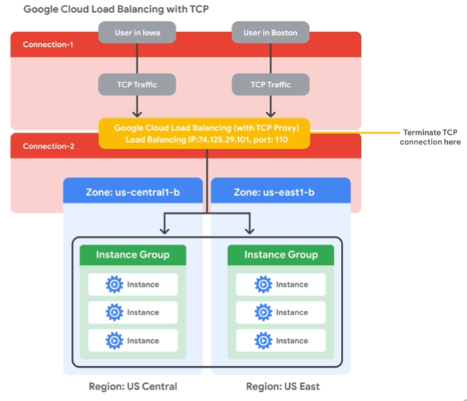
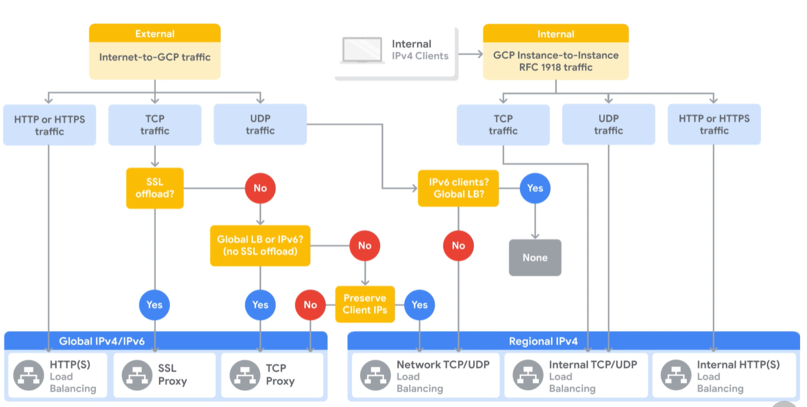

# Elastic Google Cloud Infrastructure: Scaling and Automation

## Table of contents

1. Introduction
2. Interconnecting Networks
3. Load Balancing and Autoscaling
4. Infrastructure Automation
5. Managed Services

## 2. Interconnecting Networks

### 2.01. Overview

Different applications and workloads require different network connectivity solutions. That is why Google supports multiple ways to connect your infrastructure to GCP. In this module, we will focus on GCP hybrid connectivity products: Cloud VPN, Cloud Interconnect, and Cloud Peering.

### 2.02. Cloud VPN

Cloud VPN securely connects your on-prem network to your GCP VPC Network:

- Useful for low-volume data connections
- 99,9% SLA
- Supports:
  - Site-to-site VPN
  - Static routes
  - Dynamic routes (Cloud Rooter)
  - IKEv1 and IKEv2 chippers


To create a connection b/w two VPN Gateways, you must establish 2 VPN Tunnels. each Tunnel defines a connection from the perspective of its Gateway and traffic can only pass when the pair of tunnels are established. A VPN Tunnel connects your VPN Getaways and serves as a virtual medium, through which encrypted traffic is passed.


  
BGP = Border Gateway Protocol. Allows routes to be updated and exchanged without changing the tunnel configuration.

### 2.03. Lab Intro:Virtual Private Networks (VPN)

### 2.04. Getting Started With GCP And Qwiklabs

### 2.05. Lab: Virtual Private Networks (VPN)

- Configure VPN connections b/w two networks, with subnets in different regions,
- Configure VPN tunnel
- verify connection by pinging internal IP addresses

#### 2.05.1. Explore the networks and instances

- Navigation Menu – Tools -> Deployment Manager:  
- two VM instances and two VPC Networks + subnet + firewall rules
- Check VPC Networks, subnets, firewall rules

Navigation Menu –>  Networking  -> VPC Network:

- Name: vpn-network-1
- Region: us-central1
- Subnets: subnet-a
- IP address ranges: 10.5.4.0/24

- Name: vpn-network-2
- Region: europe-west1
- Subnets: subnet-b
- IP address ranges: 10.1.3.0/24

Explore the instances and their connectivity:

```shell
ping -c 3 <Enter server-2 external IP address here>
# success
ping -c 3 <Enter server-2 internal IP address here>
# fail
```

#### 2.05.2. Create the VPN gateways and tunnels

Reserve two static IP addresses:

- Navigation Menu –>  Networking  -> VPC Network -> External IP Addresses:
- Reserve Static address:
- Name:  vpn-1-static-ip
- Region: us-central1
- Reserve

- Navigation Menu –>  Networking  -> VPC Network -> External IP Addresses:
- Reserve Static address:
- Name:  vpn-2-static-ip
- Region: europe-west1
- Reserve

Create the vpn-1 gateway and tunnel1to2:

- Navigation Menu –>  Networking  -> Hybrid Connectivity -> VPN
- Create VPN Connection
- Classic VPN
- Continue
- Name: vpn-1
- Network: vpn-network-1
- Region: us-central1
- IP address: vpn-1-static-ip
- Tunnel
- Name: tunnel1to2
- Remote IP address: vpn-2-static-ip address
- IKE pre-shared key: gcprocks
- Routing Options
- Route-based: 10.1.3.0/24
- Create

Create the vpn-2 gateway and tunnel2to1:

- Navigation Menu –>  Networking  -> Hybrid Connectivity -> VPN
- VPN setup wizard.
- Classic VPN
- Continue
- Name: vpn-2
- Network: vpn-network-2
- Region: us-central2
- IP address: :  vpn-2-static-ip
- Tunnel
- Name: tunnel2to1
- Remote IP address: vpn-1-static-ip address
- IKE pre-shared key: gcprocks
- Routing Options
- Route-based: 10.5.4.0/24
- Create

#### 2.05.3. Verify VPN connectivity

### 2.06. Lab Review:Virtual Private Networks (VPN)

### 2.07. Cloud Interconnect and Peering


- Dedicated connections provide a direct connection to Google’s network
- Shared connection provides access to Google’s network via a partner.

- Layer 2 connection uses a VLAN, that pipes directly into GCP environment, providing connectivity to internal IP addresses
- Layer 3 connection provides access to GSuite, Youtube, and GCP APIs using public IP addresses.

### 2.08. Cloud Interconnect


Dedicated Interconnect provides direct physical connections b/w on-prem network and GCP network.
  
To use dedicated interconnect, your network must physically meet Google’s network in a supported co-location facility.

Partner interconnect

Partner interconnect provides connectivity through a supported service provider.


### 2.09. Peering

Direct Peering provides a direct connection b/w your business network and Google’s:

- Broad reaching edge Points of Presence (PoPs) network locations, where Google’s network connects to the rest of the Internet via peering (90+ points)
- Exchange BGP routes
- Reach all of Google’s services
- Peering requirements
- No SLA

Carrier Peering provides connectivity through a supported partner:

- Carrier Peering partner
- Reach all of Google’s services
- Partner Requirements
- No SLA


### 2.10. Choosing a connection


### 2.11. Shared VPC and VPC Peering

Many organizations commonly deploy multiple isolated projects with multiple VPC networks and subnets. Two configurations for sharing VPC networks across projects.

- Shared VPC - allows you to share a network across several projects in your GCP organization
- VPC Network Peering – allows you to configure private communication across projects in the same or different organizations.


  
When you use Shared VPC you designate a project as a host project and attach one or more other service projects to it.


  
VPC peering, in contrast, allows private connectivity across two VPC networks, regardless of whether they belong in the same project or organization.

Each VPC network will have firewall rules, defining which traffic is allowed/denied b/w networks. For VPC peering to be established, the 1st network’s admin needs to peer its network with 2nd network, and 2nd network’s admin needs to peer it with 1st network. When both peering connections are created, the VPC peering session becomes active and routes are exchanged. This allows VMs to communicate using private IP addresses.

VPC  peering is a decentralized approach to multi-project networking, as each VPC network may remain under the control of separate admin groups and maintain its global firewall and routing tables.


### 2.12. Review

## 3. Load Balancing and Autoscaling

### 3.01. Module Overview

Cloud Load Balancing gives you the ability to distribute load-balanced computing resources in single or multiple regions to meet your high availability requirements.

Global (when your users and instances are globally distributed):

- HTTP(S)
- SSL proxy
- TCP proxy

Regional (internal and network load balancers, distribute traffic in a single region):

- Internal TCP/UDP
- Network TCP/UDP
- Internal HTTP(S)

### 3.02. Managed instance groups

Instance Template -> Managed Instance Group

Managed instance groups:

- Deploy **identical instances** based on **instance template**
- Instance groups can be resized
- The Manager ensures all instances are running
- Typically used with autoscaler
- Can be single zone or regional

Compute Engine -> Instance Template -> Cerate Instance Template:

- Name
- Machine Type
- Containers
- Boot Disk
- IAM
- Firewall
- Etc

Compute Engine -> Instance Groups -> Create Instance Group:

- Location
- Port Name / Port Numbers
- Instance Template
- Autoscaling
- Nr of instances
- Health check

### 3.03. Autoscaling and health checks

Managed instance groups offer autoscaling capabilities.

Dynamically add/remove instances:

- Increases in load
- Decreases in load

Autoscaling policy:

- CPU utilization
- Load balancing capacity
- Monitoring metrics
- Queue-based workload like Cloud Pub/Sub
  
Health checks (similar to uptime check, seen in Operations -> Monitoring):

- Name
- Description
- Protocol/Port
- Request/Response
- Check interval/Timeout
- Healthy threshold/Unhealthy threshold

### 3.04. Overview of HTTP(S) load balancing

Layer 7 on the OSI model, application layer:

- Global load balancing
- Single Anycast IP address
- HTTP or port 80 or 8080
- HTTPS or port 443
- IPv4 or IPv6
- Autoscaling
- URL maps


  
Backend Services:

- Health check
- Session affinity (optional)
- Time out setting (30 sec)
- One or more backends:
  - An instance group (managed or unmanaged)
  - A balancing mode (CPU utilization or RPS)
  - A capacity scaler (ceiling % of CPU/Rate targets)

### 3.05. Example: HTTP load balancer


### 3.06. HTTP(S) load balancing

- Target HTTP(S) proxy
- One signed SSL certificate installed (min)
  - Up to 10 SSL certificates
  - Create an SSL certificate resource
- Client SSL session terminates at the load balancer
- Support the QUIC transport layer protocol

### 3.07. Lab Intro: Configuring an HTTP Load Balancer with Autoscaling

### 3.08. Lab: Configure an HTTP Load Balancer with Autoscaling


- Configure HTTP load balancer with backends in us-cental1 and europe-west1
- Autoscaling
- Two managed instance groups

Configure HTTP firewall rule:

- Navigation menu -> Networking -> VPC network -> Firewall rules:
- Name: default-allow-http
- Target tags: http-server
- Source IP ranges: 0.0.0.0/0
- tcp: 80
- Create

#### 3.08.1. Create the managed instance groups

Create a custom image for a web server:

- Navigation menu -> Compute -> Compute Engine -> VM instances:
- Name: webserver
- Region: us-central1
- Zone: us-central1-a
- Untick Delete boot disk when the instance is deleted
- Network tags: http-server
- Create

Customize the VM:

SSH in webserver

```shell
sudo apt-get update && sudo apt-get install apache2 -y
sudo service apache2 start

# Set the Apache service to start at boot
sudo update-rc.d apache2 enable
```

Reset the webserver. The reset will stop and reboot the machine. It keeps the same IPs and the same persistent boot disk, but memory is wiped.

```shell
# verify that Apache is running
sudo service apache2 status
```

Prepare the disk to create a custom image:

VM instance -> delete -> delete
Navigation menu -> Compute -> Compute Engine -> Disks -> check, that webserver disk exists

Create the custom image:

Navigation menu -> Compute -> Compute Engine -> Images -> Create image

- Name: mywebserver
- Source: Disk
- Source disk: webserver
- Create
- you can now delete the disk

Configure an instance template and create instance groups:

- Navigation menu -> Compute -> Compute Engine -> Instance templates
- Create instance template
- Name: mywebserver-template.
- Machine type: f1-micro
- Boot disk -> Change -> Click Custom images -> mywebserver -> Select
- Click Networking
- Network tags: http-server
- Create

Create the managed instance groups:

- Navigation menu ->  Compute -> Compute Engine -> Instance groups
- Create Instance group
- Name: us-central1-mig
- Location: Multiple zones
- Region: us-central1
- Instance template: mywebserver-template
- Autoscaling : On
- Autoscaling policy: HTTP load balancing utilization
- Target HTTP load balancing utilization: 80
- Minimum number of instances: 1
- Maximum number of instances: 5
- Cool-down period: 60
- Health check -> Create a health check
  - Name: http-health-check
  - Protocol: HTTP
  - Port: 80
  - Save and continue
- Initial delay: 60
- Create
- Repeat the same procedure for europe-west1-mig

#### 3.08.2. Configure the HTTP load balancer

Navigation menu ->  Networking -> Network Services -> Load balancing

- Create load balancer
- HTTP(S) Load Balancing -> Start configuration
- From Internet to my VMs -> Continue
- Name: http-lb
- Backend configuration -> Create backend services & backend buckets -> Backend services -> Create a backend service:
- Name: http-backend
- Backend type: Instance groups
- Instance group: us-central1-mig
- Port numbers: 80
- Balancing mode: Rate
- Maximum RPS: 50 (This configuration means that the load balancer attempts to keep each instance of us-central1-mig at or below 50 requests per second (RPS)
- Capacity: 100
- Done
- Repeat the same procedure for europe-west1-mig
- Health Check -> select http-health-check (TCP)
- Create
- Frontend configuration:
- Protocol: HTTP
- IP version: IPv4
- IP address: Ephemeral
- Port: 80
- Done
- Review and create the HTTP load balancer

#### 3.08.3. Stress test the HTTP load balancer

Create a new VM to simulate a load on the HTTP load balancer:

- Navigation menu -> Compute Engine -> VM instances -> Create instance
- Name: stress-test
- Region: us-west1
- Zone: us-west1-c (Because us-west1 is closer to us-central1 than to europe-west1, traffic should be forwarded only to us-central1-mig)
- Machine type: f1-micro (1 vCPU)
- For Boot Disk, click Change -> Click Custom images -> mywebserver -> Select.
- Create

For stress-test, click SSH to launch a terminal and connect

```shell
export LB_IP=<Enter [YOUR_LB_IP] here>
ab -n 500000 -c 1000 http://$LB_IP/
```

Navigation menu -> Network Services ->  Load balancing -> Backends -> http-backend -> Frontend Location (Total inbound traffic).

At first, traffic should just be directed to us-central1-mig, but as the RPS increases, traffic is also directed to europe-west1-mig. This demonstrates that by default traffic is forwarded to the closest backend, but if the load is very high, traffic can be distributed across the backends.

Navigation menu -> Compute Engine -> Instance groups -> us-central1-mig -> Monitoring (to monitor the number of instances and LB capacity).

### 3.09. Lab Review: Configuring an HTTP Load Balancer with Autoscaling

### 3.10. SSL proxy load balancing

- Global load balancing for encrypted, non-HTTP traffic
- Terminates SSL session at the load balancing layer
- IPv4 vs IPv6 clients
- Benefits:
  - Intelligent routing
  - Certificate management
  - Security patching
  - SSL policies


### 3.11. TCP proxy load balancing

- Global load balancing for unencrypted, non-HTTP traffic
- Terminates TCP sessions at the load balancing layer
- IPv4 vs IPv6
- Benefits:
  - Intelligent routing
  - Security patching



### 3.12. Network load balancing

- A regional, non-proxied load balancer
- Forwarding rules (IP protocol data)
- Traffic:
  - UDP
  - TCP/SSL ports
- Backends:
  - Instance group
  - Target pool – target pool resource defines a group of instances, that receive incoming traffic from forwarding rules:
    - Forwarding rules (TCP and UDP)
    - Up to 50 per project
    - One health check
    - Instances must be in the same region

### 3.13. Internal load balancing

- Regional, private load balancing
  - VM instances in the same region
  - REF 1918 IP addresses
- TCO/UDP traffic
- Reduced latency, simpler configuration
- Software-defined, fully distributed balancing


  


1. External HTTPS Load Balancer
2. Internal load balancer - application tier
3. Database tier

### 3.14. Lab Intro: Configuring an Internal Load Balancer

### 3.15. Lab: Configuring an Internal Load Balancer


Google Cloud offers Internal Load Balancing for your TCP/UDP-based traffic.

Internal Load Balancing enables you to run and scale your services behind a private load balancing IP address that is accessible only to your internal virtual machine instances.

- In this lab, you create two managed instance groups in the same region.
- you configure and test an internal load balancer with the instances groups as the backends, as shown in this network diagram:
  
#### 3.15.1. Configure internal traffic and health check firewall rules

- Configure firewall rules to allow internal traffic connectivity from sources in the 10.10.0.0/16 range. This rule allows incoming traffic from any client located in the subnet.
- For HTTP load balancing, the health check probes to your load-balanced instances come from addresses in the ranges 130.211.0.0/22 and 35.191.0.0/16. Your firewall rules must allow these connections.

Explore the my-internal-app network:

The network my-internal-app with subnet-a and subnet-b and firewall rules for RDP, SSH, and ICMP traffic have been configured for you:

- VPC Network: my-internal-app
- subnet-a, us-central1-a, 10.10.20.0/24
- subnet-b, us-central1-b, 10.10.30.0/24
- app-allow-icmp, icmp
- app-allow-ssh-rdp, tcp:22,3389

Create the firewall rule to allow traffic from any sources in the 10.10.0.0/16 range:

This rule allows incoming traffic from any client located in the subnet.

- Navigation menu -> Networking -> VPC network -> Firewall -> Create Firewall Rule
- Name: fw-allow-lb-access
- Network: my-internal-app
- Targets: Specified target tags
- Target tags: backend-service
- Source filter: IP Ranges
- Source IP ranges: 10.10.0.0/16
- Protocols and ports: Allow all

Create the health check rule:

Navigation menu -> Networking -> VPC network -> Firewall -> Create Firewall Rule

- Name: fw-allow-health-checks
- Network: my-internal-app
- Targets: Specified target tags
- Target tags: backend-service
- Source filter: IP Ranges
- Source IP ranges: 130.211.0.0/22 35.191.0.0/16
- Protocols and ports: Specified protocols and ports
- Tcp: 80

#### 3.15.2. Create a NAT configuration using Cloud Router

The Google Cloud VM backend instances that you setup will not be configured with external IP addresses. You will setup the Cloud NAT service to allow these VM instances to send outbound traffic only through the Cloud NAT, and receive inbound traffic through the load balancer.

Create the Cloud Router instance:

Navigation menu -> Networking -> Network services -> Cloud NAT

- Get started.
- Name: nat-config
- VPC network: my-internal-app
- Region: us-central1
- Cloud Router -> Create new router
- Name: nat-router-us-central1
- Create
- Create

#### 3.15.3. Configure instance templates and create instance groups

Navigation menu -> Compute -> Compute Engine ->  Instance templates:

- Create instance template
- Name: instance-template-1
- Machine type: f1-micro(1 vCPU)
- Management, security, disks, networking, sole tenancy -> Management -> Metadata, specify the following:
  - Key: startup-script-url
  - Value: gs://cloud-training/gcpnet/ilb/startup.sh
- Networking:
  - Network: my-internal-app
  - Subnetwork: subnet-a
  - Network tags: backend-service
  - External IP: None
- Create

```shell
# startup.sh
#! /bin/bash

apt-get update 
apt-get install -y apache2 php
apt-get install -y wget
cd /var/www/html
rm index.html -f
rm index.php -f
wget https://storage.googleapis.com/cloud-training/gcpnet/ilb/index.php
META_REGION_STRING=$(curl "http://metadata.google.internal/computeMetadata/v1/instance/zone" -H "Metadata-Flavor: Google")
REGION=`echo "$META_REGION_STRING" | awk -F/ '{print $4}'`
sed -i "s|region-here|$REGION|" index.php
```

Additional info regarding Google Metadata server: <https://cloud.google.com/compute/docs/storing-retrieving-metadata>

```php
// /var/www/html/index.php
<?php 
$ip = $_SERVER['REMOTE_ADDR'];
// display it back
echo "<h1>Internal Load Balancing Lab</h1>";
echo "<h2>Client IP</h2>";
echo "Your IP address : " . $ip;
echo "<h2>Hostname</h2>";
echo "Server Hostname: " . php_uname("n");
echo "<h2>Server Location</h2>";
echo "Region and Zone: " . "us-central1-a";
?>
```

Create 2nd instance template:

- Select instance-template-1
- Copy
- Change Subnetwork to subnet-b
- Create

Create the managed instance groups:

Create the managed instance groups:

- Navigation menu -> Compute -> Compute Engine  ->  Instance groups
- Create Instance group
- Name: instance-group-1
- Location: Single-zone
- Region: us-central1
- Zone: us-central1-a
- Instance template: instance-template-1
- Autoscaling metrics > metrics type: CPU utilization
- Target CPU utilization: 80
- Minimum number of instances: 1
- Maximum number of instances: 5
- Cool-down period: 45
- Create

- Navigation menu -> Compute -> Compute Engine  ->  Instance groups
- Create Instance group
- Name: instance-group-2
- Location: Single-zone
- Region: us-central1
- Zone: us-central1-b
- Instance template: instance-template-2
- Autoscaling metrics > metrics type: CPU utilization
- Target CPU utilization: 80
- Minimum number of instances: 1
- Maximum number of instances: 5
- Cool-down period: 45
- Create

Create utility VM and SSH:

- Navigation menu -> Compute Engine -> VM instances
- Click Create Instance.
- Name: utility-vm
- Region: us-central1
- Zone: us-central1-f
- Machine type: f1-micro (1 vCPU)
- Boot disk: Debian GNU/Linux 10 (buster)
- Network: my-internal-app
- Subnetwork: subnet-a
- Primary internal IP: Ephemeral (Custom)
- Custom ephemeral IP address: 10.10.20.50
- External IP: None
- Done
- Create

SSH in utility-vm:

```shell
curl 10.10.20.2
curl 10.10.30.2
```

```html
<h1>Internal Load Balancing Lab</h1>
<h2>Client IP</h2>
Your IP address : 10.10.20.50
<h2>Hostname</h2>
Server Hostname: instance-group-1-xxxx
<h2>Server Location</h2>
Region and Zone: us-central1-a
```

```html
<h1>Internal Load Balancing Lab</h1>
<h2>Client IP</h2>
Your IP address : 10.10.20.50
<h2>Hostname</h2>
Server Hostname: instance-group-2-xxxx
<h2>Server Location</h2>
Region and Zone: us-central1-b
```

#### 3.15.4. Configure the internal load balancer

Configure the internal load balancer to balance traffic between the two backends (instance-group-1 in us-central1-a and instance-group-2 in us-central1-b).

Start the configuration:

- Navigation menu  -> Network Services  ->  Load balancing
- Create load balancer
- TCP Load Balancing -> Start configuration
- Only between my VMs (makes this load balancer internal. This choice requires the backends to be in a single region (us-central1) and does not allow offloading TCP processing to the load balancer)
- Name: my-ilb

- Click Backend configuration
- Network: my-internal-app
- Region: us-central1
- Network: my-internal-app
- Instance group: instance-group-1 (us-central1-a)
- Done
- Add backend
- Instance group: instance-group-2 (us-central1-b)
- Click Done.

- For Health Check, select Create a health check.
- Name: my-ilb-health-check
- Protocol: TCP
- Port: 80
- Save and Continue

- Configure the frontend
- Frontend configuration
- Subnetwork: subnet-b
- Internal IP: Reserve a static internal IP address
- Name: my-ilb-ip
- Static IP address: Let me choose
- Custom IP address:10.10.30.5
- Click Reserve.
- Ports : 80.
- Click Done

- Click Review and finalize.
- Review the Backend and Frontend.
- Create

#### 3.15.5. Test the internal load balancer

Verify that the my-ilb IP address forwards traffic to instance-group-1 in us-central1-a and instance-group-2 in us-central1-b

Access the internal load balancer:

- SSH in utility-vm
-`curl 10.10.30.5` a couple of times

You should be able to see responses from instance-group-1 in us-central1-a and instance-group-2 in us-central1-b.

### 3.16. Lab Review: Configuring an Internal Load Balancer

### 3.17. Choosing a load balancer



  


### 3.18. Module Review

## 4. Infrastructure Automation

### 4.01. Module Overview

How to automate a deployment?

APIs are OK but use the deployment manager instead.
The deployment manager uses a system of highly structured templates and configuration files, to document infrastructure in an easily readable and understandable format.
The deployment manager hides the actual API calls, so you do not need to write code and can focus on the definition of infrastructure.

### 4.02. Deployment Manager

GCP console -> Cloud DSK -> Deployment Manager

1. GCP Console, if you are new to a service or prefer UI
2. Cloud DSK works best if you want to create a resource using a command line
3. Deployment Manager takes this one step further

Deployment Manager is an infrastructure automation tool:

- Repeatable deployment process
- Declarative language – what the config should be, not how to do that
- Focus on the application
- Parallel deployment
- Template-driven

The deployment manager uses APIs of underlying services to deploy your resources. This enables you to deploy almost everything in GCP.

#### 4.02.1. Example: auto mode network + HTTP firewall rule

It is useful to parameterize your configuration with templates.

Each resource must contain a name, type and properties.

For the name, we are using an environment variable to get the name from the top-level configuration, which makes this template more flexible.
By definition, an auto mode network automatically creates a subnetwork in each region, which is why we are creating autoCreateSubnetworks value as true.

Using the self-link reference for the network name ensures that the VPC Network is created before firewall rule.
This is very important because the deployment manager creates all the resources in parallel unless you use references.
You would get an error, without the reference, because firewall rules cannot be created w/o an existing network.

```YAML
# autonetwork.jinja
resources:
- name: {{ env[“name”] }}
  type: compute.v1.network
  properties:
    autoCreateSubnetworks: true
```

```YAML
# firewall.jinja
resources:
- name: {{ env[“name”] }}
  type: compute.v1.firewall
  properties:
    network: {{ properties[network] }}
    sourceRanges: [“0.0.0.0/0”]
    allowed:
    - IPProtocol: {{ properties[“IPProtocol”] }}
    - ports: {{ properties[“Port”] }}

```

```YAML
# config.yaml
imports:
- path: autonetwork.jinja
- path: firewall.jinja

resources:
- name: mynetwork
  type: autonetwork.jinja

- name: mynetwork-allow-http
  type: firewall.jinja
  properties:
    network: $(ref.mynetwork.selfLink)
    IPProtocol: TCP
    Port: [80]
```

Because firewall rules depend on their network, you are using the $(ref.mynetwork.selfLink) reference to instruct Deployment Manager to resolve these resources in a dependent order. Specifically, the network is created before the firewall rule. By default, Deployment Manager creates all resources in parallel, so there is no guarantee that dependent resources are created in the correct order unless you use references

There are other infrastructure automation tools that you can use in GCP, like, Terraform, Chef, puppet, Ansible, or Packer. All of these tools allow you to treat your Infrastructure as Code.

### 4.03. Lab Intro: Automating the Infrastructure of Networks Using Deployment Manager or Terraform

### 4.04. Lab: Automating the Deployment of Infrastructure Using Deployment Manager

In this lab, you create a Deployment Manager configuration with a template to automate the deployment of Google Cloud infrastructure. Specifically, you deploy one auto mode network with a firewall rule and two VM instances, as shown in this diagram:


#### 4.04.1. Configure the network

Verify that the Deployment Manager API is enabled:

- Navigation menu -> APIs & services -> Library -> Deployment Manager ->  Google Cloud Deployment Manager V2 API
- Verify that the API is enabled

Start the Cloud Shell Editor

```shell
mkdir dminfra
cd dminfra
```

Activate Cloud Shell -> Open Editor

Create the auto mode network configuration:

```YAML
# config.yaml

resources:
# Create the auto-mode network
- name: [RESOURCE_NAME]
  type: [RESOURCE_TYPE]
  properties:
    #RESOURCE properties go here
```

```YAML
# config 0.1.yaml

resources:
# Create the auto-mode network
- name: mynetwork
  type: compute.v1.network
  properties:
    autoCreateSubnetworks: true
```

#### 4.04.2. Configure the firewall rule

```YAML
# config 0.2.yaml

resources:
# Create the auto-mode network
- name: mynetwork
  type: compute.v1.network
  properties:
    autoCreateSubnetworks: true
# Create the firewall rule
- name: mynetwork-allow-http-ssh-rdp-icmp
  type: [RESOURCE_TYPE]
  properties:
    #RESOURCE properties go here
```

```YAML
# config 0.3.yaml

resources:
# Create the auto-mode network
- name: mynetwork
  type: compute.v1.network
  properties:
    autoCreateSubnetworks: true

# Create the firewall rule
- name: mynetwork-allow-http-ssh-rdp-icmp
  type: compute.v1.firewall
  properties:
    network: $(ref.mynetwork.selfLink)
    sourceRanges: ["0.0.0.0/0"]
    allowed:
    - IPProtocol: TCP
      ports: [22, 80, 3389]
    - IPProtocol: ICMP
```

#### 4.04.3. Create a template for VM instances

Create the VM instance template:

```YAML
# instance-template 0.1.jinja

resources:
- name: [RESOURCE_NAME]
  type: [RESOURCE_TYPE]
  properties:
    #RESOURCE properties go here
```

```YAML
# instance-template 0.2.jinja

resources:
- name: {{ env["name"] }}
  type: compute.v1.instance
  properties:
    #RESOURCE properties go here
```

Specify the VM instance properties:

```YAML
# instance-template 0.3.jinja

resources:
- name: {{ env["name"] }}
  type: compute.v1.instance  
  properties:
    machineType: zones/{{ properties["zone"] }}/machineTypes/{{ properties["machineType"] }}
    zone: {{ properties["zone"] }}
    networkInterfaces:
    - network: {{ properties["network"] }}
      subnetwork: {{ properties["subnetwork"] }}
      accessConfigs:
      # allows external ip address
      - name: External NAT
        type: ONE_TO_ONE_NAT
    disks:
    - deviceName: {{ env["name"] }}
      type: PERSISTENT
      boot: true
      autoDelete: true
      initializeParams:
        sourceImage: https://www.googleapis.com/compute/v1/projects/debian-cloud/global/images/family/debian-9
```

#### 4.04.4. Deploy the configuration

```YAML
# config 0.4.yaml

imports:
- path: instance-template.jinja

resources:
# Create the auto-mode network
- name: mynetwork
  type: compute.v1.network
  properties:
    autoCreateSubnetworks: true

# Create the firewall rule
- name: mynetwork-allow-http-ssh-rdp-icmp
  type: compute.v1.firewall
  properties:
    network: $(ref.mynetwork.selfLink)
    sourceRanges: ["0.0.0.0/0"]
    allowed:
    - IPProtocol: TCP
      ports: [22, 80, 3389]
    - IPProtocol: ICMP
  
# Create the mynet-us-vm instance
- name: mynet-us-vm
  type: instance-template.jinja
  properties:
    zone: us-central1-a
    machineType: n1-standard-1
    network: $(ref.mynetwork.selfLink)
    subnetwork: regions/us-central1/subnetworks/mynetwork

# Create the mynet-eu-vm instance
- name: mynet-eu-vm
  type: instance-template.jinja
  properties:
    zone: europe-west1-d
    machineType: n1-standard-1
    network: $(ref.mynetwork.selfLink)  
    subnetwork: regions/europe-west1/subnetworks/mynetwork
```

The zone, machineType, and subnetwork are passed from this configuration to the template.

#### 4.04.5. Deploy the configuration

```shell
gcloud deployment-manager deployments create dminfra --config=config.yaml --preview
```

The --preview flag gives you a preview of how your configuration is applied before creating it.
Previewing a configuration causes the Deployment Manager to start creating your deployment but then stop before actually creating any resources.

```shell
gcloud deployment-manager deployments update dminfra
```

The update command commits the preview.

If you don't preview a configuration, you can directly run the following command: `gcloud deployment-manager deployments create dminfra --config=config.yaml`

If something goes wrong with the preview or creation of the deployment, try to use the error messages to troubleshoot the source of the issue. You must delete the Deployment Manager configuration before you can try deploying it again. This can be achieved with this command in Cloud Shell: `gcloud deployment-manager deployments delete dminfra`

### 4.05. Lab Review: Automating the Infrastructure of networks using Deployment Manager

### 4.06. Lab: Automating the Deployment of Infrastructure Using Terraform

### 4.07. Lab Review: Automating the Infrastructure of networks using Terraform

### 4.08. Google Cloud Marketplace

- Deploy production-grade solution
- single bill for GCP and third party services
- Manage solutions using Deployment Manager
- Notifications when security update is available
- Direct access to partner support

### 4.09. Demo: Launch on Google Cloud Marketplace

### 4.10. Module Review

## 5. Managed Services

### 05.01. Module Overview

Managed service - exists on a continuum b/w PaaS and SaaS.

- <https://cloud.google.com/architecture/data-lifecycle-cloud-platform#processing_large-scale_data>
- <https://trends.google.com/trends/explore?date=today%205-y&q=Dataproc,Dataprep,Dataflow>

### 05.02. BigQuery

GCP's serverless, highly scalable and cost-effective cloud data warehouse:

- fully managed
- petabyte scale
- SQL interface
- very fast (1 billion rows < 1 min!)
- free usage tier

### 05.03. Cloud Dataflow aka. Process & Enrich aka. Transform

Dataflow: Serverless, fully managed batch and stream processing.

Use Cloud Dataflow to execute a wide variety of data processing patterns:

- Serverless, fully managed processing
- Batch and stream processing with autoscale
- Open source programming using beam
- Intelligently scale to millions of QPS


### 05.04. Cloud Dataprep by Trifacta

Dataprep by Trifacta: Visual data exploration, cleaning, and processing.

Use Cloud Dataprep to visually explore, clean an prepare data for analysis and machine learning:

- Serverless, works at any scale
- Suggests ideal data transformations
- Focus on data analysis
- Integrated partner service operated by Trifacta


### 05.05. Cloud Dataproc

Dataproc: Managed Apache Hadoop and Apache Spark.

Cloud Dataproc is a service for running Apache Spark and Apache Hadoop clusters:

- Low cost
- Super fast to start, scale and shut down
- Integrated with GCP
- Managed service
- Simple and familiar


### 05.06. Demo: Cloud Dataproc

### 05.07. Module Review

### 05.08. Course Series Review

### 05.09. What’s Next? Get Certified
