# Architecting with Google Kubernetes Engine - Foundations

## Table of Contents

1. Course Introduction for Course 1
2. Introduction to Google Cloud
3. Introduction to Containers and Kubernetes
4. Kubernetes Architecture
5. Course Resources

## 2. Introduction to Google Cloud

### 2.1. Introduction

Learn how to:

- Define cloud computing
- Identify GCP's compute services
- Understand regions and zones
- Understand the cloud hierarchy hierarchy
- Administer your GCP resources

### 2.2. Cloud Computing and GCP

Cloud computing has five fundamental attributes:

- **On-demand self-service**, no human interaction needed to get resources
- **Broad network access**, access from anywhere
- **Resource pooling**, provider shares resources to customers
- **Rapid elasticity**, get more resources quickly as needed
- **Measured service**, pay only for what you consume

Variety of services offered by GCP:

- Compute:
  - **Compute Engine**, IaaS
  - **Google Kubernetes Engine** (GKE)
  - **App Engine**, PaaS
  - **Cloud Functions**, Functions as a Service
- Storage:
  - **Cloud Storage**, object storage
  - **Cloud SQL**, managed SQL
  - **Cloud Spanner** managed SQL on steroids
  - **Cloud Datastore (Firestore)** - NoSQL
  - **Cloud Bigtable** - NoSQL on steroids
- Big Data
  - 5+ services
- ML
  - 5+ services

### 2.3. Resource Management

GCP provides resources in multi-region -> regions -> zones:

- Multi-region: 3 areas: Americas, Europe, and Asia-Pacific
- Region: independent geographic area in the same continent
- Zone: deployment area for GCP resources within a focused geographical area (like a data center within a region).

Zonal resources operate exclusively in a single zone:

- GKE node or GCE instance
- Persistent disk

Regional resources span multiple zones:

- Regional GKE cluster
- Cloud Datastore

Global Resources:

- HTTP(S) load balancer
- Virtual Private Cloud

#### 2.3.1  The Organization, Folders, Projects

Logical organization on GCP resources. Resources sit in a project.
Project is the base level organizing entity cor creating and using resources and services and managing billing, APIs, and permissions.
Each project is identified by a unique Project ID and Project Nr. You can name your project and apply labels for filtering.
Folders are another grouping mechanism. Use folders to reflect the hierarchy of your enterprise and apply policies ar the right levels.

Folders can contain projects or nested folders.
The organization is the root node of a GCP resource hierarchy. Organizations let you set policies that apply throughout your entire enterprise.

An organization node is required for the use of folders. You can get one through Google Cloud Identity.

Cloud IAM lets you fine-tune access controls to all the GCP resources you use. You define IAM policies that control user access to resources. You apply policies at the level you choose and those policies inherit downwards.
Org -> folder -> Project -> Resource.

Billing accumulates at the project level.

Resource hierarchy like company employee organization chart.
Billing like companies cost center structure.

### 2.4. Billing

Billing is set up at the GCP project level. When you define a project, you link a billing account to it, including the payment option.
The billing account pays for project resources.
A billing account is linked to one or more projects.

Charged automatically or invoiced every month or at the threshold limit.
Sub-accounts can be used to separate billing for projects.

1. Budgets and alerts, at billing account or project level
2. Billing export, store billing info in Cloud BigQuery or Cloud Storage
3. Reports, visual tool in console

Quotas are helpful limits:

- Rate quota: GKE API: 1000 req per 100 sec
- Allocation quota: 5 networks per project.
- Many quotas are changeable

### 2.5. Interacting with GCP

- GCP Console
  - Web-based GUI to manage all GCP resources
  - execute common tasks using simple mouse clicks
  - provides visibility into GCP projects and resources
- Cloud SDK
  - gcloud
  - kubectl
  - gsutil
  - bq
- Cloud Shell
  - command-line access to your cloud resource directly from your browser
  - constant availability of gcloud command-line tool and other utilities
  - ephemeral compute engine virtual machine instance:
    - stopped whenever you stop using it interactively
    - restarted whenever you re-enter the Cloud Shell
    - no production webserver on Cloud Shell
  - 5 GB of persistent disk storage
  - Built-in authorization for access to GCP Console project and resources
  - Cloud Shell code editor
- Mobile App
  - start, stop and ssh into Compute Engine instances
  - up to date billing information and alerts
  - set up customizable graphs, showing key metrics
- APIs

### 2.6. Lab: Accessing the GCP Console and Cloud Shell

Create a new bucket in Cloud Storage:

- Navigation menu -> Storage -> Browser
- Name: GCP Project ID
- Create

Create a virtual machine:

- Navigation menu -> Compute Engine -> VM instances
- Name: first-vm
- Region: us-central1
- Zone: us-central1-c
- Machine type: f1-micro
- Firewall -> Allow HTTP traffic
- Create

Create an IAM service account:

- Navigation menu -> IAM & admin -> Service accounts -> Create service account
- Service account details
- Service account name: test-service-account
- Create
- Service account permissions:
- Role: Project > Editor
- Done
- Create Key -> JSON -> Create
- Close
- Done

Open Cloud Shell and Use Cloud Shell to set up the environment variables:

```shell
MY_BUCKET_NAME_1=[BUCKET_NAME] = GCP Project ID
MY_BUCKET_NAME_2=[BUCKET_NAME_2] = globally unique name = $(MY_BUCKET_NAME_1)_1
MY_REGION=us-central1

```

Move the credentials JSON file you created earlier into Cloud Shell

- Cloud Shell ->  Three dots -> Upload file
- Upload JSON file from your local machine to the Cloud Shell VM
- Close

Create a second Cloud Storage bucket using gsutil and verify it in the GCP Console

```shell
gsutil mb gs://$MY_BUCKET_NAME_2
gsutil ls
```

Use the gcloud command line to create a second virtual machine:

Select zone and set it in Cloud Shell Specify the name of the VM

```shell
gcloud compute zones list | grep $MY_REGION
MY_ZONE=[ZONE]
gcloud config set compute/zone $MY_ZONE
MY_VMNAME=second-vm
```

Create VM and list the instances:

```shell
gcloud compute instances create $MY_VMNAME \
--machine-type "n1-standard-1" \
--image-project "debian-cloud" \
--image-family "debian-9" \
--subnet "default"

gcloud compute instances list
```

Use the gcloud command line to create a second service account and add the role

```shell
gcloud iam service-accounts create test-service-account2 --display-name "test-service-account2"
gcloud projects add-iam-policy-binding $GOOGLE_CLOUD_PROJECT --member serviceAccount:test-service-account2@${GOOGLE_CLOUD_PROJECT}.iam.gserviceaccount.com --role roles/viewer
```

Copy cat.jpg from public bucket to Cloud Shell and two Cloud Storage buckets created earlier:

```shell
gsutil cp gs://cloud-training/ak8s/cat.jpg cat.jpg
gsutil cp cat.jpg gs://$MY_BUCKET_NAME_1
gsutil cp gs://$MY_BUCKET_NAME_1/cat.jpg gs://$MY_BUCKET_NAME_2/cat.jpg
```

View the current access control list:

```shell
gsutil acl get gs://$MY_BUCKET_NAME_1/cat.jpg  > acl.txt
cat acl.txt
```

Change access control to private and View updated ACL:

```shell
gsutil acl set private gs://$MY_BUCKET_NAME_1/cat.jpg
gsutil acl get gs://$MY_BUCKET_NAME_1/cat.jpg  > acl-2.txt
cat acl-2.txt
```

Authenticate as a service account in Cloud Shell:

```shell
# Check currently logged user
gcloud config list

# Change user to activate-service-account
gcloud auth activate-service-account --key-file credentials.json

# The account is now set to the test-service-account service account
gcloud config list

# Verify the list of authorized accounts in Cloud Shell
gcloud auth list
```

## 3. Introduction to Containers and Kubernetes

### 3.1. Introduction

- What containers are
- Benefits for app deployments
- how containers are configured and built
- Functions of Kubernetes Engine
- Advantage of GKE vs. custom Kubernetes Engine

Learn how to:

- Create a container using Cloud Build
- Store a container in Containers Registry
- Compare Kubernetes and GKE features

### 3.2. Introduction to Containers

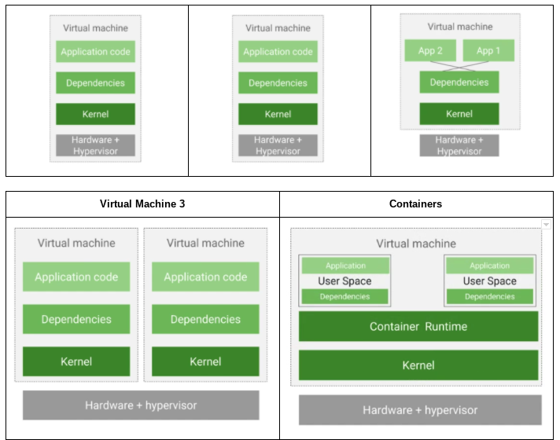

Why do developers like containers?

- Containers are application-centric ways to deliver high performing and scalable applications.
- Containers allow developers to make assumptions about underlying hardware/software.
- Containers allow incremental changes to applications.
- Containers allow microservice design-pattern.

Image = Application + Dependencies
A container is a running instance of an image.

By building software in container images, developers can easily package an application w/o worrying about the system it will be running on.

### 3.3. Containers and Container Images

You need software to build images and run them. Docker does both. Docker is an open-source technology that allows us to create and run apps in containers. Docker does not allow a way to orchestrate those applications at scale as Kubernetes does. We will use Cloud Build to create Docker formatted images.

Containers use a varied set of Linux technologies:

- Linux Processes
- Linux namespaces
- cgroups
- Union file systems

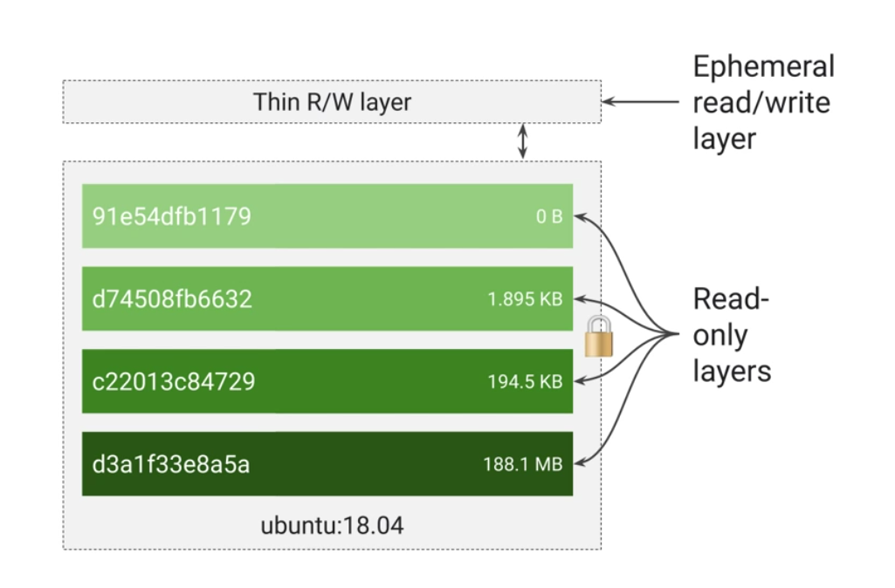

A container image is structured in layers.  

The tool you use to build the image reads instructions from a file called the Container manifest. In the case of a Docker formatted containers image that is called a Docker file.
Each instruction in the Docker file specifies a layer inside the container image. Each layer is read-only.

When a container runs from this image, it will also have a writable ephemeral top-most layer.

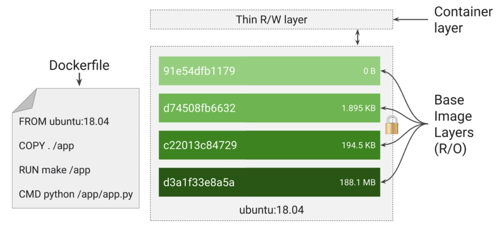

Dockerfile will contain four commands, each creates a layer:

- FROM ubuntu 18.04 - base layer, from public repo
- COPY . /app - 2nd layer from build tools directory
- RUN make /app - builds your application, puts the result in 3rd layer
- CMD python /app/app.py - specifies what command to run, when launched

Each layer is only a set of differences from the layer before it. When you write a Dockerfile, you should organize the layers least likely to change through to the layers most likely to change.

#### 3.3.1 Multi-build process

These days the best practice is not to build your application in the very same container that you ship and run. After all, your build tools are at best just clatter in a deployed container and at worst are an additional attack surface. Today, application packaging relies on a multi-stage build process, in which one container builds the final executable image and a separate container receives only what is needed to run the application.

The tools that we use support this practice. When you launch a new container from an image, the container runtime adds a new writeable layer on top of the underlying layers. This layer is often called the Container layer. All changes made to the running container, such as:

- writing new files
- modifying existing files
- and deleting files

are written to this thin writeable Container layer and are ephemeral. When the container is deleted the contents of this Container layer are lost forever. The underlying container image itself remains unchanged. This fact about containers has an implication for your application design. Whenever you want to store data permanently, you must do so somewhere other than a running container image.

#### 3.3.2 Structure of layers

Because each container has a writable Container layer, and all changes are stored in this layer, multiple containers can share access to the same image and yet have their separate data state.

Because each layer is just a set of differences from the previous layer, you get smaller images. For example:

- base application image = 200 MB
- The difference to the next point is only 200 KB.

When you build a container, instead of copying the whole image, it creates a layer with just the differences. When you run a container, the container runtime pulls down the layers it needs. When you update, you only need to copy the difference. This is much faster than running a new VM.

#### 3.3.3 How can you get containers

It is very common to use publicly available open-source container images as a base for your images or un-modified use. For example, you already saw an Ubuntu container image, which provides an Ubuntu Linux environment inside of a container. Alpine is a popular Linux environment in a container, noted for being very, very small. Nginx web server is frequently used in container packaging.

Google maintains a Container Registry, which contains many public open-source images and GCP customers use it to store their private images in a way that integrates well with Cloud IAM, which restricts the access to your private images in your project.

#### 3.3.4 How can you build containers

The open-source Docker command is a popular way to build your container images. This command is widely known and widely available. Google provides a managed service for building containers that are also integrated with Cloud IAM. This service is called Cloud Build.

Cloud Build can retrieve the source code from a variety of different sources:

- Cloud Storage
- git repository
- Cloud Source Repositories

To generate a build with Cloud Build, you define a series of steps. For example, you can configure build steps to:

- fetch dependencies
- compile source code,
- run integration tests
- use additional tools like Maven

Each build step in Cloud Build runs in a Docker container.

Then Cloud Build can deliver your images to various execution environments:

- Cloud Functions
- GKE
- App engine

### 3.4. Lab: Working with Cloud Build

- Use Cloud Build to build and push containers
- Use Container Registry to store and deploy containers

#### 3.4.1 Confirm that needed APIs are enabled

- Navigation menu -> APIs & Services -> Library -> Search for APIs & Services
- Cloud Build - If you do not see a message confirming that the Cloud Build API is enabled, click the ENABLE button
- Container Registry - If you do not see a message confirming that the Cloud Build API is enabled, click the ENABLE button

#### 3.4.2 Building Containers with DockerFile and Cloud Build

- `nano quickstart.sh`

```shell
# quickstart.sh

#!/bin/sh

echo "Hello, world! The time is $(date)."
```

- `nano Dockerfile`

```DOCKERFILE
# Dockerfile

FROM alpine
COPY quickstart.sh /
CMD ["/quickstart.sh"]
```

- `chmod +x quickstart.sh`

To build a Docker container image in Cloud build:

- `gcloud builds submit --tag gcr.io/${GOOGLE_CLOUD_PROJECT}/quickstart-image .`

When the build completes, your Docker image is built and pushed to the Container Registry:

- Navigation menu -> Tools ->  Container Registry -> Images

#### 3.4.3 Building Containers with a build configuration file and Cloud Build

```shell
git clone https://github.com/GoogleCloudPlatformTraining/training-data-analyst
cd ~/training-data-analyst/courses/ak8s/02_Cloud_Build/a
cat cloudbuild.yaml
```

```YAML
# cloudbuild.yaml
steps:
- name: 'gcr.io/cloud-builders/docker'
  args: [ 'build', '-t', 'gcr.io/$PROJECT_ID/quickstart-image', '.' ]
images:
- 'gcr.io/$PROJECT_ID/quickstart-image'
```

This file instructs Cloud Build to use Docker to build an image using the Dockerfile specification in the current local directory, and tag it with gcr.io/\$PROJECT_ID/quickstart-image ($PROJECT_ID is a substitution variable automatically populated by Cloud Build with the project ID of the associated project) and then push that image to Container Registry.

Update the version of the image:

- `gcloud builds submit --config cloudbuild.yaml .`
- Navigation menu -> Container Registry -> Images -> quickstart-image

#### 3.4.4 Building and Testing Containers with a build configuration file and Cloud Build

The true power of custom build configuration files is their ability to perform other actions, in parallel or in sequence, in addition to simply building containers:

- running tests on your newly built containers
- pushing them to various destinations
- and even deploying them to Kubernetes Engine.

In this lab, we will see a simple example: a build configuration file that tests the container it built and reports the result to its calling environment.

```shell
cd ~/training-data-analyst/courses/ak8s/02_Cloud_Build/b
cat cloudbuild.yaml
```

```YAML
# cloudbuild.yaml

steps:
- name: 'gcr.io/cloud-builders/docker'
  args: [ 'build', '-t', 'gcr.io/$PROJECT_ID/quickstart-image', '.' ]
- name: 'gcr.io/$PROJECT_ID/quickstart-image'
  args: ['fail']
images:
- 'gcr.io/$PROJECT_ID/quickstart-image
```

In addition to its previous actions, this build configuration file runs the quickstart-image it has created. In this task, the quickstart.sh script has been modified so that it simulates a test failure when an argument ['fail'] is passed to it.

- `gcloud builds submit --config cloudbuild.yaml .`
- `ERROR: (gcloud.builds.submit) build f3e94c28-fba4-4012-a419-48e90fca7491 completed with status "FAILURE"`

### 3.5. Introduction to Kubernetes

You've embraced containers, but managing them at scale is a challenge. What can you do to better manage your container infrastructure?

Kubernetes is an open-source platform that helps you orchestrate and manage your container infrastructure on-prem or in the cloud.

What is Kubernetes?

It is a container-centric management environment:

- **Open-source**
- **Automation** of deployment, scaling, load balancing, logging, monitoring, etc, PaaS solutions
- **Container management**
- **Declarative configurations** (how it should be, not what to do), saves you work
- **Imperative configuration**, if needed

Kubernetes Features:

- Supports both stateless and stateful applications
- Autoscaling
- Resource limits
- Extensibility
- Portability

### 3.6. Introduction to Google Kubernetes Engine (GKE)

Google Cloud's managed service offering for Kubernetes is called Google Kubernetes Engine by GKE. Kubernetes is powerful, but it is a full-time job managing the infrastructure.

Is there a managed service for Kubernetes within GCP?
Yes! Google Kubernetes Engine. It will help you:

- deploy
- manage
- and scale

Kubernetes environments in GCP.

GKE features:

- GKE is fully managed, which means that you do not have to provision underlying resources.
- Container-optimized OS, scale quickly and with minimal resource footprint
- Auto-upgrade
- Auto repair, with health checks
- Cluster scaling
- Seamless integration with containers (Cloud Build and Container Registry)
- integration with IAM
- Integration with Stackdriver (logging and monitoring)
- Integrated networking
- GCP Console as a dashboard for Kubernetes

When you use GKE, you start by directing the service to instantiate a Kubernetes system for you. This system is called a cluster.
The VMs that host your containers inside a GKE cluster are called nodes.

### 3.7. GCP Computing Options

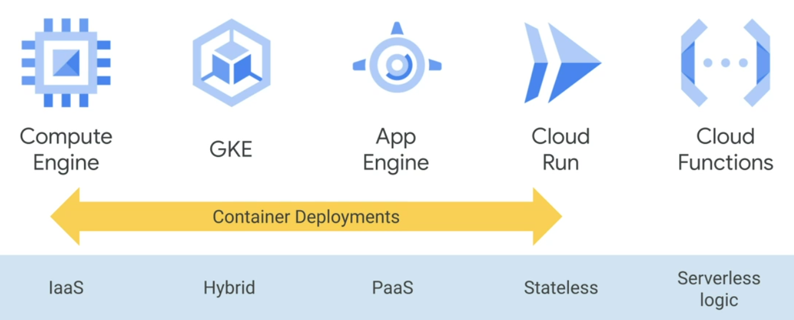

#### 3.7.1. Compute Engine

- Fully customizable virtual machines
- persistent disks and optional local SSDs
- Global load balancing and autoscaling
- Per-second billing, for batch processing jobs

Compute Engine use cases:

- Complete control over the OS and virtual hardware
- Well suited for lift-and-shift migrations to the cloud
- Most flexible compute solution, often used when a managed
- solution is too restrictive

#### 3.7.2. Google Kubernetes Engine

- Fully managed Kubernetes platform
- Supports cluster scaling, persistent disks, automated upgrades, and auto node repairs
- Built-in integrations with GCP services
- Portability across multiple environments
- hybrid computing
- multi-cloud computing

Google Kubernetes Engine use cases:

- Containerized applications
- Cloud-native distributed systems
- Hybrid applications

#### 3.7.3. App Engine

- Fully managed, code-first platform
- Streamlines application deployment and scalability
- Provides support for popular programming languages and application runtimes
- Supports integrated monitoring, logging, and diagnostics
- Simplifies version control, canary testing, and rollbacks

App Engine use cases:

- Websites
- Mobile app and gaming backends
- RESTful APIs

#### 3.7.4. Cloud Run

- Enables stateless containers
- Abstracts away infrastructure management
- Automatically scales up and down
- Open API and runtime environment

Cloud Run use cases:

- Deploy stateless containers that listen for requests or events
- Build applications in any language using any frameworks and tools

#### 3.7.5. Cloud Functions

- Event-driven, serverless compute service, simple single-purpose functions
- Automatic scaling with highly available and fault-tolerant design
- Charges apply only when your code runs
- Triggered based on events in GCP services, HTTP endpoints, and Firebase

Cloud Functions use cases:

- Supporting microservice architecture
- Serverless application backends
  - Mobile and IoT backends
  - Integrate with third-party services and APIs
- Intelligent applications
  - Virtual assistants and chatbots
  - video and image analysis

#### 3.7.6. Which Compute service should you adopt?

A lot depends on where you are coming from:

- If you are running applications on physical server hardware, it will be that path of least resistance to move the Compute Engine.
- If you are running applications in long-lived VMs in which each machine is managed and maintained in this case also moving into Compute Engine is the quickest solution.
- What if you do not want to think about operations at all? App Engine and Cloud Functions are good choices.
- Compute Engine, Application Engine, GKE, Cloud run can launch containers for you:
  - Container -> Compute Engine -> VM based on container
  - Container -> Application Engine Flex -> Fully Managed no-ops environment
  - Cloud Run to run stateless containers on a Managed Compute Platform.
- More Control than Application Engine & more dense packaging than Compute Engine? That is what GKE is designed to address! Using Kubernetes as a managed service from GKE saves you work and lets you benefit from other GCP resources.

## 4. Kubernetes Architecture

### 4.1. Introduction

- How does Kubernetes expect you to tell what to do?
- What choices do you have for describing your workloads?

Lean how to:

- Understand K8s objects and the Kubernetes control plane
- Deploy a Kubernetes cluster using Google Kubernetes Engine (GKE)
- Deploy Pods to a GKE cluster
- View and manage Kubernetes objects

### 4.2. Kubernetes Concepts

We will lay-out fundamental components of the Kubernetes operating philosophy. To understand how Kubernetes work, there are two related concepts, that you have to understand:

1. **Kubernetes Object model** - each thing Kubernetes manages is represented by an object, and you can view and change these object's attributes and state.
2. **Principle of declarative management** - Kubernetes expects you to tell what the expected state of objects under it's management should be. It will work to bring that state into being and keep it there.

**Kubernetes Object** - Persistent entity representing the state of something running in the cluster, it's desired state and current state. Various kinds of objects represent the containerized applications, the resources that are available to them and the policies that affect their behavior.

Kubernetes objects have two important elements:

- **Object spec** - desired state described by us
- **Object status** - current state described by Kubernetes

#### 4.2.1 Kubernetes Control Plane

**Kubernetes Control Plane** - to refer to the various system processes, that collaborate to make a Kubernetes cluster work.

Each object is of the certain type or kind, as Kubernetes calls them.

#### 4.2.2 Pod

Pods are the basic building block of the standard Kubernetes model and are the smallest deployable Kubernetes object.

Why not the container?
Every running container in a Kubernetes system is in a Pod. A Pod embodies the environment, where the containers live and that environment can accommodate one or more containers. If there is more than one container in a pod, they are tightly coupled and share resources, including networking and storage.

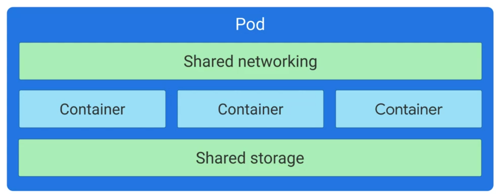

Kubernetes assigns each Pod an unique IP address. Every container within a Pod shares the network name space, including IP address and network ports. Containers within the same pod can communicate through localhost - 127.0.0.1 A Pod can also specify a set of storage volumes to be shared among its containers.

#### Example: three nginx containers

- Declare objects that represent those containers, most probably pods
- Kubernetes launches those objects and maintains them
- BUT Pods are not self healing, so we might use  more sophisticated kind of object (pod 2.0)?

- Lets suppose we have given a Kubernetes a desired state (thee nginx pods, always kept running), we did this by telling Kubernetes to create and maintain one or more objects, that represent them.
- Now Kubernetes compares the desired state from the current state.
- Let's imagine that declaration of 3 nginx containers is completely new, the current state does not match the desired state.
- So Kubernetes, specifically its Control Plane will remedy the situation, so three nginx pods will be launched. And Kubernetes Control Plane will continuously monitor the state of the cluster.

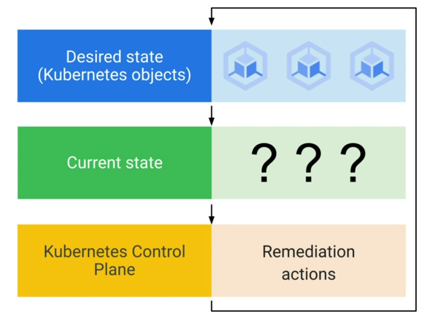

### 4.3. The Kubernetes Control Plane

Kubernetes Control Plane is a fleet of co-operating processes, that make a Kubernetes cluster work. Even though you will fork directly with only few of these components, it helps to know about them and role, each plays.

We will build Kubernetes Cluster part by part, explaining each peace. After that we will look how a Kubernetes cluster running in GKE is a lot less work to manage than the one you provision yourself.

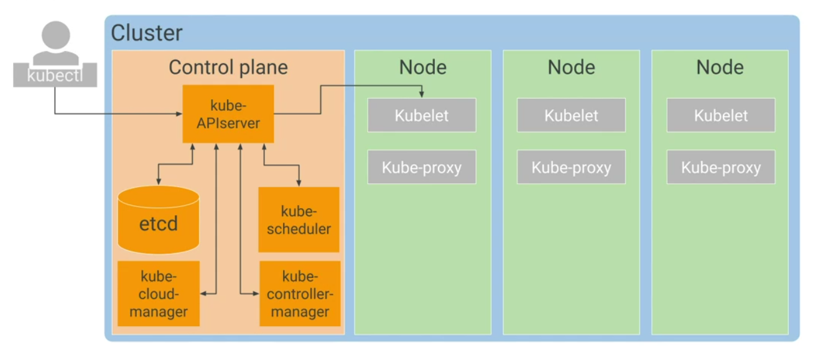

First and fore most, your cluster needs a computer. One is called the Control Plane and others are called Nodes:

- The job of the Nodes is to run Pods.
- The job of the Control Plane is to coordinate the entire Cluster.

#### Control Plane

We will have  a look at its control components first. Several critical Kubernetes components run on the Control Plane.

#### kubeAPIserver

The single component that you interact directly is the kubeAPIserver, this components job is to accept commands that view of change the state of the Cluster, including launching Pods.
In this specialization you will use *kubectl* command frequently. This commands job is to connect to kubeAPIserver and communicate with it using Kubernetes API. KubeAPIserver also authenticates incoming requests, determines whether they are authorized, invalid and manages admission control. But it is not just kubectl that talks with kubeAPIserver. Any query or change to the cluster's state must must be addressed to the kubeAPIserver.

#### etcd

etcd is the cluster's database. It's job is to reliably store the state of the cluster. It includes all the cluster's configuration data and more dynamic information, such as what nodes are part of the cluster, what pods should be running and where they should be running. You never interact directly with etcd, instead kubeAPIserver interacts with the database on behalf of the rest of the system.

#### kube-schedule

kube-scheduler is responsible for scheduling Pods onto the Nodes. To do that it evaluates the requirements of each individual pod and selects which node is the most suitable. But, it does not do the work of actually launching the pods onto the nodes.
Instead, whenever it discovers a pod object that does not yet have an assignment to a node, it chooses a node and writes the name of the node into the pod object. Another components of the system is then responsible for then launching the pods.

How does a kube-scheduler decides where to run a pod?

It knows the state of all the nodes and it will also obey the constraints that you define, on where a pod may run, based on hardware, software and policies:

- For example: you might specify that a certain pod is only allowed to run on a nodes with certain amount of memory.
- For example: you can also define affinity specifications, which cause groups of pods to prefer running on the same node OR anti-affinity specifications, which ensure that pods no not run on the same node

#### kube-controller-manager

kube-controller-manager continuously monitors the state of the cluster through kubeAPIserver. Whenever the current state of the cluster does not match the desired state, kube-controller-manager will attempt to make changes to achieve the desired state. It is called the controller manager, because many Kubernetes objects are managed by code called controllers. These loops of code handle the process of remediation. Controllers will be very useful to you - you will use certain kinds of Kubernetes controllers to manage workloads.

For example: to keep tree nginx pods always running? We can gather them together into a controller object called a Deployment, that not only keeps them running, but also lets us scale them and bring them together underneath a frontend. More on deployments later in this module.

#### other controllers

Other kinds of controllers have system level responsibilities. For example:

- node-controllers - monitor and respond when a node is offline.
- kube-cloud-manager - manages controllers that interact with underlying cloud providers. For example: if you manually launched a Kubernetes cluster on GCP, kube-cloud-manager would be responsible for bringing in GCP features, like load-balances and storage volumes, when you needed them.

#### node

Each node runs a small family of control-plane components too.

#### Kubelet

Each Node runs a Kubelet - a Kubernetes agent on each node. When a kubeAPIserver wants to start a pod on a node, it connects to that node's Kubelet. Kubelet uses the container runtime to start the pod and monitors its lifecycle, including readiness and liveness probes and reports back to kubeAPIserver.

#### Container runtime

Container runtime - software that knows how to launch a containers from a container image. Kubernetes offer several choices of container runtimes, but the Linux distribution that GKE uses for its nodes, launches containers using *containerd*, the runtime component of Docker.

#### Kube-proxy

Kube-proxy job is to maintain network connectivity among the pods in the cluster. In open-source Kubernetes it does so using the firewall  capabilities of IP tables, which are built into the Linux kernel. Later we will learn how GKE handles pod networking.

### 4.4. Google Kubernetes Engine Concepts

Setting up a Kubernetes cluster by hand is tons of work. Fortunately, there is an open-source command called kubeamd, that can automate initial setup of a cluster. BUT if a node fails or needs maintenance, human admin had to respond manually.

How does this picture we saw earlier differs for GKE?

#### Control Plane in GKE

GKE manages all of the control-plane components for us. It still exposes an IP address, to which we send all of our Kubernetes API requests. But GKE takes responsibility for provisioning and managing ALL of the master infrastructure behind it.
It also abstracts away having a separate control plane.The responsibilities of Master are observed by GCP and you are not separately billed for your control plane.

#### Nodes in GKE

In any Kubernetes environment, Kubernetes does not create nodes. Nodes are created externally by cluster admins, who  add them to Kubernetes.

GKE automates this for you by deploying and registering Compute Engine instances as nodes.
You can manage node setting directly from the GCP Console.
You pay per hour of life of your nodes, not counting the control plane.

Because nodes run on Compute engine, you choose your node machine type, when you create your cluster, default n1-standard-1.
You can choose a baseline minimum CPU platform for the Nodes or Node pool.

#### Node pools

You can also select multiple node machine types, by creating multiple Node Pools. A node pool is a subset of nodes within a cluster that share a configuration, such as their amount of memory or their CPU generation. Node pools also provide an easy way to enure that workloads run on the right hardware within your cluster, you just label them with the desired node pool.

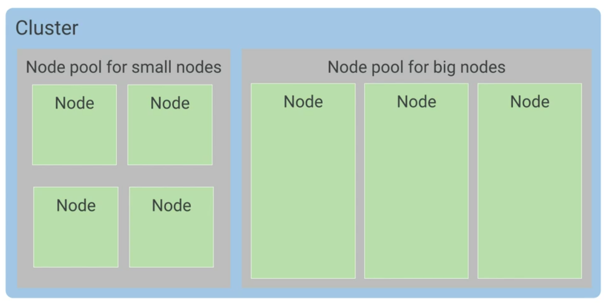

Node pools are GKE feature rather than a Kubernetes feature. You can build a similar feature with open-source Kubernetes, but  you would have to maintain it yourself.

You can enable automatic node upgrades, automatic node repairs and cluster autoscaling at this node pool level.
Some of each node's CPU and memory are needed to run GKE and kubernetes components that let it work as part you your cluster.
So, if you allocate nodes with 15 GB of memory, not quite all of that 15 GB will be available for use by pods.

#### Zonal vs. Regional Cluster

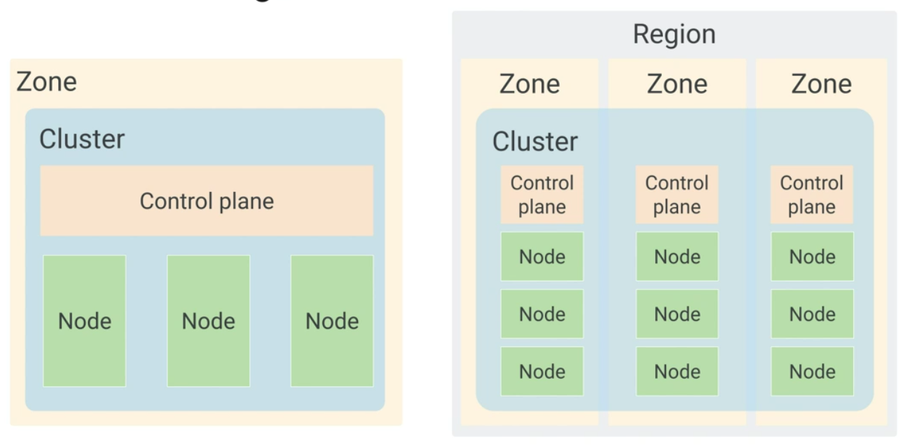

By default a cluster launches in a single GCE zone. With three identical nodes all in one node pool. Nr. of nodes can be changed, during or after the creation of the cluster. Adding more nodes and deploying multiple replicas will improve applications availability, but only up to a point.

Regional clusters have a singular API endpoint for the cluster, however it's control planes and nodes are spread out across multiple GCE zones within a region. Regional clusters ensure that the availability of the application is maintained across multiple zones in single region. In addition, the availability of the control plane is also maintained, so both the app and management functionality is maintained.
By default, regional cluster is spread across three zones, each containing one control plane and three nodes.

Regional Cluster can not be converted to zonal cluster and vice-versa.

#### Private cluster

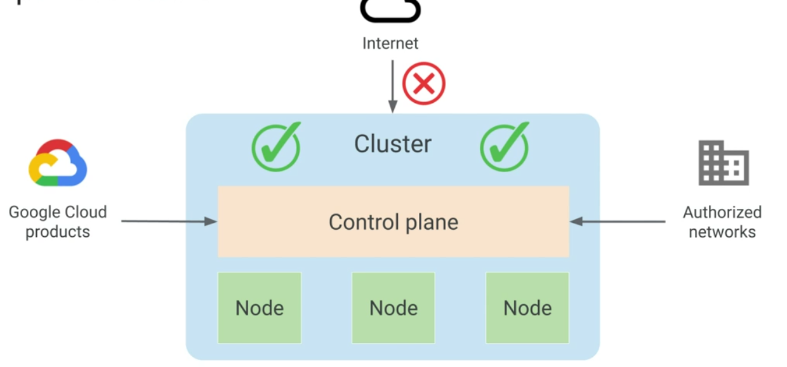

A cluster can be set as a private cluster. The entire cluster is hidden from public internet. Cluster control plane could be access by GCP Products, through internal IP address or through authorized networks via external IP address. Authorized networks are IP address ranges, that are trusted to access the control plane.

### 4.5. Kubernetes Object Management

All Kubernetes objects are identified by an unique name and unique identifier.

Example: three nginx containers running all the time.

How wo we create Pods for these containers?

Declare three pods objects and specify their state: for each a pod must be created and nginx container must be used.

You define objects you want Kubernetes to create and maintain with manifest files. These are ordinary text files, you may write them in YAML or JSON. YAML ir more human readable and less tedious to edit.

You should have YAML files in version controlled repositories.

```YAML
apiVersion: apps/v1
kind: Pod
metadata:
  name: nginx
  labels:
    app: nginx
spec:
  containers:
  - name: nginx
    image: nginx:latest
```

- apiVersion - describes which Kubernetes API version is used to create the object.
- kind - defines the object you want, in this case a Pod
- metadata - helps to identify the object using name and label.
- name - names must be unique for pods, only one object of particular kind can have a particular name at the same time in Kubernetes name space (max. char length = 253).Each object generated throughout the life of a cluster has a unique ID generated by Kubernetes. No two object will have the same UID.
- labels - key-value pairs, with which you tag your objects during of after their creation. Labels help you identify and organize the objects. For example:
  - key-value
  - app: nginx

```YAML
apiVersion: apps/v1
kind: Deployment
metadata:
  name: nginx
  labels:
    app: nginx
    env: dev
    stack: frontend
spec:
  replicas: 3
  selector:
    matchLabels
    app: nginx
```

```Shell
# you can select pods by the label
kubectl get pods -selector=app=nginx
```

#### Pods have a life cycle

So one way to bring three nginx servers into being would be to declare 3 pod objects, each with its own section of YAML.Kubernetes default scheduling algorithm prefers to spread the workload evenly across the nodes available. So we would get three running nodes with one pod in each.

The downsides of executing this manually is at least two:

- If you would want 200 instances of nginx, there should be a better way of defining pod objects.
- Also pods do not heal or repair themselves, and they are not meant to run forever. They are designed to be ephemeral, and disposable.

#### Pods vs. Controller Object, like Deployment

For these reasons, there are better ways to manage what you run on Kubernetes than specifying individual pods.

So how do you tell Kubernetes to maintain the desired state of three nginx containers?

We can instead declare a Controller Object, whose job is to manage the state of the pods.

Controller Object:

- nginx Pod
- nginx Pod
- nginx Pod

Controller Object Type:

- Deployments
- StatefulSet
- DeamonSet
- Job

#### Deployments

Deployments are great choice for long-lived software components, like web-servers, especially when we want to manage them as a group.
When kube-scheduler schedules pods for a deployment, it notifies the kubeAPIserver. These changes are constantly monitored by controllers, especially by the deployment controller. The deployment controller will maintain 3 nginx pods. If one of those pods fails, the deployment controller will recognize the difference b/w the current state and the desired state and will try to fix it by launching new pod.

Instead of using multiple yaml manifests, or files for each pod, you used a single deployment yaml to launch three replicas of the same container.

```YAML
apiVersion: apps/v1
kind: Deployment
metadata:
  name: nginx-deployment
  labels:
    app: nginx
spec:
  replicas: 3
  template:
    metadata:
      labels:
        app: nginx
    spec:
      containers:
      - name: nginx
        image: nginx:latest
```

A deployment ensures that a defined set of pods is running at any given time. Within it's object spec, you specify how many replica pods you want, how pods should run, which containers should run within these pods, and which volumes should be mounted.

Based on these templates, controllers maintain the pod's desired state within the cluster.

Deployments can do much more than this. You will see that later in the course.

#### Allocating resource quotas

Multiple projects run on a single cluster.
How can I allocate resource quota?
How do you keep everyone's work on cluster organized?

#### Namespace

Kubernetes allows you to abstract the physical cluster into several clusters using namespaces. Namespaces provide scope for naming resources, such as pods, deployments and controllers.

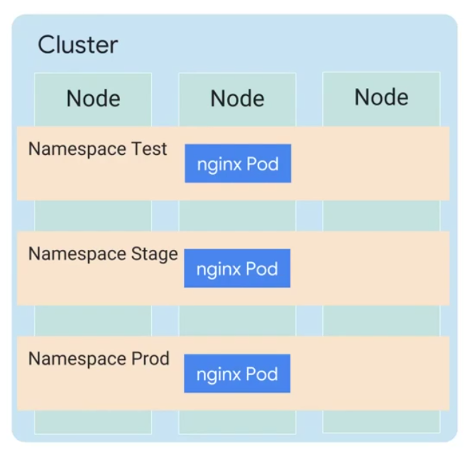

In this example, there are three namespaces in this cluster:

You cannot have duplicate object names in the same namespace. You can create 3 pods with the same name nginx Prod in different namespaces.

Namespaces also let's you implement resource quotas across the cluster. These quotas define limits for the resource consumption within a namespace. You are not required to use namespaces for your day-to-day management, you can also use labels. Still namespaces are a valuable tool.

Suppose, you want to spin up a copy of deployment as a quick test. Doing so in a new namespace makes it easy and free of name collisions.

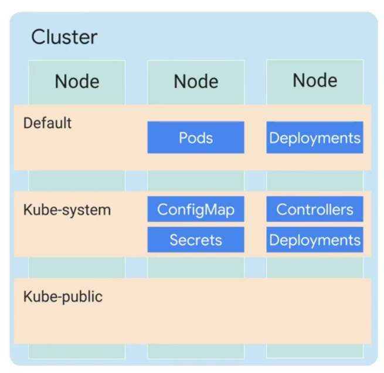

There are thee initial namespaces in a cluster:

- Default - for object with no namespace defined
- Kube-system - for objects created by Kubernetes systems itself
- Kube-public - objects that are publicly readable to all users

#### Best practice tip: namespace-neutral YAML

```shell
kubectl -n demo apply -f mypod.yaml
```

```yaml
apiVersion: apps/v1
kind: Pod
metadata:
  name: mypod
  namespaces: demo
```

### 4.6. Lab: AK8S-03 Creating a GKE Cluster via GCP Console

- Use the GCP Console to build and manipulate GKE clusters
- Use the GCP Console to deploy a Pod
- Use the GCP Console to examine the cluster and Pods

#### 4.6.1. Deploy GKE clusters

Use the GCP Console to deploy a GKE cluster:

- Navigation menu-> Kubernetes Engine -> Clusters
- Create cluster
- name: standard-cluster-1
- zone: us-central1-a
- Create
- Kubernetes Engine > Clusters
- Click the cluster name standard-cluster-1 to view the cluster details
- Click the Storage and Nodes tabs

 Modify GKE clusters:

- Navigation menu-> Kubernetes Engine -> Clusters
- standard-cluster-1
- Edit
- Node Pools -> default-pool ->  Edit ->  change the number of nodes in the default pool from 3 to 4
- Save

#### 4.6.2. Deploy a sample workload

- Navigation menu ->  Kubernetes Engine -> Workloads
- Deploy
- Continue, to accept the default container image, nginx.latest
- Deploy

#### 4.6.3.  View details about workloads in the GCP Console

- Navigation menu ->  Kubernetes Engine -> Workloads
- Kubernetes Engine -> Workloads page -> nginx-1.
- Overview ->  Managed Pods ->   of one of the Pods to view the details page for that Pod - provides information on the Pod configuration and resource utilization and the node where the Pod is running
- Details -  shows more details about the workload including the Pod specification, number and status of Pod replicas and details about the horizontal Pod autoscaler
- Revision History - displays a list of the revisions that have been made to this workload.
- Events - lists events associated with this workload
- YAML - provides the complete YAML file that defines this components and full configuration of this sample workload
