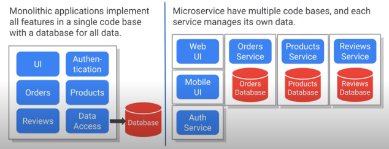
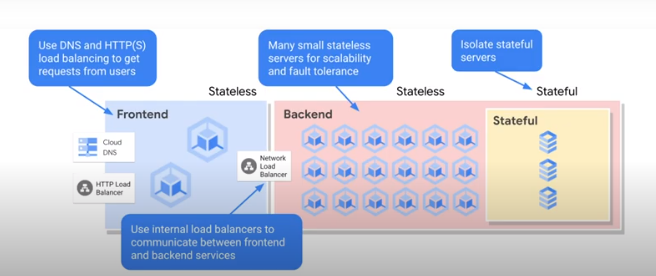
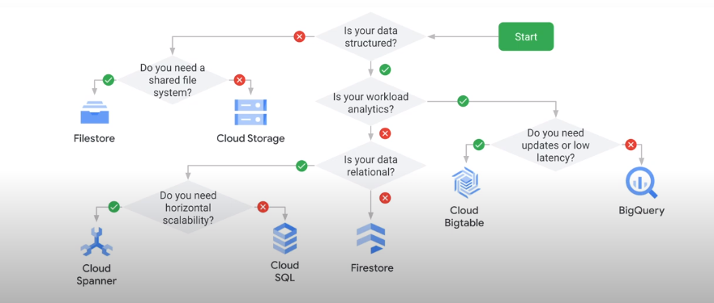

# 5. Reliable Google Cloud Infrastructure: Design and Process

## Table of Contents

1. Introduction
2. Defining Services
3. Microservice Design and Architecture
4. DevOps Automation
5. Choosing Storage Solutions
6. Google Cloud and Hybrid Network Architecture
7. Deploying Applications to Google Cloud
8. Designing Reliable Systems
9. Security
10. Maintenance and Monitoring
11. Course Resources

## 1. Introduction

This course is not about implementing specific cloud features, it's about architecture design and process.

Define in your case study:

- Description
- Features
- Users

## 2. Defining Services

User stories - describe a feature from the user's point of view. (As an xxx, I want to xxx so ...)

### 2.1. Requirements, Analysis, and Design

Who:

- who are the users
- who are the devs
- who are the stakeholders

What:

- what does the system do
- what are the main features

Why:

- why is the system needed?

When:

- when does the user need and/or want the solution?
- when can the developers be done?

How:

- how will the system work?
- How many users?
- How much data will there be?

Define in your case study:

- Write personas for each role
- Write user stories for each feature

### 2.2. SLOs, SLIs, and SLAs

KPIs = metrics that can be used to measure success. Must be measurable!!!

KPI != Goal:

- Goal = Outcome you want to achieve
- KPI = metric that indicates if you are on track to achieve the metrics

- SLI = Service Level Indicator = KPI (The latency of successful HTTP responses HTTP-200)
- SLO = Service Level Objective = Goal (The latency of 99% of the responses must be < 200 ms)
- SLA = Service Level Agreements = More restrictive version of the SLO (The user is compensated if 99th percentile exceeds 300 ms)

## 3. Microservice Design and Architecture

### 3.1. Microservices

Microservices divide a large program into multiple smaller, independent services.

Microservices pros:

- Easier to develop and maintain
- A reduced risk when deploying new versions
- Services scale independently to optimize the use of infrastructure
- Faster to innovate and add new features
- Can use different languages and frameworks for different services
- Choose the runtime appropriate to each service

Microservices cons:

- Increased complexity when communicating b/w services
- Increased latency across service boundaries
- Concerns about securing inter-service traffic
- Multiple deployments
- Need to ensure that you do not break clients as versions change
- Must maintain backward compatibility with clients as the microservices evolve.

The key difference between **stateful** and **stateless** microservices is that:

- stateless microservices don’t store data on the host, whereas
- stateful microservices require some kind of storage on the host who serves the requests.

### 3.2. Microservices 12-factor app

1. Codebase:
    - one codebase tracked in version control, many deploys
    - track each app in a separate repo
2. Dependencies:
    - explicitly declare and isolate dependencies
    - declare dependencies and use a package manager to install dependencies
3. Config:
    - store config in the environment
    - do not put secrets in the source code, use env. variables instead
4. Backing services:
    - treat backing services as attached resources
    - databases, cache, etc are accessed via URLs
5. Build, Release, Run:
    - strictly separate build and run stages
    - build = deployment package from the source code; release = deployment package + config; run = executes the app
6. Processes:
    - execute the app as one or more stateless processes
    - each instance of the app gets its data from a separate DB service
7. Port Binding:
    - expose services via port binding
    - apps are self-contained and expose a port & protocol internally.
8. Concurrency:
    - scale-out via the process model
    - as apps are self-contained and run in separate processes, they scale easily by adding instances.
9. Disposability:
    - maximize robustness with fast startup and graceful shutdown
    - if an instance is not needed, you should be able to turn it off with no side effects
10. Dev/Prod Parity:
    - keep dev/staging/prod as simple as possible
    - leverage IaC and containers to make environments easier to use
11. Logs:
    - treat logs as event streams
    - write log msgs to STOUT and aggregate logs to a single source
12. Admin processes:
    - run admin/mgmt tasks as repeatable processes, not one-off manual tasks
    - admin tasks should not be part of the application

### 3.3. REST

Services communicate via HTTPS using text-based payloads:

- client makes GET, POST, PUT, or DELETE request
- body of the request is formatted as JSON or XML
- response is returned as JSON, XML or HTML

REST = Representational State Transfer:

- protocol-independent: HTTP, gRPC
- service endpoints supporting REST are called RESTful
- client/server communicate with Request/Response processing

RESTful services communicate over the web using HTTPS:

- URIs (or endpoints) identify resources
- REST apps provide consistent, uniform interfaces
- caching of immutable representations is appropriate

### 3.4. APIs

It is important to design consistent APIs for services. OpenAPI is an industry-standard for exposing APIs to clients:

- standard interface description format for the rest APIs
- allows tools and humans to understand how to use service w/o needing its source code

## 4. DevOps Automation

### 4.1. CI Pipelines

1. Developers check-in code:
    - Use a Git repo for each microservice and branches for versions
2. Run unit tests:
    - if the tests do not pass, stop
3. Build deployment package:
    - Create Docker image
4. Deploy:
    - Save your new Docker image in a container registry

Cloud Source Repo:
    - provides managed Git Repos
    - developers push to a central repo when they want a build to occur
Cloud Build:
    - Google-hosted Docker build service, an alternative to using Docker build command.
    - build system executes the steps required to make a deployment package or Docker image
Build triggers:
    - watch a repo and build a container whenever code is pushed (Maven, custom builds, and Docker)
    - watches the changes in the Git repo and starts the build
Container Registry:
    - Google-cloud hosted Docker Repo
    - Store your docker images or deployment packages in a central location for deployment

### 4.2. IaC

In the cloud, all infrastructure needs to be disposable. IaC allows for the quick provisioning and removing of infra:

- build an infra when needed
- destroy the infra when not in use
- create identical infra for dev/test/prod
- can be part of CI/CD
- templates are the building blocks for disaster recovery (DR)
- manage resource dependencies and complexity

Deployment Manager if Google Cloud native IaC Tool:

- define infra using YAML
- can create dynamic templates using Py or Jinja
- use gcloud to create, update and delete deployments

Terraform is similar to Deployment Manager but can be used on multiple public/private clouds:

- considered as the first-class tool in Google Cloud

## 5. Choosing Storage Solutions

### 5.1. Key Storage Characteristics

1. Relational
    - Cloud SQL (up to 30 TB)
    - Cloud Spanner
2. NoSQL
    - Firestore
    - Bigtable
3. Object
    - Cloud Storage
4. Warehouse
    - BigQuery
5. In memory
    - Memorystore

Amount of data & nr of reads/writes:

1. Scales Horizontally (by adding nodes)
    - Cloud Spanner
    - Cloud Bigtable
2. Scales vertically (by making machines larger)
    - Cloud SQL
    - Memorystore
3. Scales automatically w/o limits
    - Cloud Storage
    - BigQuery
    - Firestore

Strong consistency options:

1. Strong consistency by updating all copies within a transaction:
    - Cloud Storage
    - Cloud SQL
    - Spanner
    - Firestore
2. Eventually consistent - update main and the rest async
    - Bigtable nodes
    - Memorystore replicas

### 5.2. Choosing GCP storage and data solutions

## 6. Google Cloud and Hybrid Network Architecture

### 6.1. Designing Google Cloud Networks

VPC global, subnet = regional, instances are zonal.

- Global LBs provide access to services deployed in multiple regions. HTTPS, TCP Proxy and SSL Proxy.
- Regional LBs provide access to services deployed in a single region HTTPS, TCP LB, and UDP LB.

Cloud CDN for lower latency and decreased egress cost. Caches static content worldwide using GCP edge-cashing locations.

### 6.2. Connecting Networks

- Classic VPN - low volume data connections 99.9%. HA VPN = 2 connections 99.99%. up to 3Gbps per tunnel
- VPC Network Peering
- Cloud Interconnect for GCP - from 10 to 200 Gbps

## 7. Deploying Applications to Google Cloud

### 7.1. GCP IaaS

- Compute Instance
- Instance Groups

### 7.2. GCP Deployment Platforms

- GKE
- Cloud Run
- App Engine - App -> Services -> Versions -> Instances
- Cloud Functions

## 8. Designing Reliable Systems

### 8.1. Key Performance Metrics

- Availability - the percent of the time a system is running and able to process requests
  - achieved with fault tolerance
  - use health checks
- Durability - The odds of losing data because of a hardware or system failure
  - achieved by replicating data in multiple zones
  - do regular backups
- Scalability - The ability of a system to continue to work as user load and data grows
  - use capacity autoscaling

### 8.2. Design for Reliability

- Avoid single points of failure, a spare spare N+2
- Beware of correlated failures. The group of related items that could fail together is a **failure domain** (individual zone in GCP)
  - deploy to multiple zones/regions
- Beware of cascading failures
  - use health checks + autoscale
- Positive feedback cycle overload failure
  - inteligent retry policy
  - circuit breaker design pattern
- Lazy deletion (trash -> soft deletion -> hard deletion -> backups)

### 8.3. Disaster Planning

- HA can be achieved by deploying to multiple zones in a region.
- Create a health check when creating instance groups to enable auto-healing
- If using Cloud SQL, create a failover replica for HA. Can be created in another zone in the same region. Doubles the cost of the DB.

- Recovery Point Objective - the amount of data that would be acceptable to lose (from 24 hrs for Ratings Service to 0 hrs for Orders Service (cannot lose any data))
- Recovery Time Objective - the amount of time it can take to be back up and running (from 1 hour for Rating Service to 2 minutes for Orders Service)

## 9. Security

### 9.1. Security Concepts

- Google Cloud security is a shared responsibility b/w you and Google
- Security is implemented in layers
- Principle of least privilege
- Separation of duties
  - use multiple projects to separate duties
  - different people can be given different rights in different projects
  - use folders to help organize projects
- Regularly audit the Google Cloud Logs to discover attacks
- Security Command Center provides access to org and project security configuration

### 9.2. Securing People

- To grant people access to your projects, add them as members and assign them one or more roles
- Use IAM policies to secure environments and manage resources
- Cloud IAP simplifies authorization to Google Cloud applications and VMs
- Identity Platform provides authentication as a service

### 9.3. Securing Machine Access

- Service Account can be used for machine or application identities
- Can use service accounts keys to configure the CLI - allows you to grant controlled Google Cloud access to developers w/o giving them access to the Cloud Console.

### 9.4. Network Security

- Remove external IPs to prevent access to machines outside their network (IAP to access machines, Cloud NAT to allow egress)
- private access allows access to Google Cloud services using an internal address
- control access to APIs using Cloud Endpoints
- Leverage Google Cloud network services for DDoS protection (LBs, Cloud CDN)
- Use Google Cloud Armor to create network security policies (allow list, deny list)
- Cloud Armor supports layer 7 web application firewall (WAF) rules

### 9.5. Encryption

- Google Cloud provides server-side encryption of data at rest by default
- for compliance reasons, you may need to manage your own keys - customer-supplied keys are created in your environment and provided to Google Cloud
- the Data Loss Prevention API can be used to protect sensitive data by finding it and redacting it

## 10. Maintenance and Monitoring

### 10.1. Managing Versions

- In a microservice arch. be careful not to break clients when services are updated.
- Rolling updates allow you to deploy new versions with no downtime
- use blue/green deployment when you do not wat multiple versions of a service running simultaneously.
  - blue = current version
  - green = entirely new environment
- Canary releases can be used before a rolling update to reduce the risk

### 10.2. Cost Planning

- preemptible + auto-healing to re-create VMs
- keep machines close to your data!!!
- Storage 1 GB in Firesore is free vs storing 1 GB in Bigtable ~ $ 1 400/month
- use GCP Pricing Calculator
- Billing reports provide detailed cost breakdowns, for advanced analysis, export billing data to BigQuery
- Visualize spend with Google Data Studio
- Set Budgets and alerts to one, several, or all projects
