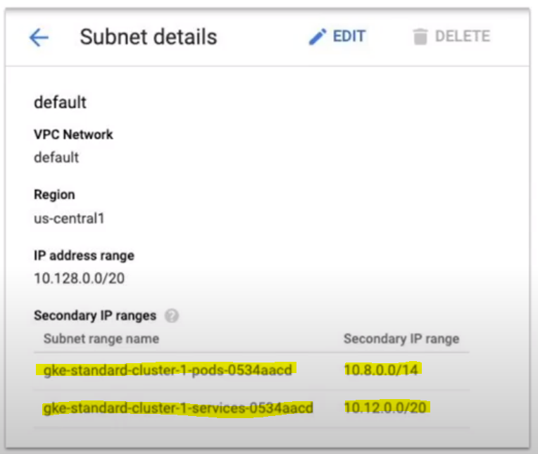
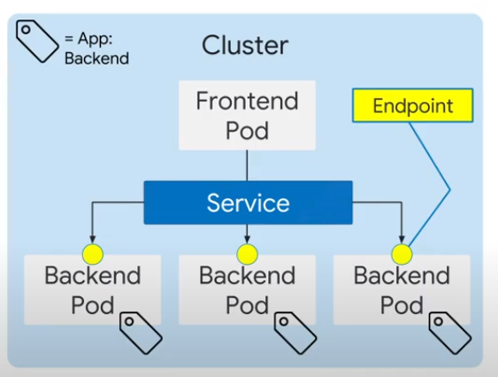
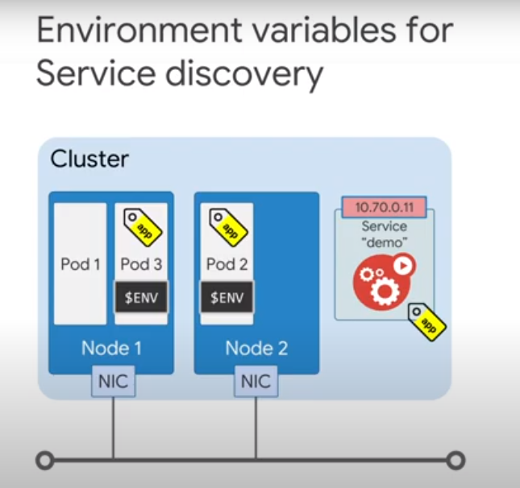
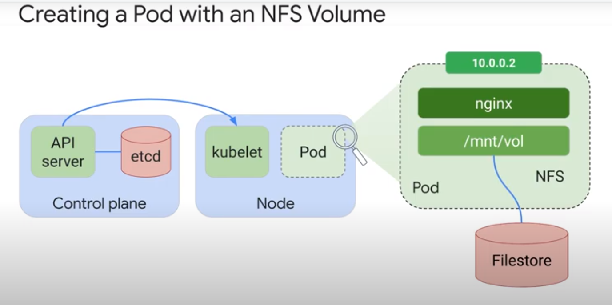
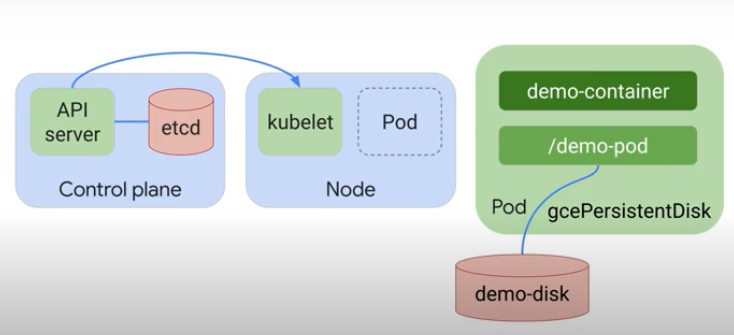
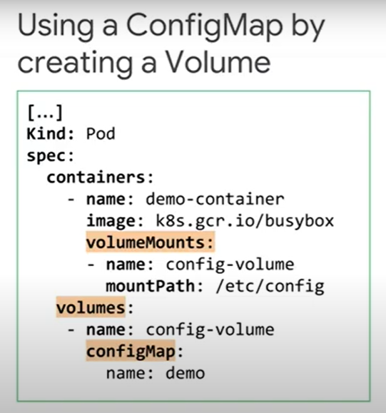

# 7. Architecting with Google Kubernetes Engine: Workloads

## Table of Contents

1. Course Introduction for Course 2
2. Kubernetes Operations
3. Deployments, Jobs, and Scaling
4. Google Kubernetes Engine (GKE) Networking
5. Persistent Data and Storage
6. Course Resources

## 1. Course Introduction for Course 2

## 2. Kubernetes Operations

### 2.1. The kubectl command

`Kubectl` is a utility used by administrators to control Kubernetes clusters. Use `kubectl` to connect to K8s Control plane via `kube-APIserver`.
`kubectl get pods` <-> `API call/response through HTTPS` <-> `kube-apiserver` <-> `etcd`.

`kubectl` stores its config in `$home/.kube/config`. Contains information about:

- cluster name, and
- credentials for the cluster.

To write configuration information into a k8s config file: `gcloud containers clusters get-credentials [CLUSTER_NAME]`

`kubectl config view`, shows you configuration information:

```YAML
apiVersion: v1
clusters:
- cluster:
    certificate-authority-data: DATA+OMITTEDv
    server: https://34.72.236.79
  name: gke_qwiklabs-gcp-02-580cf4e80427_us-central1-a_standard-cluster-1
contexts:
- context:
    cluster: gke_qwiklabs-gcp-02-580cf4e80427_us-central1-a_standard-cluster-1
    user: gke_qwiklabs-gcp-02-580cf4e80427_us-central1-a_standard-cluster-1
  name: gke_qwiklabs-gcp-02-580cf4e80427_us-central1-a_standard-cluster-1
current-context: gke_qwiklabs-gcp-02-580cf4e80427_us-central1-a_standard-cluster-1
kind: Config
preferences: {}
users:
- name: gke_qwiklabs-gcp-02-580cf4e80427_us-central1-a_standard-cluster-1
  user:
    auth-provider:
      config:
        cmd-args: config config-helper --format=json
        cmd-path: /usr/lib/google-cloud-sdk/bin/gcloud
        expiry-key: '{.credential.token_expiry}'
        token-key: '{.credential.access_token}'
      name: gcp
```

Describe the active context cluster (the cluster that `kubectl` commands manipulate): `kubectl cluster-info`. The command is also an easy way to switch the active context to a different cluster:

```sh
Kubernetes control plane is running at https://34.72.236.79
GLBCDefaultBackend is running at https://34.72.236.79/api/v1/namespaces/kube-system/services/default-http-backend:http/proxy
KubeDNS is running at https://34.72.236.79/api/v1/namespaces/kube-system/services/kube-dns:dns/proxy
Metrics-server is running at https://34.72.236.79/api/v1/namespaces/kube-system/services/https:metrics-server:/proxy
```

Show the active context cluster: `kubectl config current-context`.

Displays all cluster contexts: `kubectl config get-contexts`.

`kubectl [command] [TYPE] [NAME] [flags]`:

- `[command]` - get, describe, logs, exec
- `[TYPE]` -  pods, deployments, objects
- `[NAME]` - name of the object
- `[flags]` - `-o=yaml, o=wide`

### 2.2. Introspection

Few basic commands:

- `kubectl get pods` - returns all the pods in the cluster, and shows 1 of 6 available pod phases - pending, running, succeeded, failed, unknown, CrashLoopBackOff
- `kubectl describe pod [POD_NAME]` - provides pod and container information:
  - pod - name, namespace, node name, labels, status, IP address, etc
  - container - state (waiting, running, terminated), images, ports, commands, restart counts, etc
- `kubectl exec [POD_NAME] -- [command]` - executes commands within a pod
  - `kubectl exec demo -- ls`
  - `kubectl exec -it demo -- /bin/bash`
- `kubectl cp ~/test.html $my_nginx_pod:/usr/share/nginx/html/test.html`. This command copies the test.html file from the local home directory to the /usr/share/nginx/html directory of the first container in the nginx Pod
- `kubectl expose pod $my_nginx_pod --port 80 --type LoadBalancer`. his command creates a LoadBalancer service, which allows the nginx Pod to be accessed from internet addresses outside of the cluster.
- `kubectl logs [POD_NAME]` -  log information within the pod

## 3. Deployments, Jobs, and Scaling

In GKE and K8s containerized applications whether for applications or batch jobs are collectively called **workloads**.

Two of the main types of workloads:

- deployments (a good fit for managing a stateless application)
- jobs (Jobs represent one-off tasks, whereas CronJobs recur according to a schedule)

### 3.1. Deployments

- Deployments describe a desired state of Pods - for example, 5 Nginx servers running at all times.
- Deployments declare the state of the Pods - updating them to a newer container image - a new replicaSet is created
- Deployments allow Rollouts, Rollbacks, and autoscale, which is well suited for stateless applications, like web front-end.

Deployment process:

1. YAML.file - desired states + characteristics of the pods + how to run them + lifecycle events
2. Deployment object
3. Deployment controller
4. Node + Pod

A controller is a loop process, created by Kubernetes, that takes care of a routine task to ensure that desired state of an object or object matches the observed state.

A ReplicaSet is a controller that ensures that a certain number of Pod replicas are running at any given time.

A Deployment is a high-level controller for a Pod, that declares its state. The Deployment configures a replicaSet controller.

```YAML
# example deployment

apiVersion: apps/v1
kind: Deployment
metadata:
  name: my-app # deployment name
spec:
  replicas: 3 # nr of pods
  template:
    metadata:
      labels:
        app: my-app # label for template
    spec:
      containers:
      - name: my-app
        image: gcr.io/demo/my-app:1.0
        ports:
        - containerPort: 8080
```

3 lifecycle states of a deployment:

- progressing state
- complete state
- failed state - if an image is not available, or resources are not available, or not enough permissions for the user to execute

#### Ways to create deployments

3 ways to create a deployment:

- `kubectl apply -f [DEPLOYMENT_FILE]`
- `kubectl run [DEPLOYMENT_NAME] \ ...`
- in the GCP console

Information about deployment:

- `kubectl get deployment [DEPLOYMENT_NAME]`
- `kubectl get deployment [DEPLOYMENT_NAME] -o yaml > output.yaml`
- more detailed information about deployment: `kubectl describe deployment [DEPLOYMENT_NAME]`

#### Services and scaling

- scale deployment manually : `kubectl scale deployment [DEPLOYMENT_NAME] -replicas=[NUMBER]`
- scale deployment automatically, which creates horizontalPodAutoscaler object: `kubectl autoscale deployment [DEPLOYMENT_NAME] --min=[NR] --max=[NR] --cpu-percent=[NR]`

The default value for a cooldown before performing another scale-down action is 5 minutes.

#### Updating Deployments

- To update deployment: `kubectl apply -f [UPDATED_DEPLOYMENT_FILE]`
- `kubectl set image deployment [DEPLOYMENT_NAME] [IMAGE] [IMAGE]:[TAG]` - change pod template specifications
- `kubectl edit deployment/[DEPLOYMENT_FILE]` will update the configuration file in vim after the changes automatically apply changes.
- GCP Console

When a Deployment is updated it launches a new ReplicaSet and creates a new set of Pods in a controlled fashion. First, new pods are launched in a new replicaSet, next, all pods are deleted from the old replicaSet.

Rolling back a deployment:

- To revert to the previous revision `kubectl rollout undo deployment [DEPLOYMENT_NAME]`
- To revert to a specific version `kubectl rollout undo deployment [DEPLOYMENT_NAME] --to-revision=2`

#### Rolling Update

- maxUnavailable = The total number of Pods across all ReplicaSets that can be unavailable during the rolling update process (can be either nr. of %)
- maxSurge = Max nr of pods that can be created concurrently in a new replicaSet (can be either nr of %)

#### Blue-Green Deployments

- Kubernetes Service is a static IP address that represents a service or a function in your infrastructure. It is a network abstraction for a set of pods that deliver that service and it hides the ephemeral nature of individual pods.


#### Canary Deployments

The canary method is based on the blue/green method, but traffic is gradually shifted to the new version.


#### Managing Deployments

- To temporary pause deployments: `kubectl rollout pause deployment [DEPLOYMENT_NAME]`
- `kubectl rollout resume deployment [DEPLOYMENT_NAME]`
- `kubectl rollout status deployment [DEPLOYMENT_NAME]`
- `kubectl delete deployment [DEPLOYMENT_NAME]`

### LAB: Creating Google Kubernetes Engine Deployments

#### Task 1. Create deployment manifests and deploy them to the cluster

```shell
export my_zone=us-central1-a
export my_cluster=standard-cluster-1
source <(kubectl completion bash)
gcloud container clusters get-credentials $my_cluster --zone $my_zone
```

``` YAML
# nginx-deployment.yaml

apiVersion: apps/v1
kind: Deployment
metadata:
  name: nginx-deployment
  labels:
    app: nginx
spec:
  replicas: 3
  selector:
    matchLabels:
      app: nginx
  template:
    metadata:
      labels:
        app: nginx
    spec:
      containers:
      - name: nginx
        image: nginx:1.7.9
        ports:
        - containerPort: 80
```

```shell
kubectl apply -f ./nginx-deployment.yaml
kubectl get deployments
```

#### Task 2. Manually scale up and down the number of Pods in deployments

```shell
kubectl scale --replicas=1 deployment nginx-deployment
kubectl scale --replicas=3 deployment nginx-deployment
```

#### Task 3. Trigger a deployment rollout and a deployment rollback

```shell
# Trigger a deployment rollout

kubectl set image deployment.v1.apps/nginx-deployment nginx=nginx:1.9.1 --record
kubectl rollout status deployment.v1.apps/nginx-deployment
kubectl rollout history deployment nginx-deployment
```

```shell
# Trigger a deployment rollback

kubectl rollout undo deployments nginx-deployment
kubectl rollout history deployment nginx-deployment
kubectl rollout history deployment/nginx-deployment --revision=3
```

#### Task 4. Define the service type in the manifest

```YAML
# service-nginx.yaml

apiVersion: v1
kind: Service
metadata:
  name: nginx
spec:
  type: LoadBalancer
  sessionAffinity: ClientIP
  selector:
    app: nginx
  ports:
  - protocol: TCP
    port: 60000
    targetPort: 80
```

```shell
kubectl apply -f ./service-nginx.yaml
```

```YAML
# nginx-canary.yaml

apiVersion: apps/v1
kind: Deployment
metadata:
  name: nginx-canary
  labels:
    app: nginx
spec:
  replicas: 1
  selector:
    matchLabels:
      app: nginx
  template:
    metadata:
      labels:
        app: nginx
        track: canary
        Version: 1.9.1
    spec:
      containers:
      - name: nginx
        image: nginx:1.9.1
        ports:
        - containerPort: 80
```

```shell
kubectl apply -f nginx-canary.yaml
kubectl scale --replicas=0 deployment nginx-deployment
kubectl get deployments
```

### 3.2. Jobs and Cron Jobs

A job is a Kubernetes object like a Deployment. Job creates one or more Pods to run a specific task reliably. In its simplest form, a Job will create one Pod and track the task completion within that Pod. When the task is completed it will terminate the Pod and report that the Job has been completed successfully.


Non-parallel jobs create only one pod at a time (and the pod is recreated if it terminates unsuccessfully). With parallelism, multiple pods are scheduled at the same time.

If completions are not mentioned, the default value = 1.

```YAML
# a Job computingPi to 2000 digits

apiVersion: apps/v1
kind: Job
metadata:
  name: pi
spec:
  template:
    spec:
      containers:
      - name: pi
        image: perl
        command: ["perl", "-Mbignum=bpi", "wle", "print bpi(2000)"]
      # restartPolicy: Never - if a conteiner in a pod fails, the entire pod fails and the pod is restarted
      # restartPolicy: OnFailure - pod remains, container is restarted
      restartPolicy: Never
  # nr of retries untill job is considered failed. Default is 6. Backoff limit exceeded
  backoffLimit: 4
```

#### Parallel Jobs

#### CronJobs

A cron job is a way how to schedule jobs.


### LAB: Deploying Jobs on Google Kubernetes Engine

#### Task 1. Define and deploy a Job manifest

```shell
# Connect to the lab Google Kubernetes Engine cluster

export my_zone=us-central1-a
export my_cluster=standard-cluster-1
source <(kubectl completion bash)
gcloud container clusters get-credentials $my_cluster --zone $my_zone
```

```YAML
# example-job.yaml

apiVersion: batch/v1
kind: Job
metadata:
  # Unique key of the Job instance
  name: example-job
spec:
  template:
    metadata:
      name: example-job
    spec:
      containers:
      - name: pi
        image: perl
        command: ["perl"]
        args: ["-Mbignum=bpi", "-wle", "print bpi(2000)"]
      # Do not restart containers after they exit
      restartPolicy: Never
```

```shell
kubectl apply -f example-job.yaml

kubectl get nodes
kubectl get pods
kubectl get jobs

kubectl describe job example-job
kubectl logs [POD_NAME]
kubectl delete job example-job

```

#### Task 2. Define and deploy a CronJob manifest

```YAML
# example-cronjob.yaml

apiVersion: batch/v1beta1
kind: CronJob
metadata:
  name: hello
spec:
  schedule: "*/1 * * * *"
  jobTemplate:
    spec:
      template:
        spec:
          containers:
          - name: hello
            image: busybox
            args:
            - /bin/sh
            - -c
            - date; echo "Hello, World!"
          restartPolicy: OnFailure
```

```shell
kubectl apply -f example-cronjob.yaml
kubectl describe job example-job
kubectl logs [POD_NAME]
kubectl describe job [JOB_NAME]
kubectl delete cronjob hello
```

### 3.3. Cluster Scaling

`gcloud container clusters resize [CLUSTER_NAME] --node-pool [POOL_NAME] --size [NR]`

**Resize down will pick nodes at random (might include nodes with pods), and all the running pods will be terminated gracefully. If your pods are not managed by the replication controller, they will not be restarted**.

Node pool is a subset of node instances within a cluster. They all have the same configuration. Node pool uses a node config specification. When you create the first cluster, that becomes a default-pool. Then you can add additional custom node pools of different sizes and types to your
cluster. Each node in a pool has a Kubernetes node label, with a node pool's name as its value. The node pool name should be unique within a cluster.

Cluster autoscaling controls the nr of worked nodes in response to workload demands. GKE cluster autoscaler allows you to pay only for resources needed at any given moment and automatically get additional resources when demand increases. GKE cluster autoscaler can both add and delete nodes, when nodes are deleted your application can experience some disruption.

Pods have their CPU and Memory requirements, based on the resource requirements of the containers. When it schedules a pod the Kubernetes scheduler must allocate that pod to a node that can meet all the demands of all that pod's containers. When the pod has to wait for a resource capacity, the scheduler marks the pod as unscheduled.

#### Downscaling

Deploying a pod to an existing node might take only a few seconds, but it might take a few minutes to deploy a new node (as we are deploying a new VM).

You should think of cluster scaling as a coarse-grain situation that should happen in-frequently and pod scaling with deployments as a fine-grained operation, that should happen frequently.

Scale down a cluster with autoscaling:

1. There can be no scale-up events pending
2. Can the nodes be deleted safely? Pod conditions that prevent node deletion:
  2.1. NOT run by a controller
  2.2. has a local storage
  2.3. restricted by constraint rules
  2.4. pods that have safe-to-evict set to False
  2.5. Restrictive PodDistruptionBudget
  2.6. pods that have scale-down-disabled set to True

Do and don't with autoscaled clusters:

1. DO NOT run GCE autoascaling - GKE autoascalinng != GCE autoscaling
2. NO NOT manually resize a node pool using the `gcloud resize` command
3. DO NOT modify node manually
4. DO specify correct resource requests for Pods. <!-- explained in 3.4. Controlling Pod Placement -->
5. DO Use PodDisruptionBudget to maintain the app's availability.

#### Node Pools

The cluster will contain one or more node pools. You can scale some of the node pools down to 0, but you cannot scale down cluster size to 0. At least one node within a cluster is required to have the system pods running.

The autoscaler is tested with 1 000  nodes, each running 30 pods.

- Create a cluster with autoscaling enabled `gcloud container clusters create [CLUSTER_NAME] --num-nodes 30 --enable-autoscaling --min-nodes 15 --max-ndoes 50 [--zone COMPUTE_ZONE]`
- Add a node pool with autoscaling enabled `gcloud container node-pools create [POOL_NAME] --cluster [CLUSTER_NAME] --enable-autoscaling --min-nodes 15 --max-ndoes 50 [--zone COMPUTE_ZONE]`
- Enable autoscaling for existing node pool `gcloud container clusters update [CLUSTER_NAME] --enable-autoscaling --min-nodes 1 --max-ndoes 10 --zone [COMPUTE_ZONE] --node-pool [POOL_NAME]`
- Disable autoscaling for existing node pool `gcloud container clusters update [CLUSTER_NAME] --not-enable-autoscaling --node-pool [POOL_NAME] --zone [COMPUTE_ZONE]`

### 3.4. Controlling Pod Placement

In Kubernetes pod placement can be controlled with:

1. Labels
2. Taints
3. node/pod affinity rules
4. tolerations in the deployment specifications.

When you specify a pod, you can optionally specify how much CPU and memory each container needs. When containers have resource requests specified, the scheduler can make better decisions about which nodes to place pods on. And when containers have their limits specified, contention for the resources on the node can be handled in a specified manner.

A pod sums each container's requested resource limits and sets up its own requested resource limits, depending on nr of containers it is sunning.

A scheduler assigns a pod to a node based on resource requests and limits set by the containers within a pod. The scheduler ensures that pods requested limits are within the capacity of a node it also spreads pods across nodes automatically. These nodes can be set up across different compute zones.

When nodes are started the kubelet automatically assigns labels to them with zone information. K8s will automatically spread the pods in a replication controller or a service across nodes in a single zone cluster to reduce the impact of failures. With multiple zone clusters, the spreading is extended across zones to refuse the zone failures.

If you want to run a pod on a node with SSD, that node must match all the labels present on the nodeSeletor field in the pod. nodeSeletor is a pod specification field, that specifies one or more labels.


#### Affinity and Anti-Affinity

Like nodeSelector nodeAffinity also allow you to constrain which nodes your pod can be scheduled on based on labels, but the features are more expressive and can be used to constrain against labels about nodes or another pod running on nodes.

Unlike nodeSelector where a pod will not be scheduled if the nodeSelector requirements are not met, it is possible to define nodeAffinity and anti Affinity preferences, which will not prevent a pod from being launched if the preferences are not met. NodeAffinity might be thought of as a soft preference instead of a hard requirement.

NodeAffinity is defined using requiredDuringSchedulingIgnoredDuringExecution (similar effect as nodeSelector which creates a hard-requirement) and preferredDuringSchedulingIgnoredDuringExecution (soft-preference) rules, where the value for weight ranges from 1 - the weakest to 100 - the strongest.


Inter PodAffinity and podAntiAfinity features extend the nodeAffinity concept to include rules based on pod labels, that are already running on the node instead of labels on the nodes themselves. A pod that is required to run on the same node as other pods, can be configured with podAffinity rules. Pods that must not or should not be scheduled with other pods can be configured with podAntiAfinity rules.


#### Taints and Tolerations

NodeAffinity attracts pods and NodeAntiAffinity repels them.

You can also use Taints to prevent pods from being scheduled on specific nodes.

Why do you need Taints and Affinity settings?

- You configure Affinity settings on pods
- You configure Taints on nodes and they apply to all nodes in the cluster.

You should use whichever mechanism works for you.

- Taint which prevents pods from being scheduled on a particular node: `kubectl taint nodes node1 key=value:noShchedule`.

NoSchedule, PrefferedNoSchedule and NoExecute.

Tolerations allow pods o negate the effects of taint.


### 3.5. Getting software into your cluster

1. Build it yourself, and supply your YAML
2. Use Helm to install software into your cluster, like apt-get for Linux
3. GCP Marketplace

### LAB: Configuring Pod Autoscaling and NodePools

#### Task 1. Connect to the lab GKE cluster and deploy a sample workload

```shell
# Connect to the lab GKE cluster

project = qwiklabs-gcp-44776a13dea667a6
export my_zone=us-central1-a
export my_cluster=standard-cluster-1
source <(kubectl completion bash)
gcloud container clusters get-credentials $my_cluster --zone $my_zone
```

```YAML
# web.yaml

apiVersion: apps/v1
kind: Deployment
metadata:
  name: web
spec:
  replicas: 1
  selector:
    matchLabels:
      run: web
  template:
    metadata:
      labels:
        run: web
    spec:
      containers:
      - image: gcr.io/google-samples/hello-app:1.0
        name: web
        ports:
        - containerPort: 8080
          protocol: TCP  
        resources:
          # You must specify requests for CPU to autoscale
          # based on CPU utilization
          requests:
            cpu: "250m"
```

```shell
# Deploy a sample web application to your GKE cluster

git clone https://github.com/GoogleCloudPlatform/training-data-analyst
ln -s ~/training-data-analyst/courses/ak8s/v1.1 ~/ak8s
cd ~/ak8s/Autoscaling/

kubectl create -f web.yaml --save-config
kubectl get deployments
kubectl expose deployment web --target-port=8080 --type=NodePort
kubectl get services
```

#### Task 2. Configure autoscaling on the cluster

```shell
# Configure autoscaling

kubectl autoscale deployment web --min 1 --max 4  --cpu-percent 1

# Inspect the HorizontalPodAutoscaler object

kubectl get hpa
kubectl describe horizontalpodautoscaler web -o yaml
```

```YAML
apiVersion: autoscaling/v1
kind: HorizontalPodAutoscaler
metadata:
  annotations:
    autoscaling.alpha.kubernetes.io/conditions: '[{"type":"AbleToScale","status":"True","lastTransitionTime":"2021-10-04T14:11:27Z","reason":"ScaleDownStabilized","message":"recent
      recommendations were higher than current one, applying the highest recent recommendation"},{"type":"ScalingActive","status":"True","lastTransitionTime":"2021-10-04T14:11:27Z","reason":"ValidMetricFound","message":"the
      HPA was able to successfully calculate a replica count from cpu resource utilization
      (percentage of request)"},{"type":"ScalingLimited","status":"False","lastTransitionTime":"2021-10-04T14:11:27Z","reason":"DesiredWithinRange","message":"the
      desired count is within the acceptable range"}]'
    autoscaling.alpha.kubernetes.io/current-metrics: '[{"type":"Resource","resource":{"name":"cpu","currentAverageUtilization":0,"currentAverageValue":"0"}}]'
  creationTimestamp: "2021-10-04T14:11:11Z"
  name: web
  namespace: default
  resourceVersion: "49782"
  uid: 6587f667-f583-442c-a5eb-ec25bd42de3b
spec:
  maxReplicas: 4
  minReplicas: 1
  scaleTargetRef:
    apiVersion: apps/v1
    kind: Deployment
    name: web
  targetCPUUtilizationPercentage: 1
status:
  currentCPUUtilizationPercentage: 0
  currentReplicas: 1
  desiredReplicas: 1
```

```YAML
# loadgen.yaml

apiVersion: apps/v1
kind: Deployment
metadata:
  name: loadgen
spec:
  replicas: 4
  selector:
    matchLabels:
      app: loadgen
  template:
    metadata:
      labels:
        app: loadgen
    spec:
      containers:
      - name: loadgen
        image: k8s.gcr.io/busybox
        args:
        - /bin/sh
        - -c
        - while true; do wget -q -O- http://web:8080; done
```

```shell
# Test the autoscale configuration

kubectl apply -f loadgen.yaml
```

```shell
# verify that the load generator is running

kubectl get deployments
kubectl get hpa
```

```shell
# stop the load

kubectl scale deployment loadgen --replicas 0
```

```shell
# verify that the autoscaler scales down

kubectl get deployments
kubectl get hpa
```

#### Task 3. Manage node pools

```shell
# Add a node pool

gcloud container node-pools create "temp-pool-1" \
--cluster=$my_cluster --zone=$my_zone \
--num-nodes "2" --node-labels=temp=true --preemptible
```

```shell
kubectl get nodes
kubectl get nodes -l temp=true
```

```shell
# add a taint to each of the newly created nodes

kubectl taint node -l temp=true nodetype=preemptible:NoExecute
```

```YAML
# To allow application Pods to execute on these tainted nodes, add a tolerations key to the web.yaml deployment configuration

tolerations:
- key: "nodetype"
  operator: Equal
  value: "preemptible"
# To force the web deployment to use the new node-pool add a nodeSelector key in the template's spec section
nodeSelector:
  temp: "true"
```


## 4. Google Kubernetes Engine (GKE) Networking

How to:

- create Services to expose an application running within a Pod, allowing them to communicate with each other and with the outside world.
- use LBs to expose Services to external clients
- Ingress resources for HTTP(S) load balancing
- leverage container-native LB to improve Pod load balancing

### 4.1. Pod Networking

The K8s networking model relies heavily on IP addresses. Services, Pods, Containers, and Nodes communicate using IP addresses and ports.
K8s provide different types of Load Balancing to direct traffic to the correct Pods.

A Pod is a group of Containers with shared storage and networking. This is based on an IP per Pod model in Kubernetes. Each Pod is assigned a single IP address and the Containers within a Pod share the same network namespace, including that IP address.


The two containers (nginx and legacy-app) appear as if they are installed on the same machine. The nginx container will access the legacy-app container using localhost:8000.


Each Pod has a unique IP address, just like the host on a network. On a Node, the pods are connected using Node's root network namespace, which ensures that Pods can find and reach each other on that VM. This allows the Pods to communicate on the same node.


The root network namespace is connected to the Node's primary NIC. Using the Node's VM NIC the root network namespace can forward traffic out of the Node. This means that the IP addresses on the Pods must be routable on the network that the Node is connected to.

Where does the node get IP addresses for the Pods?


In GKE the nodes will get the Pod IP address ranges from the address ranges assigned to your VPC.

VPC can be composed of many different IP subnets. When you deploy GKE you select a region or a zone. By default, VPC has one subnet pre-allocated per region. The IP addresses are then allocated to the compute resources in that region/zone. GKE nodes are VM instances that GKE customizes and manages for you. These machines are assigned IP addresses from the VPC subnet.


In GCP alias IP allow you to configure secondary IP addresses or ranges on your VMs. VPC native GKE clusters automatically create an alias IP range to reserve ~ 4 000 IP addresses for cluster-wide services that you might need to create later.

In GKE, clusters can be distinguished according to the way they route traffic from one Pod to another Pod. A cluster that uses alias IP address ranges is called a VPC-native cluster. A cluster that uses custom static routes in a VPC network is called a routes-based cluster.


VPC native GKE clusters also create a separate alias IP range for your Pods. Each Pod must have a unique address, so this space will be large. By default, the address range uses /14 block, which contains more than 250K addresses.



That massive /14 address range is divided among Pods using /24 block per Node, which contains ~250 IP addresses. This allows > 1 000 nodes to run > 100 pods each by default. Max nr of Nodes and max nr of Pods per Node is configurable.

GKE automatically configures your VPC to recognize this Alias IP range as an authorized secondary subnet of IP addresses. As a result, the Pods traffic is permitted to pass anti-spoofing filters on the network.


Also because each Node maintains a separate IP address space for its Pods the Nodes do not need to perform Network Address Translation on the Pod IP addresses. That means that Pods can connect directly using native IP addresses. Pod IP addresses are natively routable within the cluster's VPC network.

### 4.2. Services

In an ever-changing container environments Services give Pods a stable IP address and name that remains the same through updates, upgrades, and even Pod failures. Instead of connecting to a specific Pod, apps in K8s rely on Services to locate suitable Pods and forward the traffic through those Services rather than directly to Pods.

When a Pod is terminated and replaced, the updated version gets a new IP address. Also if the Pod is rescheduled for any reason, the Pod gets a new IP address. Pod IP addresses are ephemeral, therefore you need a more dependable way to locate apps running in your cluster. Services are the answer.



In K8s, Service is the object that creates a dynamic collection of IP addresses called Endpoints that belong to Pods that are matching the Services label selector.


When you create a Service, that Service is issued a static virtual IP address from the pool of IP addresses that the Cluster reserves for Services.

Virtual IP is durable. It is published to all nodes in the cluster. It does not change, even if the Pods behind it change. In GKE this range is automatically managed for you and contains > 4 000 IP addresses per Cluster.

#### Finding Services

There are several ways to find a Service in GKE:

- Environment Variables
- K8s DNS
- Istio

##### Environment Variables

Environment variables for Service discovery are enabled by default but are not the most robust mechanism for Service Discovery.

When a new Pod starts running on a Node `kubelet` adds a set of environment variables for each active Service in the same Namespace as the Pod.



The problem is that if a Pod is started before the Service is created, it will not have the environment variables for that Service set. If changes are made to a Service after the Pods have been started, those changes will not be visible to Pods already running.


##### K8s DNS

It is a better practice to use DNS for a service discovery than to rely on environment variables as DNS names are more discoverable and DNS changes can be visible to Pods during their lifetimes.

In K8s DNS is an optional add-on, however, DNS is preinstalled in GKE. K8s DNS server watches the `api-server` for the creation of new Services. When a new Service is created, `kube-dns` automatically creates a set of DNS records for it.


K8s is configured to use the `kube-dns` server's IP address to resolve DNS names for all Pods. With this, all the Pods in the Cluster can resolve K8s service names automatically. By default, a client pod's DNS search list will include the Pods own Namespace and the cluster's default Domain.


A Pod in any other namespace can resolve the IP address of the service using the FQDN - lab.demo.service.cluster.local.

`kube-dns` maintains the DNS record of the Pods and Services.

To maintain the high performance for Service discovery, GKE auto-scales `kube-dns` based on the nr of nodes in the cluster.

Every Service in the cluster is assigned a DNS A (Address) record.


K8s DNS Service also supports SRV (Service) records for named ports.


##### Istio

GKE makes using DNS for service discovery a much simpler task, but there are other solutions, such as the open-source service mesh Istio. A service mesh provides an infrastructure layer that is configurable for micro-services applications. Istio is a service mesh to aid in service discovery, control, and visibility in your microservices deployments. Available as an add-on for GKE.

### 4.3. Service types and Load Balancers

We will identify different types of K8s Services and discuss LBs.

There are 3 principal types of services - Cluster IP, Node Port, and Load Balancer. These services build conceptually on one another, adding functionality at each step.

#### ClusterIP Service

Cluster IP Service has a static IP address and operates as a traffic distributor within the cluster. BUT Cluster IP Services are not accessible by the resources outside the Cluster. Other Pods will use this Cluster IP as their destination IP address when communicating with the Service.

ClusterIP is a default Service type.


#### NodePort Service

In addition to the setup of ClusterIP Service, a specific port is exposed on every Node, this port is also known as Node port, and is automatically allocated from TCP range 30 000 - 32 767. In some cases, users might want to manually specify it, which is allowed as long as the value falls within that range.

**ClusterIP is useful for internal communication within a cluster**. **But what about external communication?** **Node Port enables this**. Node Port is built on top of Cluster IP Service, therefore when you create a NodePort Service a ClusterIP Service is automatically created in the process.


This Service can now be reached from outside of the cluster, using the IP address of any Node and the corresponding Node port number. Traffic through this port is directed to a Service on port 80, then further directed to one of the backend Pods on port 9376. NodePort service can be useful to expose a Service to an external LB that you set up and manage yourself. Using this approach you would have to deal with the Node management, making sure that there are no collisions.

#### LoadBalancer Service

Conceptually the LoadBalancer Service type builds on the ClusterIP Service and can be used to expose Service to resources of the Cluster.


In GKE the LoadBalander Service is implemented using Google Cloud's Network Load Balancer for inbound access to services from outside the Cluster. The traffic will be directed to the IP address of the Network Load Balancer, and then the Network Load Balancer forwards the traffic to the Nodes for the Service.


You only need to specify the type: LoadBalancer and Google cloud will assign a static LB IP address that is accessible from outside your project. GKE makes API calls to create either an external network LB or internal TCP/UPD LB. GKE creates an internal LB when you add the  `networking.gke.io/load-balancer-type: Internal` annotation, otherwise GKE creates an external LB.

#### Service type summary


- ClusterIP Services can be used within a cluster to provide a stable Endpoint that allows Pods to connect to other Pods w/o the risk of IP addresses changing.
- NodePort Services can extend the ClusterIP Services, to expose and bind a port number to each of the Nodes in the cluster to the Service. This allows you to access resources within a cluster from external resources, such as GCE instances.
- LoadBalancer Service type improve on the NodePort Service by creating a Network LB, for traffic distribution across the nodes.

### 4.4. Ingress Resource

We will discuss one of the most powerful tools to direct traffic to your cluster.


The Ingress resource operates one layer higher than the Services, it operates a bit like a Service for Services. Ingress is not a Service or even a type of Service, it is a collection of rules that direct the external inbound connections to a set of Services within a Cluster.

In GKE an Ingress resource exposes these Services using a single public IP address bound to an HTTP(S) Load Balancer provisioned within Google Cloud. In GKE Ingress resource is implemented using cloud load balancing. When you create an Ingress resource to your Cluster, GKE creates HTTP(S) LB and configures it to root traffic to your LB.

Ingress builds on the prior Service constructs and can deliver traffic to NodePort Services or LoadBalancer Services.

There might be a **double-hop** problem for LoadBalancer Services, but this problem can be mitigated by local externalTrafficPolicy in the Service manifest.


- Ingress Controller creates an HTTP/HTTP(S) LB using Ingress Object specification.
- In the object, you select backend service by specifying the Service name `demo` and the Service Port 80.
- This configuration tells LB to root all client traffic to the service named demo on port 80 or port 443.


In this Ingress example, there are rules. Each rule is named with a Hostname, the hostname can be further filtered based on a Path. The path will have a Service backend with the serviceName and the servicePort.

You can set up multiple hosts and paths.


Ingress supports multiple hostnames for the same IP address. Here are two hostnames. The traffic will be redirected based on the hostnames to the respective backend Services.


This example considers rules based on URL path. Here traffic for demo1path will be directed to backend Service demo1 and for demo2path to demo2.


You can specify a default backend Service by provisioning a backend field in your Ingress manifest. The traffic with no matching rules is set to your default backend. If you do not specify a default backend, GKE will supply one that replies with an error code 404.

- To update Ingress `kubectl edit ingress [NAME]`. When the Ingress resource has been updated, the `api-server` will tell the Ingress controller to reconfigure the HTTP(S) LB accordingly.
- you can also update the Ingress using the `kubectl replace -f [FILE]`, which replaces the Ingress manifest file entirely.

#### Ingress supports many Google Cloud services

**IAP** offers granular access at the application level. With this, your authenticated users can get HTTPS access to the applications within a cluster w/o any VPN setup.

***Google Cloud Armor*** provides built-in protection against DDOS and web attacks.

**Cloud CDN** allows you to bring static content closer to your users (140+ Edge locations)

### 4.5. Container-Native Load Balancing

A regular HTTP(S) LB distributes traffic to all Nodes in an Instance Group regardless of whether the traffic was intended for the Pods within that Node. By default, an LB routes traffic to any Node within an Instance Group.


We start with a Client, whose traffic is directed through the Network Load Balancer. The Network LB chooses a random Node in the Cluster and forwards the traffic to it (Node 1).


To keep the Pod use as even as possible, the initial Node will use `kube-proxy` to select the Pod at random to handle the incoming traffic. The selected Pod might be on this or any other Node in the Cluster (Node 3 Pod 5).


The Pod 5 responds via Node 1 thus the double-hop. Response traffic also follows the same path.

Therefore this method has 2 levels of load-balancing - one by LB and the other one by `kube-proxy`, which results in multiple network hops.


So this method is not optimal for LB, as the process does keep the Pod use even, but at the expense of increased latency and extra network traffic.

You should choose what is most important to you - lowest latency or most even cluster load balancing.

#### `externalTrafficPolicy` field to `local`

If the lowest possible latency is most important, then you can configure LoadBalander Service to force `kube-proxy` to choose a Pod local to the Node that received the client's traffic. To do that set the `externalTrafficPolicy` field to `local` in the Service manifest, which eliminates the double-hop to another Node.


#### Container-native LB

The standard workaround for the double-hop problem is to use the externalTrafficPolicy local. However, this might cause other trade-offs, and HTTP(S) LB continues to forward traffic using Nodes instead of addressing the Pods directly.

The Container-first approach to LB is now available in GKE. The solution still leverages HTTP(S) LB, but it directs traffic to the Pods directly instead of the Nodes. This method requires your GKE cluster to operate in VPC native mode and relies on a data model called Network Endpoint Groups (NEG).

NEGs are a set of network endpoints, representing IP to port pairs, which means that ports can simply be just another endpoint within that group equal in standing to Compute Instance VMs.


Every connection is made directly b/w the Load Balancer and the intended Pod.

There are many benefits to Container-native LB and NEG:

- Pods can be specified directly as an endpoint for LB,
- LB features such as traffic shaping and advanced algorithm are supported,
- Container-native LB allows direct visibility to Pods (source IP is preserved) and more accurate health checks,
- fewer network hops optimize the data path, which improves latency and throughput.

### 4.6. Network Policy

Firewall rules for Pods.

You have learned that all Pods can communicate with one another by default. But what if you do not want that? What if you would like to restrict access to certain Pods? The solution is to implement the network policy.

Network policy is a set of firewall rules at the Pod level that restrict access to other Pods and services within a Cluster. In a multi-layer application, you can restrict acc4ess at each stack level using these policies:

- a Web layer can be only accessed from a certain Service,
- an application layer can only be accessed from a Web layer.

By default Network Policies are disabled in GKE. When enabled, Nodes must be recreated for this process to complete. GKE will do this automatically during the maintenance window.

#### Enabling a Network policy

- To create a new cluster with enabled network policy - `gcloud container clusters create [NAME] --enable-network-policy`
- To add network policy to an existing cluster is a 2 step process - `gcloud container clusters update [NAME] --update-addons-NetworkPolicy=ENABLED` and `gcloud container clusters update [NAME] --enable-network-policy`

#### Writing a Network policy


- Select Pods with `podSelector` using labels.
- in `policyTypes` you can define ingress/egress traffic
- In `ingress` `from` define `ipBlock`, `namespaceSelector` and `podSelector`; in `ports` specify `protocol` and `port`.


- In `egress` `to` define `ipBlock`; in `ports` specify `protocol` and `port`.

#### Disable a Network policy

- To disable network policy for a cluster  - `gcloud container clusters create [NAME] --no-enable-network-policy`

#### Default Network policy


This is a default deny policy for ingress, if you do not specify a value for `policyTypes` `Ingress`, then all incoming traffic will be denied


Similarly, you can create a default deny-all `Egress` traffic.


You can create a default policy that permits all traffic. The name of this keyword is allow-all. Notice the difference in syntax.

#### Why use Network Policies?

- limit the attack surface of your cluster, if an attacker gets access to one of the pods
- lock down the traffic to allow only legit network pathways

Network Policies can be a lot of work to manage. Istio service mesh is an easier way to ensure that:

- only authorized traffic can occur on the network
- traffic is mutually authenticated.

### LAB: Configuring Google Kubernetes Engine (GKE) Networking

#### Task 1. Create a private cluster

In a private cluster, the nodes have internal RFC 1918 IP addresses only, which ensures that their workloads are isolated from the public Internet. The nodes in a non-private cluster have external IP addresses, potentially allowing traffic to and from the internet.

You might use private clusters to provide services such as internal APIs that are meant only to be accessed by resources inside your network.
Or they might be backend services accessed by your frontend services, and perhaps only those frontend services are accessed directly by external customers or users.


#### Task 2. Add an authorized network for cluster master access

After cluster creation, you might want to issue commands to your cluster from outside Google Cloud.
For example, you might decide that only your corporate network should issue commands to your cluster master.


A practical example might be to whitelist only the public, outside address of your corporate firewall. For example, if your corporate firewall's IP address were 8.8.8.14, you could whilelist access to 8.8.8.14/32.

#### Task 3. Create a cluster network policy

```shell
export my_zone=us-central1-a
export my_cluster=standard-cluster-1
source <(kubectl completion bash)
```

```shell
gcloud container clusters create $my_cluster --num-nodes 3 --enable-ip-alias --zone $my_zone --enable-network-policy
gcloud container clusters get-credentials $my_cluster --zone $my_zone
kubectl run hello-web --labels app=hello \
  --image=gcr.io/google-samples/hello-app:1.0 --port 8080 --expose
```

```shell
git clone https://github.com/GoogleCloudPlatform/training-data-analyst
ln -s ~/training-data-analyst/courses/ak8s/v1.1 ~/ak8s
cd ~/ak8s/GKE_Networks/
```

```YAML
# hello-allow-from-foo.yaml

kind: NetworkPolicy
apiVersion: networking.k8s.io/v1
metadata:
  name: hello-allow-from-foo
spec:
  policyTypes:
  - Ingress
  podSelector:
    matchLabels:
      app: hello
  ingress:
  - from:
    - podSelector:
        matchLabels:
          app: foo
```

```shell
kubectl apply -f hello-allow-from-foo.yaml
kubectl get networkpolicy
```

```shell
kubectl run test-1 --labels app=foo --image=alpine --restart=Never --rm --stdin --tty
```

- --stdin ( alternatively -i ) creates an interactive session attached to STDIN on the container.
- --tty ( alternatively -t ) allocates a TTY for each container in the pod.
- --rm instructs Kubernetes to treat this as a temporary Pod that will be removed as soon as it completes its startup task. As this is an interactive session it will be removed as soon as the user exits the session.
- --label ( alternatively -l ) adds a set of labels to the pod.
- --restart defines the restart policy for the Pod

```shell
wget -qO- --timeout=2 http://hello-web:8080
```


```YAML
# oo-allow-to-hello.yaml

kind: NetworkPolicy
apiVersion: networking.k8s.io/v1
metadata:
  name: foo-allow-to-hello
spec:
  policyTypes:
  - Egress
  podSelector:
    matchLabels:
      app: foo
  egress:
  - to:
    - podSelector:
        matchLabels:
          app: hello
  - to:
    ports:
    - protocol: UDP
      port: 53
```

```shell
kubectl apply -f foo-allow-to-hello.yaml
kubectl get networkpolicy

kubectl run hello-web-2 --labels app=hello-2 \
  --image=gcr.io/google-samples/hello-app:1.0 --port 8080 --expose

kubectl run test-3 --labels app=foo --image=alpine --restart=Never --rm --stdin --tty

wget -qO- --timeout=2 http://hello-web:8080
wget -qO- --timeout=2 http://hello-web-2:8080
```


### LAB: Creating Services and Ingress Resources

#### Task 1. Connect to the lab GKE cluster and test DNS

```shell
export my_zone=us-central1-a
export my_cluster=standard-cluster-1
source <(kubectl completion bash)
gcloud container clusters get-credentials $my_cluster --zone $my_zone
```

#### Task 2. Create Pods and services to test DNS resolution

```YAML
# dns-demo.yaml

apiVersion: v1
kind: Service
metadata:
  name: dns-demo
spec:
  selector:
    name: dns-demo
  # specify clusterIP not to have an IP address
  clusterIP: None
  ports:
  - name: dns-demo
    port: 1234
    targetPort: 1234
---
apiVersion: v1
kind: Pod
metadata:
  name: dns-demo-1
  labels:
    name: dns-demo
spec:
  hostname: dns-demo-1
  subdomain: dns-demo
  containers:
  - name: nginx
    image: nginx
---
apiVersion: v1
kind: Pod
metadata:
  name: dns-demo-2
  labels:
    name: dns-demo
spec:
  hostname: dns-demo-2
  subdomain: dns-demo
  containers:
  - name: nginx
    image: nginx
```

```shell
git clone https://github.com/GoogleCloudPlatform/training-data-analyst
ln -s ~/training-data-analyst/courses/ak8s/v1.1 ~/ak8s
cd ~/ak8s/GKE_Services/
kubectl apply -f dns-demo.yaml
kubectl get pods
```

```shell
kubectl exec -it dns-demo-1 -- /bin/bash
apt-get update
apt-get install -y iputils-ping
ping dns-demo-2.dns-demo.default.svc.cluster.local
ping dns-demo.default.svc.cluster.local
```

#### Task 3. Deploy a sample workload and a ClusterIP service

```YAML
# hello-v1.yaml

apiVersion: apps/v1
kind: Deployment
metadata:
  name: hello-v1
spec:
  replicas: 3
  selector:
    matchLabels:
      run: hello-v1
  template:
    metadata:
      labels:
        run: hello-v1
        name: hello-v1
    spec:
      containers:
      - image: gcr.io/google-samples/hello-app:1.0
        name: hello-v1
        ports:
        - containerPort: 8080
          protocol: TCP
```

```shell
kubectl create -f hello-v1.yaml
kubectl get deployments
```

```YAML
# hello-svc.yaml

apiVersion: v1
kind: Service
metadata:
  name: hello-svc
spec:
  type: ClusterIP
  selector:
    name: hello-v1
  ports:
  - protocol: TCP
    port: 80
    targetPort: 8080
```

```shell
kubectl apply -f ./hello-svc.yaml
kubectl get service hello-svc


curl hello-svc.default.svc.cluster.local
```


The connection should fail because that service is not exposed outside of the cluster.


This connection works because the clusterIP can be resolved using the internal DNS within the Kubernetes Engine cluster.

#### Task 4. Convert the service to use NodePort

```yaml
apiVersion: v1
kind: Service
metadata:
  name: hello-svc
spec:
  type: NodePort
  selector:
    name: hello-v1
  ports:
  - protocol: TCP
    port: 80
    targetPort: 8080
    nodePort: 30100
```

```shell
kubectl apply -f ./hello-nodeport-svc.yaml
curl [NODE-EXTERNAL-IP]:30100
```


#### Task 5. Create static public IP addresses using Google Cloud Networking

```shell
gcloud compute addresses create regional-loadbalancer --project=qwiklabs-gcp-03-ddf095741dbd --region=us-central1
gcloud compute addresses create global-ingress --project=qwiklabs-gcp-03-ddf095741dbd --global
```

#### Task 6. Deploy a new set of Pods and a LoadBalancer service

```yaml
# hello-v2.yaml

apiVersion: apps/v1
kind: Deployment
metadata:
  name: hello-v2
spec:
  replicas: 3
  selector:
    matchLabels:
      run: hello-v2
  template:
    metadata:
      labels:
        run: hello-v2
        name: hello-v2
    spec:
      containers:
      - image: gcr.io/google-samples/hello-app:2.0
        name: hello-v2
        ports:
        - containerPort: 8080
          protocol: TCP
```

```shell
kubectl apply -f hello-v2.yaml
```

```yaml
# hello-lb-svc.yaml

apiVersion: v1
kind: Service
metadata:
  name: hello-lb-svc
spec:
  type: LoadBalancer
  loadBalancerIP: 10.10.10.10
  selector:
    name: hello-v2
  ports:
  - protocol: TCP
    port: 80
    targetPort: 8080
```

```shell
export STATIC_LB=$(gcloud compute addresses describe regional-loadbalancer --region us-central1 --format json | jq -r '.address')
sed -i "s/10\.10\.10\.10/$STATIC_LB/g" hello-lb-svc.yaml
kubectl apply -f hello-lb-svc.yaml
curl [EXTENAL_IP]
```

#### Task 7. Deploy an Ingress resource

```yaml
# hello-ingress.yaml

apiVersion: app/v1
kind: Ingress
metadata:
  name: hello-ingress
  annotations:
    nginx.ingress.kubernetes.io/rewrite-target: /
    # The kubernetes.io/ingress.global-static-ip-name annotation allows specifying a named reserved ip-address that the Ingress resource will use when creating the Google Cloud Global HTTP(S) load balancer for the Ingress resource.
    kubernetes.io/ingress.global-static-ip-name: "global-ingress"
spec:
  rules:
  - http:
      Paths:
     - path: /v1
        backend:
          serviceName: hello-svc
          servicePort: 80
      - path: /v2
        backend:
          serviceName: hello-lb-svc
          servicePort: 80
```

```shell
kubectl apply -f hello-ingress.yaml
kubectl get ingress
kubectl describe ingress
```


```shell
curl [INGRESS-IP]/v1
curl [INGRESS-IP]/v2
```


## 5. Persistent Data and Storage

You will learn about different types of K8s storage abstractions. StatefulSets, ConfigMaps, Secrets.

### 5.1. Volumes

K8s uses objects to represent the resources it manages. This rule applies to the Storage as well as to the Pods. K8s provide storage abstractions as Volumes and Persistent volumes.

- Volumes are a method by which you attach storage to a Pod, not Containers.
  - Some Volumes are ephemeral, so they last only as long as the Pod to which they are attached (congigMap, emptyDir).
  - some Volumes are persistent, which means that they can outlive a Pod. Block Storage or Network File Systems. In GKE these are implemented using GCE Persistent Disks.


#### Volume Types

- emptyDir - ephemeral, shares Pod's lifecycle. An empty directory that allows Pods to read/write data. Short Term purposes
- configMap - object can be referenced in a volume. Way to inject application configuration data into Pods (for example, web server's parameters)
- Secret - stores sensitive info, passwords, etc. Backed by in-memory file systems, so the secrets are not written in non-volatile storage. Passwords, tokens, and SSH keys. Uses base64-encoding.
- downwardAPI - downward API data available to applications. Makes data about Pods data available to containers. (to create an identifier in a container, that is unique in the cluster, as pod name is unique in the cluster, downwardAPI helps you to access it)

All these Volume types are fundamentally similar -  configMap, Secret, and downwardAPI are essentially emptyDir volumes preconfigured to contain config from the GKE API.


A Volume is just a directory, that is accessible to the containers in a Pod.

1. How that directory is created,
2. The medium that backs it and
3. its contents
are determined by the particular volume that is used.


A `volumes:` section is added under a pod's `spec:`. The volume is named and fields are configured with access details for an existing NFS share. This creates an NFS volume when the Pod is created.

To mount a volume to a container, the volume `name` and `mountPath` must be specified under the `volumeMounts` field for the container.



1. The volume is created during Pod creation.
2. After the volume is created it is available to any container in the Pod before the containers are brought online.
3. After the volume is attached to a container, the data in the volume is mounted into a container's file system.
4. With the data mounted, the containers in the Pod are brought online and the rest of the Pod's initialization happens, as before.


Unlike the data in emptyDir Volumes, which are erased, when Pod is deleted, the data saved in NFS will outlive the Pod.

#### Volume types 2

Secret and ConfigMap Volumes are ephemeral and they seize to exist when the Pod seizes to exist.

Secrets are a way to store sensitive encrypted data, such as passwords or keys. They are used to keep you from having to store sensitive data into your pods or containers.

Secrets are stored in a temporary file system, so they are never written in non-volatile storage.

ConfigMaps are used for non-sensitive string data - like, setting command line variables and storing config and environment variables.

ConfigMaps and Secret volumes that attach to individual Pods are ephemeral, the Objects are not. A PersistantVolume has a lifecycle of its own, independent of the Pod.

K8s persistent volume objects abstract storage provisioning from storage consumption.

K8s persistent volume abstraction resolves the following issues:

- admins - make persistent volumes available. Using persistent volumes a cluster-admin can provision a variety of volume types.
- devs - use persistent volumes in applications. Application developers can easily claim and use provisioned storage using persistent volume claims w/o creating or maintaining storage claims directly.

PersistentVolumeClaims and PersistentVolumes separate storage consumption from provisioning.




#### The PersistentVolume abstraction

- PersistentVolume - Cluster Resource - independent of Pod's lifecycle, managed by K8s, can be dynamically provisioned, Persistent Disks are used by GKE as PeristentVolume.
- PersistentVolumeClaim -


#### More on PersistentVolumes

3 option accessModes:

- ReadWriteOnce - mounts the volume to a single node. Not recommended for Deployments.
- ReadOnlyMany
- ReadWriteMany - GCP disks do not support this feature, but are supported by NFS drives.


storageClassName and accessMoces must match. requests <= capacity.


By default, deleting the claim deletes the volume. To prevent that set `persistentVolumeReclaimPolocy: retain` to the claim manifest.


To enable HA storage, add `replication-type: regional-pd` to StorageClass manifest.


### 5.2. StatefulSets

Stateful sets are useful for stateful applications. Stateful Sets run and maintain a set of pods, just like deployments do. BUT unlike a Deployment, StatefulSets maintain a persistent identity for each Pod and has an ordinal index with the relevant Pod name.


Characteristics of a StatefulSet:

- StatefulSet are designed for stateful applications
- StatefulSet use volumeClaimTemplates to launch each Pod's unique PVCs.
- PVCs use ReadWriteOnce access mode.


StatefulSet requires a Service to control their networking. You can specify a headless Service to bring together the Pods in a StatefulSet by specifying None for the cluster IP in the Service definition.


### LAB: Configuring Persistent Storage for Google Kubernetes Engine

PersistentVolumes are storage that is available to a Kubernetes cluster.

PersistentVolumeClaims enable Pods to access PersistentVolumes. 

Without PersistentVolumeClaims Pods are mostly ephemeral, so you should use PersistentVolumeClaims for any data that you expect to survive Pod scaling, updating, or migrating.

#### Task 1. Create PVs and PVCs

```shell
export my_zone=us-central1-a
export my_cluster=standard-cluster-1
source <(kubectl completion bash)
gcloud container clusters get-credentials $my_cluster --zone $my_zone
```

```shell
git clone https://github.com/GoogleCloudPlatform/training-data-analyst
ln -s ~/training-data-analyst/courses/ak8s/v1.1 ~/ak8s
cd ~/ak8s/Storage/
kubectl apply -f pvc-demo.yaml
```

```yaml
# pvc-demo.yaml

apiVersion: v1
kind: PersistentVolumeClaim
metadata:
  name: hello-web-disk
spec:
  accessModes:
    - ReadWriteOnce
  resources:
    requests:
      storage: 30Gi
```

```shell
kubectl get persistentvolumeclaim
```


#### Task 2. Mount and verify Google Cloud persistent disk PVCs in Pods

```yaml
# pod-volume-demo.yaml

kind: Pod
apiVersion: v1
metadata:
  name: pvc-demo-pod
spec:
  containers:
    - name: frontend
      image: nginx
      volumeMounts:
      - mountPath: "/var/www/html"
        name: pvc-demo-volume
  volumes:
    - name: pvc-demo-volume
      persistentVolumeClaim:
        claimName: hello-web-disk
```

```shell
kubectl apply -f pod-volume-demo.yaml
kubectl get pods
```

```shell
kubectl exec -it pvc-demo-pod -- sh
echo Test webpage in a persistent volume!>/var/www/html/index.html
chmod +x /var/www/html/index.html
cat /var/www/html/index.html
cat /var/www/html/index.html
```

```shell
kubectl delete pod pvc-demo-pod
kubectl get pods
kubectl get persistentvolumeclaim
```


#### Task 3. Create StatefulSets with PVCs

```YAML
kind: Service
apiVersion: v1
metadata:
  name: statefulset-demo-service
spec:
  ports:
  - protocol: TCP
    port: 80
    targetPort: 9376
  type: LoadBalancer
---

apiVersion: apps/v1
kind: StatefulSet
metadata:
  name: statefulset-demo
spec:
  selector:
    matchLabels:
      app: MyApp
  serviceName: statefulset-demo-service
  replicas: 3
  updateStrategy:
    type: RollingUpdate
  template:
    metadata:
      labels:
        app: MyApp
    spec:
      containers:
      - name: stateful-set-container
        image: nginx
        ports:
        - containerPort: 80
          name: http
        volumeMounts:
        - name: hello-web-disk
          mountPath: "/var/www/html"
  volumeClaimTemplates:
  - metadata:
      name: hello-web-disk
    spec:
      accessModes: [ "ReadWriteOnce" ]
      resources:
        requests:
          storage: 30Gi
```

kubectl apply -f statefulset-demo.yaml


### 5.3. ConfigMaps

ConfigMaps decouple configuration from the application pods.

You store this config in one place and maintain it as one source of truth.


`kubectl create configmap [NAME] [DATA]`


Pods refer to the ConfigMap in three ways:

1. As a Container environment variable
2. In Pod commands
3. By creating a Volume




Each Node's kubelet periodically syncs with ConfigMap to keep the ConfigMap volume updated. When a ConfigMap volume is already mounted and the source ConfigMap is changed, the keys are eventually updated - within seconds or minutes.

### 5.4. Secrets

Just like ConfigMaps, Secrets pass information to Pods. K8s should use Secrets when storing sensitive information, such as passwords, tokens, and SSH keys. Secrets let you manage sensitive information in their own control plane. Secrets also help to ensure that K8s do not output secret information to logs.
<!-- TODO what does their own control plane mean -->

Secrets are not truly secret. If your application is managing high-value assets, you should use key management systems like GCP KMS for full Secret management.

There are 3 types of Secrets:

1. Generic - is used when creating secrets from files, directories, or literal values.
2. TLS - is used for existing public/private encryption key pairs. You give a public key certificate in a .PEM format. Also, supply the private key of that certificate.
3. Docker Registry - is used to pass credentials for image registry to a kubelet to pull private image on behalf of Pod. GCP does not use this secret type for Google Container Registry, as it uses IAM policies for that.


Base64 encoding is not encryption!


Encoded strings are not visible in GCP Console or using kubectl command.


### LAB: Working with Google Kubernetes Engine Secrets and ConfigMaps

#### Task 1. Work with Secrets

```shell
export my_zone=us-central1-a
export my_cluster=standard-cluster-1
source <(kubectl completion bash)
export my_service_account=[MY-SERVICE-ACCOUNT-EMAIL]
```

```shell
gcloud container clusters create $my_cluster \
  --num-nodes 2 --zone $my_zone \
  --service-account=$my_service_account
gcloud container clusters get-credentials $my_cluster --zone $my_zone
```

```shell
export my_pubsub_topic=echo
export my_pubsub_subscription=echo-read
gcloud pubsub topics create $my_pubsub_topic
gcloud pubsub subscriptions create $my_pubsub_subscription \
 --topic=$my_pubsub_topic
```

```shell
git clone https://github.com/GoogleCloudPlatform/training-data-analyst
ln -s ~/training-data-analyst/courses/ak8s/v1.1 ~/ak8s
cd ~/ak8s/Secrets/
```

```yaml
# pubsub.yaml

apiVersion: apps/v1
kind: Deployment
metadata:
  name: pubsub
spec:
  selector:
    matchLabels:
      app: pubsub
  template:
    metadata:
      labels:
        app: pubsub
    spec:
      containers:
      - name: subscriber
        image: gcr.io/google-samples/pubsub-sample:v1
```

```shell
kubectl apply -f pubsub.yaml
kubectl get pods
```


Notice the CrashLoopBackOff.

```shell
kubectl logs pod/pubsub-f6f9c86cf-zf7ls | tail
```


```shell
# Create a new secrvice account, grant access Pub/Sub Subscriber, add key (JSON), upload json to CloudShell

kubectl create secret generic pubsub-key \
 --from-file=key.json=$HOME/credentials.json
rm -rf ~/credentials.json
kubectl describe secrets
```


```yaml
# pubsub-secret.yaml

apiVersion: apps/v1
kind: Deployment
metadata:
  name: pubsub
spec:
  selector:
    matchLabels:
      app: pubsub
  template:
    metadata:
      labels:
        app: pubsub
    spec:
      volumes:
      - name: google-cloud-key
        secret:
          secretName: pubsub-key
      containers:
      - name: subscriber
        image: gcr.io/google-samples/pubsub-sample:v1
        volumeMounts:
        - name: google-cloud-key
          mountPath: /var/secrets/google
        env:
        - name: GOOGLE_APPLICATION_CREDENTIALS
          value: /var/secrets/google/key.json
```

```shell
kubectl apply -f pubsub-secret.yaml
kubectl get pods
```


```shell
gcloud pubsub topics publish $my_pubsub_topic --message="Hello, world!"
kubectl logs -l app=pubsub
```


#### Task 2. Work with ConfigMaps

```shell
kubectl create configmap sample --from-literal=message=hello
kubectl describe configmaps sample
```


```yaml
# sample2.properties
message2=world
foo=bar
meaningOfLife=42
```

```shell
kubectl create configmap sample2 --from-file=sample2.properties
kubectl describe configmaps sample2
```


```yaml
apiVersion: v1
data:
  airspeed: africanOrEuropean
  meme: testAllTheThings
kind: ConfigMap
metadata:
  name: sample3
  namespace: default
  selfLink: /api/v1/namespaces/default/configmaps/sample3
```

```shell
kubectl apply -f config-map-3.yaml
kubectl describe configmaps sample3
```

!3[kubectl describe configmaps sample](./img/07/17_31_05.png)

```yaml
# pubsub-configmap.yaml

apiVersion: apps/v1
kind: Deployment
metadata:
  name: pubsub
spec:
  selector:
    matchLabels:
      app: pubsub
  template:
    metadata:
      labels:
        app: pubsub
    spec:
      volumes:
      - name: google-cloud-key
        secret:
          secretName: pubsub-key
      containers:
      - name: subscriber
        image: gcr.io/google-samples/pubsub-sample:v1
        volumeMounts:
        - name: google-cloud-key
          mountPath: /var/secrets/google
        env:
        - name: GOOGLE_APPLICATION_CREDENTIALS
          value: /var/secrets/google/key.json
        - name: INSIGHTS
          valueFrom:
            configMapKeyRef:
              name: sample3
              key: meme
```

```shell
kubectl apply -f pubsub-configmap.yaml
kubectl get all
```


```shell
kubectl exec -it [MY-POD-NAME] -- sh
printenv
```

![kubectl exec -it [MY-POD-NAME] -- sh](./img/07/17_36_24.png)

```yaml
# pubsub-configmap2.yaml

apiVersion: apps/v1
kind: Deployment
metadata:
  name: pubsub
spec:
  selector:
    matchLabels:
      app: pubsub
  template:
    metadata:
      labels:
        app: pubsub
    spec:
      volumes:
      - name: google-cloud-key
        secret:
          secretName: pubsub-key
      - name: config-3
        configMap:
          name: sample3
      containers:
      - name: subscriber
        image: gcr.io/google-samples/pubsub-sample:v1
        volumeMounts:
        - name: google-cloud-key
          mountPath: /var/secrets/google
        - name: config-3
          mountPath: /etc/config
        env:
        - name: GOOGLE_APPLICATION_CREDENTIALS
          value: /var/secrets/google/key.json
        - name: INSIGHTS
          valueFrom:
            configMapKeyRef:
              name: sample3
              key: meme
```

```shell
kubectl apply -f pubsub-configmap2.yaml
kubectl get all
```


```shell
kubectl exec -it [MY-POD-NAME] -- sh
cd /etc/config
ls
cat airspeed
cat meme
```

![kubectl exec -it [MY-POD-NAME] -- sh](./img/07/17_40_24.png)
