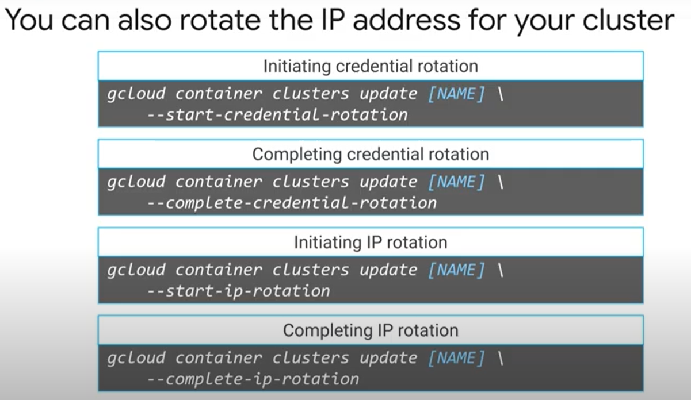
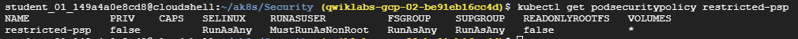
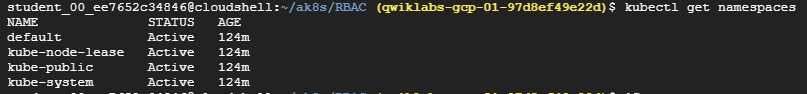
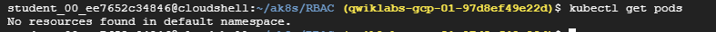
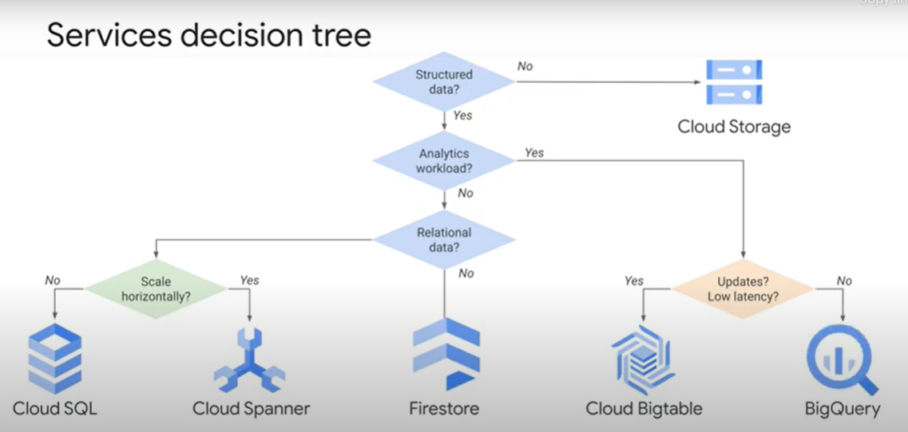
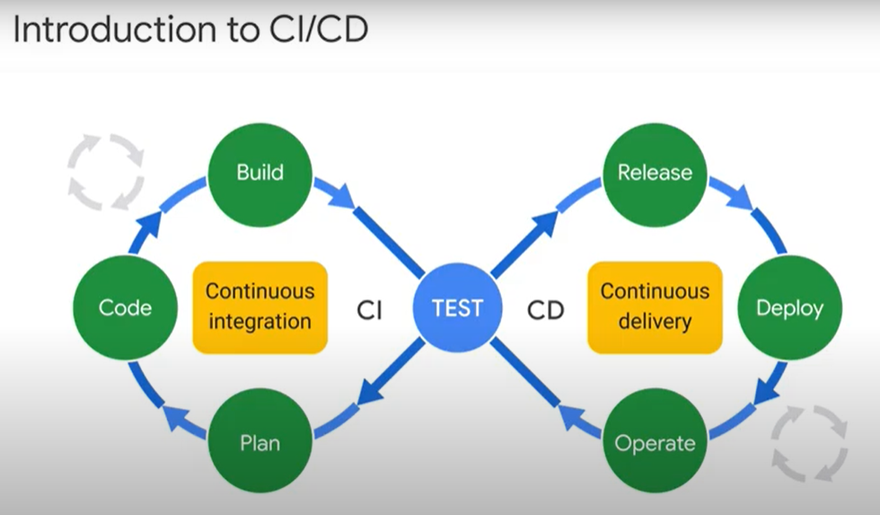

# 8. Architecting with Google Kubernetes Engine Production

## Table of Contents

1. Course Introduction for Course 3
2. Access Control and Security in Kubernetes and GKE
3. GKE Logging and Monitoring
4. Using Google Cloud Managed Storage Services with GKE
5. Using CI/CD with GKE
6. Course Resources

## 1. Course Introduction for Course 3

## 2. Access Control and Security in Kubernetes and GKE

### 2.1. Authentication and Authorization

In K8s there are two main types of users:

- Normal users - are managed outside of K8s. K8s relies on external identity services both in K8s and GKE. In GCP users are managed by Cloud IAM.
- K8s Service Accounts - managed by K8s. Not the same as GCP Service Account. Provide an identity for the processes in the Pod and are used to interact with K8s Cluster.

In K8s every namespace has a default K8s Service Account. When processes in containers within a Pod communicate with kube-apiserver, they identify themselves as a K8s Service Account.

After a user is authenticated via Cloud IAM, there are two main ways to authorize in GKE:

- Cloud IAM - access control for Project and Cluster level
- RBAC - access control for Cluster and Namespace level.

In K8s kube-apiserver listens for remote requests using HTTPS on port 443. Each request must be authenticated before it is acted upon. Kube-apiserver authenticates requests using various methods:

- OpenId connect tokens, which is recommended by K8s
- x506 client certificates
- Static passwords

### 2.2. Cloud IAM

- who - identity/member, group
- what - role(permission1, permission2)
- which - project/resource

#### IAM Roles

- Basic (Project level)
- Predefined:
  - Kubernetes Engine Admin (Provides access to full management of clusters and their Kubernetes API objects)
  - Kubernetes Engine Cluster Admin (Provides access to management of clusters)
  - Kubernetes Engine Cluster Viewer (Get and list access to GKE Clusters)
  - Kubernetes Engine Developer (Provides access to Kubernetes API objects inside clusters)
  - Kubernetes Engine Viewer (Provides read-only access to GKE resources)
- Custom Roles

### 2.3. K8s RBAC

RBAC - Role-Based Acces Control. RBAC is a native K8s security feature, that provides you with fine-grained tools to manage user permissions. In GKE RBAC extends Cloud IAM security by offering control over K8s resources within a cluster, supplementing the control provided by Cloud IAM.

3 main elements to RBAC concepts:

- who - Subjects - set of users or processes that can make requests to kube-apiserver
- which - Resources - set of kube-apiserver objects, such as pod, deployment, service, or persistent volume
- what - Verbs - set of operations that can be performed on resources, such as get, watch, create and describe

2 types of RBAC Objects:

- Role - connects Resources and Verbs
- RoleBinding - connect Roles to Subjects


Roles and RoleBindings can be applied to a Namespace or Cluster level - Role and ClusterRole respectively.


`- apiGroup: [""]` means that role applies to the core API group.

it is common practice to put following verbs together:

- `verbs: ["get", "list", "watch"]` standard read-only verbs
- `verbs: ["path", "update"]`
- `verbs: ["get", "post"]` for non resource endpoints

Rules are only additive - there is no denied rule.


AS ClusterRole grants permissions on the Cluster level there is no need to specify a Namespace.

Resources can be a Cluster scope, such as Storageclass or Nodes, or Namespace resources, such as Pods and Deployments.


#### Attaching roles


- User
- Group
- ServiceAccount

You cannot assign K8s RBAC permissions to Google Groups. You can only assign Cloud IAM permissions to the Google group. However, K8s supports groups too. And you can assign K8s RBAC permissions to K8s groups.

In the right column, you have more group types. These are the system groups, so they can be used for RBAC and GKE environments.

The middle example includes all service accounts in a namespace.


Now that you have defined Roles and ClusterRoles, you can attach RoleBinding and ClusterRoleBinding to those roles.

Define the `namespace`, then the `subjects` (Users, Groups, or ServiceAccounts). You bind a role to a subject using `roleRef`, by defining a role `kind` and a role `name`. A role kind can refer to Role or ClusterRole.

If a ClusterRole is bound to a RoleBinding, it grants permissions to the resources in the particular namespaces defined in RoleBinding.


ClusterRoleBinding can only refer to a ClusterRole, not to a Role.


With K8s RBAC you can manage granular permissions for the people (using users and groups) and containers (using ServiceAccount) at both the Namespace and Cluster levels.


### 2.4. K8s Control Plane Security

In GKE Google manages all the control plane components:

- GKE manages cluster root Certificate Authority (CA) outside the cluster
- Every cluster has its root CA
- Certificates are used to secure cluster network communications
- A shared Secret on each node is used for certificate signing requests, which are used by kubelet to communicate with kube-apiserver. This Secret can be accessed by Pods and by Containers unless Metadata concealment is enabled.
- rotate credentials periodically to limit the impact of a Breach


These credentials must be rotated periodically to improve the security posture of your cluster and limit the impact of potential security breaches through compromised credentials.


The process starts by issuing a new IP address for the cluster's control plane, along with its existing IP. New credentials are issued to the control plane.
API Server will not be available during this period. Pods will continue to run.


After the control plane is reconfigured, Nodes are automatically updated by GKE to use the new IP and credentials. This causes GKE to automatically update the Node version to the closest supported version. As Nodes are recreated any Pod running will be terminated.


Address rotation must be completed, for the Cluster control plane to start serving the new IP address and credentials and to remove the old IP address and credentials.



Protect your metadata:

- Restrict Node VMs Service Account for `compute.instances.get` permission, to restrict exposure to other node metadata.
- Disable legacy CE API endpoints
- Enable metadata concealment (temporary), like a firewall, which prevents Pods from accessing a Node's metadata.

### 2.5. Pod Security

#### SecurityContext

By default, users can deploy containers inside a pod that can allow privilege elevation and can access the host file system and networking. Sometimes those capabilities are convenient - and sometimes they are undesirable from a security perspective. You can set restrictions on what a container in a pod can do using SecurityContext, you can also enforce it using specific security measures.


SecurityContext is a set of settings specified in Pod specification. SecurityContext specifies that the first process runs with the userID 1 000 for any containers in the pod (root user ID is 0), and group ID 2 000 is associated with all containers in the pod. This provides specific user and group context for the containers. Taking away root privileges from the code running inside a container, limits what it can do if it gets compromised. If you define SecurityContext at the Pod level, it is applied to all of the Pod's containers.

Using SecurityContext in a Pod definition, you can exercise a lot of control over the use of the host:

- namespace,
- networking,
- file system
- volume types
- where privilege containers can run and
- whether code in the container can escalate to root privileges

You can also control other security settings, for example, you can enable Seccomp, to block code running in containers from making system calls. You can enable AppArmor, which uses security profiles to restrict individual programs' actions.

#### PodSecurityPolicy

It is easier to define and manage security configurations separately and then apply them to the Pods that need them. By defining Pod security policies you create re-usable security contexts. You can apply Pod security policies to multiple Pods w/o having to specify and those details in each Pod definition.

Pod Security Policy consists of:

- an object - a set of restrictions, requirements, and defaults
- admission controller - all conditions must be fulfilled for a Pod to be created or updated.
- PodSecurityPolicy controller is an admission controller
- The controller validates or modifies requests to create or modification of Pods against one or more PodSecurityPolicies.

Note that PodSecurityPolicy is enforced during Pod creation or update, but SecurityContext is enforced by the container runtime.


After you defined PodSecurityPolicy you need to authorize it, otherwise, it will prevent any Pods from being created. You can authorize a PodSecurityPolicy using K8s RBAC.


Here a ClusterRole allows PodSecurityPolicy `demo-psp` to be used.


Define a RoleBinding to bind a previous ClusterRole to Users or Groups. In this example, two subjects for the RoleBinding are specified.

The RoleBoinding can grant permission to the creator of the Pod, which might be Deployment, ReplicaSet, or any other templated controller. Or RoleBoinding can grant permission to the created Pod Service Account. Granting the controller access to the policy will grant access for all pods created by that controller. So the preferred method for authorizing policies is to grant access to Pod's Service Account.

Without a PodSecurityPolicy controller, Pod Security policies mean nothing, you need both define the policies and enable the PodSecurityPolicy controller. If you enable PodSecurityPolicy controller before defining policies, you have just commanded that nothing is allowed to be deployed. In GKE PodSecurityPolicy controller is disabled by default.

1) Define the policies
2) enable PodSecurityPolicy controller using 'gcloud beta container cluster update [NAME] --enable-pod-security-policy'

#### Additional Security measures in K8s

- Use container optimized OS
- Enable automatic node upgrades
- using private cluster and control plane authorized networks
- Use secrets for sensitive info
- Assign roles to groups, not users
- Do not enable K8s Dashboard

### LAB: Securing Google Kubernetes Engine with Cloud IAM and Pod Security Policies

#### Task 1: Use Cloud IAM roles to grant administrative access to all the GKE clusters in the project


To deploy a GKE cluster, a user in addition to Kubernetes Engine Cluster Administrator must also be assigned the iam.serviceAccountUser role on the Compute Engine default service account.

#### Task 2. Create and Use Pod Security Policies

```shell
export my_zone=us-central1-a
export my_cluster=standard-cluster-1
source <(kubectl completion bash)
gcloud container clusters get-credentials $my_cluster --zone $my_zone
```

```shell
git clone https://github.com/GoogleCloudPlatform/training-data-analyst
ln -s ~/training-data-analyst/courses/ak8s/v1.1 ~/ak8s
cd ~/ak8s/Security/
```

```yaml
# restricted-psp.yaml

apiVersion: policy/v1beta1
kind: PodSecurityPolicy
metadata:
  name: restricted-psp
spec:
  privileged: false  # Don't allow privileged pods!
  seLinux:
    rule: RunAsAny
  supplementalGroups:
    rule: RunAsAny
  runAsUser:
    rule: MustRunAsNonRoot
  fsGroup:
    rule: RunAsAny
  volumes:
  - '*'
```

```shell
kubectl apply -f restricted-psp.yaml
kubectl get podsecuritypolicy restricted-psp
```



The file restricted-pods-role.yaml creates a ClusterRole that includes the resource you created in the last task, restricted-psp, and grants the subject the ability to use the restricted-psp resource. The subject is the user or service account that is bound to this role. You will bind an account to this role later to enable the use of the policy.

```yaml
# restricted-pods-role.yaml

kind: ClusterRole
apiVersion: rbac.authorization.k8s.io/v1
metadata:
  name: restricted-pods-role
rules:
- apiGroups:
  - extensions
  resources:
  - podsecuritypolicies
  resourceNames:
  - restricted-psp
  verbs:
  - use
```

Before you can create a role, the account you use to create the role must already have the permissions granted in the role being assigned. For cluster administrators, this can be easily accomplished by creating the necessary RoleBinding to grant your own user account the cluster-admin role.

```shell
export USERNAME_1_EMAIL=$(gcloud info --format='value(config.account)')
kubectl create clusterrolebinding cluster-admin-binding --clusterrole cluster-admin --user $USERNAME_1_EMAIL
kubectl apply -f restricted-pods-role.yaml
kubectl get clusterrole restricted-pods-role
```


```shell
gcloud beta container clusters update $my_cluster --zone $my_zone --enable-pod-security-policy
kubectl get podsecuritypolicies
```


One of the built-in policies, gce.privileged, explicitly allows privileged pods to be deployed. By default, only accounts that are bound to the cluster-admin role have permission to use the gce.privileged policy.

```shell
kubectl auth can-i use podsecuritypolicy/gce.privileged
```


```yaml
# privileged-pod.yaml

kind: Pod
apiVersion: v1
metadata:
  name: privileged-pod
spec:
  containers:
    - name: privileged-pod
      image: nginx
      securityContext:
        privileged: true
```

```shell
kubectl apply -f privileged-pod.yaml
```


This will succeed because Username 1 has been assigned the cluster-admin role and that role is allowed to use the gce.privileged pod security policy that is enabled by default.

```shell
kubectl delete pod privileged-pod
```

You have to configure the Cloud Shell for Username 2 before you can attempt to deploy the test Pods for this task from the Cloud Shell.

```shell
export my_zone=us-central1-a
export my_cluster=standard-cluster-1
source <(kubectl completion bash)
gcloud container clusters get-credentials $my_cluster --zone $my_zone
```

```shell
git clone https://github.com/GoogleCloudPlatform/training-data-analyst
ln -s ~/training-data-analyst/courses/ak8s/v1.1 ~/ak8s
cd ~/ak8s/Security/
```

```yaml
kind: Pod
apiVersion: v1
metadata:
  name: unprivileged-pod
spec:
  containers:
    - name: unprivileged-pod
      image: nginx
```

```shell
kubectl apply -f unprivileged-pod.yaml
```


```shell
kubectl apply -f privileged-pod.yaml
```


```shell
kubectl auth can-i use podsecuritypolicy/restricted-psp
```


```shell
kubectl auth can-i use podsecuritypolicy/gce.privileged
```


#### Task 3. Rotate IP Address and Credentials

```shell
gcloud container clusters update $my_cluster --zone $my_zone --start-credential-rotation
gcloud container clusters upgrade $my_cluster --zone $my_zone --node-pool=default-pool
gcloud container clusters update $my_cluster --zone $my_zone --complete-credential-rotation
```

### Implementing Role-Based Access Control with Google Kubernetes Engine

#### Task 1: Create namespaces for users to access cluster resources

```shell
export my_zone=us-central1-a
export my_cluster=standard-cluster-1
source <(kubectl completion bash)
gcloud container clusters get-credentials $my_cluster --zone $my_zone
```

```shell
git clone https://github.com/GoogleCloudPlatform/training-data-analyst
ln -s ~/training-data-analyst/courses/ak8s/v1.1 ~/ak8s
cd ~/ak8s/RBAC/
kubectl get namespaces
```



```yaml
apiVersion: v1
kind: Namespace
metadata:
  name: production
```

```shell
kubectl create -f ./my-namespace.yaml
kubectl get namespaces
```


```shell
kubectl describe namespaces production
```


```yaml
# my-pod.yaml

apiVersion: v1
kind: Pod
metadata:
  name: nginx
  labels:
    name: nginx
spec:
  containers:
  - name: nginx
    image: nginx
    ports:
    - containerPort: 80
```

```shell
kubectl apply -f ./my-pod.yaml --namespace=production
kubectl get pods
```



```shell
kubectl get pods --namespace=production
```


#### Task 2. About Roles and RoleBindings

Before you can create a Role, your account must have the permissions granted in the role being assigned.
For cluster administrators, this can be easily accomplished by creating the following RoleBinding to grant your own user account the cluster-admin role.

```shell
export USERNAME_1_EMAIL=$(gcloud info --format='value(config.account)')
kubectl create clusterrolebinding cluster-admin-binding --clusterrole cluster-admin --user $USERNAME_1_EMAIL
```

```yaml
kind: Role
apiVersion: rbac.authorization.k8s.io/v1
metadata:
  namespace: production
  name: pod-reader
rules:
- apiGroups: [""]
  resources: ["pods"]
  verbs: ["create", "get", "list", "watch"]
```

```shell
kubectl apply -f pod-reader-role.yaml
kubectl get roles --namespace production
```


```yaml
kind: RoleBinding
apiVersion: rbac.authorization.k8s.io/v1
metadata:
  name: username2-editor
  namespace: production
subjects:
- kind: User
  name: [USERNAME_2_EMAIL]
  apiGroup: rbac.authorization.k8s.io
roleRef:
  kind: Role
  name: pod-reader
  apiGroup: rbac.authorization.k8s.io
```

```shell
export USERNAME_2_EMAIL=student-01-11ec94e48813@qwiklabs.net
sed -i "s/\[USERNAME_2_EMAIL\]/${USERNAME_2_EMAIL}/" username2-editor-binding.yaml
```

Switch to the Username 2 Google Cloud Console tab

```shell
export my_zone=us-central1-a
export my_cluster=standard-cluster-1
source <(kubectl completion bash)
gcloud container clusters get-credentials $my_cluster --zone $my_zone
```

```shell
git clone https://github.com/GoogleCloudPlatform/training-data-analyst
ln -s ~/training-data-analyst/courses/ak8s/v1.1 ~/ak8s
cd ~/ak8s/RBAC/
kubectl get namespaces
```

```yaml
# production-pod.yaml

apiVersion: v1
kind: Pod
metadata:
  name: production-pod
  labels:
    name: production-pod
  namespace: production
spec:
  containers:
  - name: production-pod
    image: nginx
    ports:
    - containerPort: 8080
```

```shell
kubectl apply -f ./production-pod.yaml
```


Switch to the Username 1 Google Cloud Console tab

```shell
kubectl apply -f username2-editor-binding.yaml
kubectl get rolebinding --namespace production
```


Switch to the Username 2 Google Cloud Console tab

```shell
kubectl apply -f ./production-pod.yaml
```


```shell
kubectl delete pod production-pod --namespace production
```


This fails because Username 2 does not have the delete permission for Pods.

## 3. Deployments, Jobs, and Scaling

### 3.1. Google Cloud Operations Suite


It is best practice to create a GCP project specifically for GCP Operations Suite if you have multiple projects in your organization.

### 3.2. Logging

There are 2 different ways to view logs:

- you can view container logs using the `kubectl` command
- in the Stackdriver web-based GCP console interface.

Viewing logs using `kubectl` is a quick way to view the logs directly from the Pod. But these logs are not saved to a long-term database, and logs might be lost if containers are restarted or deleted. Staskdriver saves logs for 30 days.

GKE automatically streams its logs to Stackdriver. In Stackdriver there is a free tier (First 50 GiB/project).

You can export logs to **Cloud Storage** or **BigQeury** for long term retention if you:

- ned them for periods  > 30 days
- or for more complex analysis.

The basic GKE logs:

- system components - kubelet, kube-proxy, etc logs,
- Container logs - stout, sterr,
- and events - deletion of the pod, scaling of the deployment, creation of the container,

are stored in `/var/logs/` directory on the nodes and can be queried using `kubectl logs` command or by directly accessing the log directory on the nodes.

- `kubectl logs [POD-NAME]`
- `kubectl logs [POD-NAME] --tail=20`
- `kubectl logs [POD-NAME] --since=3h`


Native K8s logs in archives are not persistent. If a Pod is evicted or restarted, logs are lost. As a result, there is a need to store logs outside a Container, Pod, or Node. This is called **Cluster level logging**. K8s does not offer any log store solution, but it does support various implementations. In GKE this is handled with the integration of Cloud Logging.

When a Container starts on a Node, a log file is created. As the containers run, events happen and the log file grows. Either 1x day or when log file >= 100 MB, the log rotate utility creates a new log and archives the old file. It then deletes all but the 5 last log archives. This ensures that logs do not consume all of the available storage on the Node.

If a container is deleted all of the container logs are deleted as well, if a Pod is deleted, all of the containers and all the logs are deleted, which leaves you w/o any logs unless you use a central log mgmt utility, like cloud Logging.


Logging Agent can be scaled to inject Terrabytes of log data per second. In GKE logging is enabled by default and logging agents are pre-installed on all the nodes in the cluster and configured to push log data to Cloud Logging. Cloud Logging uses FluentD as a logging agent. FluentD is set up using DeamonSet.

### 3.3. Monitoring

Why monitoring matter:

- provides a complete picture
- helps you scale and size the system
- provides focus on applications current state
- helps you troubleshoot complex microservices solutions


Monitoring the cluster:

- Nr of nodes
- node utilization
- pods/deployments running
- errors/failures

Monitoring the pods:

- System metrics
- Container metrics
- Application metrics, based on K8s labels

### LAB: Configuring GKE-Native Monitoring and Logging

#### Task 1. Using Kubernetes Engine Monitoring

```shell
export my_zone=us-central1-a
export my_cluster=standard-cluster-1
source <(kubectl completion bash)
gcloud container clusters create $my_cluster \
   --num-nodes 3 --enable-ip-alias --zone $my_zone  \
   --enable-stackdriver-kubernetes
gcloud container clusters get-credentials $my_cluster --zone $my_zone
```

```shell
git clone https://github.com/GoogleCloudPlatform/training-data-analyst
ln -s ~/training-data-analyst/courses/ak8s/v1.1 ~/ak8s
cd ~/ak8s/Monitoring/
```

```yaml
# hello-v2.yaml

apiVersion: apps/v1
kind: Deployment
metadata:
  name: hello-v2
spec:
  replicas: 3
  selector:
    matchLabels:
      run: hello-v2
  template:
    metadata:
      labels:
        run: hello-v2
        name: hello-v2
    spec:
      containers:
      - image: gcr.io/google-samples/hello-app:2.0
        name: hello-v2
        ports:
        - containerPort: 8080
          protocol: TCP
```

```shell
kubectl apply -f hello-v2.yaml
kubectl get all
```


```shell
export PROJECT_ID="$(gcloud config get-value project -q)"
cd gcp-gke-monitor-test
gcloud builds submit --tag=gcr.io/$PROJECT_ID/gcp-gke-monitor-test .
cd ..
sed -i "s/\[DOCKER-IMAGE\]/gcr\.io\/${PROJECT_ID}\/gcp-gke-monitor-test\:latest/" gcp-gke-monitor-test.yaml
```

```yaml
# gcp-gke-monitor-test.yaml

apiVersion: apps/v1
kind: Deployment
metadata:
  labels:
    name: gcp-gke-monitor-test
  name: gcp-gke-monitor-test
  namespace: default
spec:
  replicas: 1
  selector:
    matchLabels:
      name: gcp-gke-monitor-test
  template:
    metadata:
      labels:
        name: gcp-gke-monitor-test
    spec:
      containers:
      - image: gcr.io/qwiklabs-gcp-01-53a5b5d826ba/gcp-gke-monitor-test:latest
        name: gcp-gke-monitor-test
        ports:
        - containerPort: 8080
          protocol: TCP
        env:
        - name: POD_ID
          valueFrom:
            fieldRef:
              fieldPath: metadata.uid
        - name: POD_NAME
          valueFrom:
            fieldRef:
              fieldPath: metadata.name
        - name: NAMESPACE_NAME
          valueFrom:
            fieldRef:
              fieldPath: metadata.namespace

---
apiVersion: v1
kind: Service
metadata:
  labels:
    name: gcp-gke-monitor-test
  name: gcp-gke-monitor-test-service
  namespace: default
spec:
  ports:
  - port: 80
    protocol: TCP
    targetPort: 8080
  selector:
    name: gcp-gke-monitor-test
  type: LoadBalancer
```

```shell
kubectl apply -f gcp-gke-monitor-test.yaml
kubectl get all
```


#### Task 2: Using the GCP-GKE-Monitor-Test application

```shell
kubectl get service
```


Open your web browser and navigate to the EXTERNAL-IP

#### Task 3. Using Kubernetes Engine Monitoring

Done in GCP Console

#### Task 4. Creating Alerts with Kubernetes Engine Monitoring

Done in GCP Console

### 3.4. Probes

When working in a microservices environment, you have service dependencies.

1. If a service is not ready, another service might generate an error.
2. Also, some containers might appear to be operational, because they are consuming compute resources, but they are not able to service client requests.

In both of these cases, the other microservices will generate errors, that we can prevent, by checking the status of a Pod. If it is found to be non-responsive - re-deploy it.


Orders must be saved in the shopping cart. If not, the credit card processing would not process the shopping cart properly.

It is essential to have a functioning Shopping Cart microservice. How do you know if Shopping Cart is working properly?

It is best to apply additional health checks such as:

- Liveness probe:
  - is the container running? If not, restart the container.
- Readiness probe:
  - is the containers ready to accept requests? If not, probe removes Pod's IP address from all Services endpoints. The Service will ignore the Pod until the Readiness Probe succeeds.
  
Readiness probes are configured similarly to liveness probes. The only difference is that you use the readinessProbe field instead of the livenessProbe field.


- initialDelaySeconds - wait for xx seconds, make sure you are aware of how long time it takes for the app to be ready
- periodSeconds - interval b/w probe tests
- timeoutSeconds - defines the timeout
- successThreshold -
- failureThreshold -

### LAB: Configuring Liveness and Readiness Probes

#### Task 1. Connect to the lab GKE Cluster

```shell
export my_zone=us-central1-a
export my_cluster=standard-cluster-1
source <(kubectl completion bash)
gcloud container clusters get-credentials $my_cluster --zone $my_zone
git clone https://github.com/GoogleCloudPlatform/training-data-analyst
ln -s ~/training-data-analyst/courses/ak8s/v1.1 ~/ak8s
cd ~/ak8s/Probes/
```

#### Task 2. Configure liveness probes

```yaml
apiVersion: v1
kind: Pod
metadata:
  labels:
    test: liveness
  name: liveness-exec
spec:
  containers:
  - name: liveness
    image: k8s.gcr.io/busybox
    args:
    - /bin/sh
    - -c
    - touch /tmp/healthy; sleep 30; rm -rf /tmp/healthy; sleep 600
    livenessProbe:
      exec:
        command:
        - cat
        - /tmp/healthy
      initialDelaySeconds: 5
      periodSeconds: 5
```

```shell
kubectl apply -f exec-liveness.yaml
kubectl describe pod liveness-exec
kubectl get pods
```


#### Task 3. Configure readiness probes

The startup script for the containers sleeps for 30 seconds, launches the hello-world web application in the background, and then creates the /tmp/healthy file. This keeps each container from passing the readiness test for at least 30 seconds after startup.

The pods will then seem to pause for 30 seconds after starting up before they are flagged as ready and therefore before any service will select them as endpoints.

The startup script then waits for a random time, between 60 and 180 seconds, before deleting the /tmp/healthy file. That will cause both the readiness and liveness probes to fail so the readiness-svc service will remove the endpoint for that container and at more or less the same time the failure of the liveness probe will cause the container to restart.

```yaml
# readiness-deployment.yaml

apiVersion: apps/v1
kind: Deployment
metadata:
  labels:
    test: readiness
  name: readiness-deployment
spec:
  replicas: 3
  selector:
    matchLabels:
      app: readiness-test
  template:
    metadata:
      labels:
        app: readiness-test
    spec:
      containers:
      - name: readiness
        image: gcr.io/google-samples/hello-app:1.0
        ports:
        - containerPort: 8080
          protocol: TCP
        args:
        - /bin/sh
        - -c
        - sleep 30; nohup ./hello-app &2>/dev/null & touch /tmp/healthy; export xx=$((60+$RANDOM % 120)) ; sleep $xx ;  rm -rf /tmp/healthy
        livenessProbe:
          exec:
            command:
            - cat
            - /tmp/healthy
          initialDelaySeconds: 45
          timeoutSeconds: 1
          periodSeconds: 5
        readinessProbe:
          exec:
            command:
            - cat
            - /tmp/healthy
          initialDelaySeconds: 5
          timeoutSeconds: 1
          periodSeconds: 5
```

```yaml
# readiness-service.yaml

apiVersion: v1
kind: Service
metadata:
  name: readiness-svc
spec:
  type: LoadBalancer
  selector:
    app: readiness-test
  ports:
  - protocol: TCP
    port: 80
    targetPort: 8080
```

```shell
kubectl create -f readiness-deployment.yaml
kubectl create -f readiness-service.yaml
```

```shell
# query the external ip-address from the load balancer service details and save it in an environment variable

export EXTERNAL_IP=$(kubectl get services readiness-svc -o json | jq -r '.status.loadBalancer.ingress[0].ip')
curl $EXTERNAL_IP
```

## 4. Using Google Cloud Managed Storage Services with GKE

### 4.1. Using Google Cloud Services

Storage options for GKE applications:

- Volumes or Persistent Volumes
- Google Cloud managed storage solutions

You might want to focus on your application, rather than maintaining a storage solution for it. Google Cloud managed storage solutions reduce the time it takes to store all kinds of data.

Using APIs:

Applications access Google Cloud storage by using Cloud APIs:

- provide applications credentials to access Google APIs
- Apps running in GKE can take full advantage of all services provided by Google Cloud.


A service account must be assigned an IAM role, that has the permissions your application requires.

**Create a new service account for each app,** that needs to request GCP services.

1. Using a separate service account for diff applications, lets you minimize the privileges accosted with each account as it makes it easier to enable monitoring and auditing of API requests at the application level.
2. It is also easier to revoke access for specific applications by deleting the service accounts associated with those applications.
3. In the event of a security breach, having separate accounts, reduces the exposure.

Using Google Cloud Services from GKE:

1. Create a new Service Account
2. Choose a role based on the service and use case
3. Create a credential and key file
4. Use K8s Secrets to store these credentials (or Cloud KMS)
5. Use Secrets to make API calls to Cloud Storage

### 4.2. Using Google Cloud Storage

Object storage simply means the storage of ordered groups of bytes.
The storage service does not know or care about the structure and semantics of those bytes.

### 4.3. Using Google Cloud Databases

- Data and Transaction processing:
  - Cloud Bigtable
  - Firestore
  - Cloud SQL
    - Cloud SQL Proxy container (no need to configure SSL or allow list IP addresses)
  - Cloud Spanner
- Analytics processing:
  - BigQuery

Cloud Bigtable:

- Apps requiring very high throughput and scalability
- Batch MapReduce operations
- Stream processing/analytics
- ML

Cloud Firestore:

- User session management (shopping cart, booking events)
- Real-time inventory (document store like JSON files)
- user profiles (flexible schema)
- Consistent state (ACID transactions - data stays internally consistent)
- Persistent write-through cache
- Mobile application date (part of Firebase - mobile app platform)

Cloud SQL:

- Existing DBs
- Web and mobile apps
- E-commerce apps
- Mobile and online gaming
- ACID

Cloud Spanner:

- ACID
- Global finance and trading
- Global services
- Global online gaming

BigQuery:

- Supports SQL queries
- Only query charges
- Real-time analytics
- IoT
- Large-scale logging of events
- Predictive digital marketing



### LAB: Using Cloud SQL with Google Kubernetes Engine

The SQL Proxy lets you interact with a Cloud SQL instance as if it were installed locally (localhost:3306), and even though you are on an unsecured port locally, the SQL Proxy makes sure you are secure over the wire to your Cloud SQL Instance

#### Task 1. Connect to the lab GKE cluster

```shell
export my_zone=us-central1-a
export my_cluster=standard-cluster-1
source <(kubectl completion bash)
gcloud container clusters get-credentials $my_cluster --zone $my_zone
git clone https://github.com/GoogleCloudPlatform/training-data-analyst
ln -s ~/training-data-analyst/courses/ak8s/v1.1 ~/ak8s
cd ~/ak8s/Cloud_SQL/
```

#### Task 2. Enable Cloud SQL APIs

Navigation menu -> APIs & Services -> Search for APIs & Services:

- Cloud SQL
- Cloud SQL Admin API

#### Task 3. Create a Cloud SQL instance

```shell
gcloud sql instances create sql-instance --tier=db-n1-standard-2 --region=us-central1
```

Navigation menu -> SQL:

- Create user
<!-- TODO check how to do this in gcloud -->

```shell
export SQL_NAME=$(gcloud sql instances describe sql-instance --format='value(connectionName)'
gcloud sql connect sql-instance
```

```sql
create database wordpress;
use wordpress;
show tables;
exit;
```

#### Task 4. Prepare a Service Account with permission to access Cloud SQL

Navigation menu -> IAM & Admin> Service Accounts -> + CREATE SERVICE ACCOUNT:

- Service account name: sql-access
- Select a role: Cloud SQL Client

Actions -> Manage keys -> ADD KEY -> Create new key -> JSON -> CREATE
Rename json file as credentials.json

#### Task 5. Create Secrets

Upload credentials.json to Cloud Shell.

```shell
mv ~/credentials.json .
kubectl create secret generic google-credentials\
   --from-file=key.json=credentials.json
```


```shell
kubectl create secret generic sql-credentials \
   --from-literal=username=sqluser\
   --from-literal=password=sqlpassword
kubectl describe secrets sql-credentials
```


#### Task 6. Deploy the SQL Proxy agent as a sidecar container

```yaml
# sql-proxy.yaml

apiVersion: apps/v1
kind: Deployment
metadata:
  name: wordpress
  labels:
    app: wordpress
spec:
  selector:
    matchLabels:
      app: wordpress
  template:
    metadata:
      labels:
        app: wordpress
    spec:
      containers:
        - name: web
          image: gcr.io/cloud-marketplace/google/wordpress:5.3
          #image: wordpress:5.3
          ports:
            - containerPort: 80
          env:
            - name: WORDPRESS_DB_HOST
              value: 127.0.0.1:3306
            # These secrets are required to start the pod.
            # [START cloudsql_secrets]
            - name: WORDPRESS_DB_USER
              valueFrom:
                secretKeyRef:
                  name: sql-credentials
                  key: username
            - name: WORDPRESS_DB_PASSWORD
              valueFrom:
                secretKeyRef:
                  name: sql-credentials
                  key: password
            # [END cloudsql_secrets]
        # Change <INSTANCE_CONNECTION_NAME> here to include your GCP
        # project, the region of your Cloud SQL instance and the name
        # of your Cloud SQL instance. The format is
        # $PROJECT:$REGION:$INSTANCE
        # [START proxy_container]
        - name: cloudsql-proxy
          image: gcr.io/cloudsql-docker/gce-proxy:1.11
          command: ["/cloud_sql_proxy",
                    "-instances=<INSTANCE_CONNECTION_NAME>=tcp:3306",
                    "-credential_file=/secrets/cloudsql/key.json"]
          # [START cloudsql_security_context]
          securityContext:
            runAsUser: 2  # non-root user
            allowPrivilegeEscalation: false
          # [END cloudsql_security_context]
          volumeMounts:
            - name: cloudsql-instance-credentials
              mountPath: /secrets/cloudsql
              readOnly: true
        # [END proxy_container]
      # [START volumes]
      volumes:
        - name: cloudsql-instance-credentials
          secret:
            secretName: google-credentials
      # [END volumes]
---
apiVersion: v1
kind: Service
metadata:
  name: wordpress-service
  namespace: default
  labels:
    app: wordpress
spec:
  ports:
  - protocol: TCP
    port: 80
  selector:
    app: wordpress
  type: LoadBalancer
  loadBalancerIP: 
```

- the variable WORDPRESS_DB_HOST is set to 127.0.0.1:3306. This will connect to a container in the same Pod listening on port 3306. This is the port that the SQL-Proxy listens on by default.
- the variables WORDPRESS_DB_USER and WORDPRESS_DB_PASSWORD are set using values stored in the sql-credential Secret you created in the last task.
- the command switch that defines the SQL Connection name, "-instances=<INSTANCE_CONNECTION_NAME>=tcp:3306", contains a placeholder variable that is not configured using a ConfigMap or Secret and so must be updated directly in this example manifest to point to your Cloud SQL instance.
- the JSON credential file is mounted using the Secret volume in the directory /secrets/cloudsql/ . The command switch "-credential_file=/secrets/cloudsql/key.json" points to the filename in that directory that you specified when creating the google-credentials Secret.

```shell
sed -i 's/<INSTANCE_CONNECTION_NAME>/'"${SQL_NAME}"'/g'\
   sql-proxy.yaml
kubectl apply -f sql-proxy.yaml
kubectl get all
```


#### Task 7. Connect to your Wordpress instance

```shell
export EXTERNAL_IP=$(kubectl get services wordpress-service -o json | jq -r '.status.loadBalancer.ingress[0].ip')
```

Open EXTERNAL_IP and complete the initial Wordpress installation wizard.

```shell
gcloud sql connect sql-instance
```

```sql
use wordpress;
show tables;
select * from wp_users;
```


## 5. Using CI/CD with GKE

### 5.1. CI/CD Background



CI/CD gives your software development process the agility to meet you customers needs quickly. Reduce risk of delivering changes by allowing far more frequent and incrimental updates.

- CI - the practice of regularly merging the work of individual developers toggether into the repo, to enable detection of integration bugs.
- CD - teams produce software in short cycles and use processes to ensure the reliable release of software to prod at any time.

Why CI/CD:

- all users see the same version of your application
- you can create test groups for a percentage of users
- All other users are using the same envbironment as the test group
- users see a seignificant reduction of bugs


1. build - code base is checked out and artifacts (Docker images) are built
2. deploy - application is deployed to test env.
3. test - unit, functional, integration, vulnerability, performance
4. approve - once tests are passed, app is deployed to prod

CD/CD  Spectrum:

1. Manual - ./deploy.sh
2. Built-in automation - out of the box CI/CD features of the service
3. Dev-dentric CI/CD - repo is the source of truth and control plane for CI/CD automation
4. Ops-centric CI/CD - deshboards across deployed services with integrated monitoring. Trade management effort for congurability, for example Spinnaker.

### 5.2. CI/CD in Google Cloud

- Jenkins - open cource CI services
- Spinnaker - open soruce multi-cloud CD platform
- CircleCI -  CI/CD
- GitLab CI - CI tool
- Drone - Modern CI/CD
- Cloud Build - GCP CI tool

### LAB: CI/CD for Google Kubernetes Engine using Cloud Build


For this lab you will create 2 Git repositories:

- app repository: contains the source code of the application itself
- env repository: contains the manifests for the Kubernetes Deployment

When you push a change to the app repository, the Cloud Build pipeline runs tests, builds a container image, and pushes it to Container Registry.

After pushing the image, Cloud Build updates the Deployment manifest and pushes it to the env repository. This triggers another Cloud Build pipeline that applies the manifest to the GKE cluster and, if successful, stores the manifest in another branch of the env repository.


#### Task 1. Initialize Your Lab

```shell
# Enable APIs

gcloud services enable container.googleapis.com \
    cloudbuild.googleapis.com \
    sourcerepo.googleapis.com \
    containeranalysis.googleapis.com

gcloud container clusters create hello-cloudbuild \
    --num-nodes 1 --zone us-central1-b

git config --global user.email "you@example.com"  
git config --global user.name "Your Name"
```

#### Task 2. Create the Git repositories in Cloud Source Repositories

```shell
gcloud source repos create hello-cloudbuild-app
gcloud source repos create hello-cloudbuild-env

cd ~
git clone https://github.com/GoogleCloudPlatform/gke-gitops-tutorial-cloudbuild \
    hello-cloudbuild-app

# Configure Cloud Source Repositories as a remote

cd ~/hello-cloudbuild-app
PROJECT_ID=$(gcloud config get-value project)
git remote add google \
    "https://source.developers.google.com/p/${PROJECT_ID}/r/hello-cloudbuild-app"
```

#### Task 3. Create a container image with Cloud Build

```python
# app.py

from flask import Flask
app = Flask('hello-cloudbuild')

@app.route('/')
def hello():
  return "Hello World!\n"

if __name__ == '__main__':
  app.run(host = '0.0.0.0', port = 8080)
```

```dockerfile
# DOCKERFILE

FROM python:3.7-slim
RUN pip install flask
WORKDIR /app
COPY app.py /app/app.py
ENTRYPOINT ["python"]
CMD ["/app/app.py"]
```

```shell
# create a Cloud Build build based on the latest commit with the following command

cd ~/hello-cloudbuild-app
COMMIT_ID="$(git rev-parse --short=7 HEAD)"
gcloud builds submit --tag="gcr.io/${PROJECT_ID}/hello-cloudbuild:${COMMIT_ID}" .
```

Navigation Menu -> Container Registry > Images:


#### Task 4. Create the Continuous Integration (CI) Pipeline

Navigation Menu -> Cloud Build > Triggers -> Create Trigger:

- Name: hello-cloudbuild
- Event: Push to a branch
- Repository: hello-cloudbuild-app
- Branch: ^master$
- Build configuration: Cloud Build configuration file
- Cloud Build configuration file location: cloudbuild.yaml
- Create

```yaml
# cloudbuild.yaml

# [START cloudbuild]
steps:
# This step runs the unit tests on the app
- name: 'python:3.7-slim'
  id: Test
  entrypoint: /bin/sh
  args:
  - -c
  - 'pip install flask && python test_app.py -v'

# This step builds the container image.
- name: 'gcr.io/cloud-builders/docker'
  id: Build
  args:
  - 'build'
  - '-t'
  - 'gcr.io/$PROJECT_ID/hello-cloudbuild:$SHORT_SHA'
  - '.'

# This step pushes the image to Container Registry
# The PROJECT_ID and SHORT_SHA variables are automatically
# replaced by Cloud Build.
- name: 'gcr.io/cloud-builders/docker'
  id: Push
  args:
  - 'push'
  - 'gcr.io/$PROJECT_ID/hello-cloudbuild:$SHORT_SHA'
# [END cloudbuild]
```

```shell
cd ~/hello-cloudbuild-app
git push google master
```


#### Task 5. Create the Test Environment and CD Pipeline

Cloud Build needs the Kubernetes Engine Developer Identity and Access Management Role

```shell
PROJECT_NUMBER="$(gcloud projects describe ${PROJECT_ID} --format='get(projectNumber)')"
gcloud projects add-iam-policy-binding ${PROJECT_NUMBER} \
    --member=serviceAccount:${PROJECT_NUMBER}@cloudbuild.gserviceaccount.com \
    --role=roles/container.developer
```

You need to initialize the hello-cloudbuild-env repository with two branches (production and candidate) and a Cloud Build configuration file describing the deployment process.

Clone the hello-cloudbuild-env repository and create the production branch. It is still empty.

```shell
cd ~
gcloud source repos clone hello-cloudbuild-env
cd ~/hello-cloudbuild-env
git checkout -b production
```

Copy the cloudbuild-delivery.yaml file available in the hello-cloudbuild-app repository and commit the change.

```shell
cd ~/hello-cloudbuild-env
cp ~/hello-cloudbuild-app/cloudbuild-delivery.yaml ~/hello-cloudbuild-env/cloudbuild.yaml
git add .
git commit -m "Create cloudbuild.yaml for deployment"  
```

```yaml
# cloudbuild-delivery.yaml

# [START cloudbuild-delivery]
steps:
# This step deploys the new version of our container image
# in the hello-cloudbuild Kubernetes Engine cluster.
- name: 'gcr.io/cloud-builders/kubectl'
  id: Deploy
  args:
  - 'apply'
  - '-f'
  - 'kubernetes.yaml'
  env:
  - 'CLOUDSDK_COMPUTE_ZONE=us-central1-b'
  - 'CLOUDSDK_CONTAINER_CLUSTER=hello-cloudbuild'

# This step copies the applied manifest to the production branch
# The COMMIT_SHA variable is automatically
# replaced by Cloud Build.
- name: 'gcr.io/cloud-builders/git'
  id: Copy to production branch
  entrypoint: /bin/sh
  args:
  - '-c'
  - |
    set -x && \
    # Configure Git to create commits with Cloud Build's service account
    git config user.email $(gcloud auth list --filter=status:ACTIVE --format='value(account)') && \
    # Switch to the production branch and copy the kubernetes.yaml file from the candidate branch
    git fetch origin production && git checkout production && \
    git checkout $COMMIT_SHA kubernetes.yaml && \
    # Commit the kubernetes.yaml file with a descriptive commit message
    git commit -m "Manifest from commit $COMMIT_SHA
    $(git log --format=%B -n 1 $COMMIT_SHA)" && \
    # Push the changes back to Cloud Source Repository
    git push origin production
# [END cloudbuild-delivery]
```

Create a candidate branch and push both branches for them to be available in Cloud Source Repositories.

```shell
git checkout -b candidate
git push origin production
git push origin candidate
```

Grant the Source Repository Writer IAM role to the Cloud Build service account for the hello-cloudbuild-env repository.

```shell
PROJECT_NUMBER="$(gcloud projects describe ${PROJECT_ID} \
    --format='get(projectNumber)')"
cat >/tmp/hello-cloudbuild-env-policy.yaml <<EOF
bindings:
- members:
  - serviceAccount:${PROJECT_NUMBER}@cloudbuild.gserviceaccount.com
  role: roles/source.writer
EOF
gcloud source repos set-iam-policy \
    hello-cloudbuild-env /tmp/hello-cloudbuild-env-policy.yaml
```

##### Create the trigger for the continuous delivery pipeline

Navigation Menu -> Cloud Build > Triggers -> Create Trigger:

- Name: hello-cloudbuild-deploy
- Event: Push to a branch
- Repository: hello-cloudbuild-env
- Branch: ^candidate$
- Build configuration: Cloud Build configuration file
- Cloud Build configuration file location: cloudbuild.yaml
- Create

##### Modify the continuous integration pipeline to trigger the continuous delivery pipeline

Copy the extended version of the cloudbuild.yaml file for the app repository.

```shell
cd ~/hello-cloudbuild-app
cp cloudbuild-trigger-cd.yaml cloudbuild.yaml
```

```yaml
# cloudbuild-trigger-cd.yaml

# [START cloudbuild]
steps:
# This step runs the unit tests on the app
- name: 'python:3.7-slim'
  id: Test
  entrypoint: /bin/sh
  args:
  - -c
  - 'pip install flask && python test_app.py -v'

# This step builds the container image.
- name: 'gcr.io/cloud-builders/docker'
  id: Build
  args:
  - 'build'
  - '-t'
  - 'gcr.io/$PROJECT_ID/hello-cloudbuild:$SHORT_SHA'
  - '.'

# This step pushes the image to Container Registry
# The PROJECT_ID and SHORT_SHA variables are automatically
# replaced by Cloud Build.
- name: 'gcr.io/cloud-builders/docker'
  id: Push
  args:
  - 'push'
  - 'gcr.io/$PROJECT_ID/hello-cloudbuild:$SHORT_SHA'
# [END cloudbuild]

# [START cloudbuild-trigger-cd]
# This step clones the hello-cloudbuild-env repository
- name: 'gcr.io/cloud-builders/gcloud'
  id: Clone env repository
  entrypoint: /bin/sh
  args:
  - '-c'
  - |
    gcloud source repos clone hello-cloudbuild-env && \
    cd hello-cloudbuild-env && \
    git checkout candidate && \
    git config user.email $(gcloud auth list --filter=status:ACTIVE --format='value(account)')

# This step generates the new manifest
- name: 'gcr.io/cloud-builders/gcloud'
  id: Generate manifest
  entrypoint: /bin/sh
  args:
  - '-c'
  - |
     sed "s/GOOGLE_CLOUD_PROJECT/${PROJECT_ID}/g" kubernetes.yaml.tpl | \
     sed "s/COMMIT_SHA/${SHORT_SHA}/g" > hello-cloudbuild-env/kubernetes.yaml

# This step pushes the manifest back to hello-cloudbuild-env
- name: 'gcr.io/cloud-builders/gcloud'
  id: Push manifest
  entrypoint: /bin/sh
  args:
  - '-c'
  - |
    set -x && \
    cd hello-cloudbuild-env && \
    git add kubernetes.yaml && \
    git commit -m "Deploying image gcr.io/${PROJECT_ID}/hello-cloudbuild:${SHORT_SHA}
    Built from commit ${COMMIT_SHA} of repository hello-cloudbuild-app
    Author: $(git log --format='%an <%ae>' -n 1 HEAD)" && \
    git push origin candidate

# [END cloudbuild-trigger-cd]
```

Commit the modifications and push them to Cloud Source Repositories.

```shell
cd ~/hello-cloudbuild-app
git add cloudbuild.yaml
git commit -m "Trigger CD pipeline"
git push google master
```

#### Task 6. Review Cloud Build Pipeline


```yaml
# kubernetes.yaml

apiVersion: apps/v1
kind: Deployment
metadata:
  name: hello-cloudbuild
  labels:
    app: hello-cloudbuild
spec:
  replicas: 1
  selector:
    matchLabels:
      app: hello-cloudbuild
  template:
    metadata:
      labels:
        app: hello-cloudbuild
    spec:
      containers:
      - name: hello-cloudbuild
        image: gcr.io/GOOGLE_CLOUD_PROJECT/hello-cloudbuild:COMMIT_SHA
        ports:
        - containerPort: 8080
---
kind: Service
apiVersion: v1
metadata:
  name: hello-cloudbuild
spec:
  selector:
    app: hello-cloudbuild
  ports:
  - protocol: TCP
    port: 80
    targetPort: 8080
  type: LoadBalancer
```

#### Task 7. Test the complete pipeline

```shell
export EXTERNAL_IP=$(kubectl get services hello-cloudbuild -o json | jq -r '.status.loadBalancer.ingress[0].ip')
curl http://$EXTERNAL_IP


```

```shell
# replace "Hello World" by "Hello Cloud Build", both in the application and in the unit test.

cd ~/hello-cloudbuild-app
sed -i 's/Hello World/Hello Cloud Build/g' app.py
sed -i 's/Hello World/Hello Cloud Build/g' test_app.py

# Commit and push the change to Cloud Source Repositories.

git add app.py test_app.py
git commit -m "Hello Cloud Build"
git push google master
curl http://$EXTERNAL_IP
```


#### Task 8. Test the rollback

Navigation Menu -> Cloud Build > Build History -> Rebuild

### 5.3. Example CI/CD Architecture


