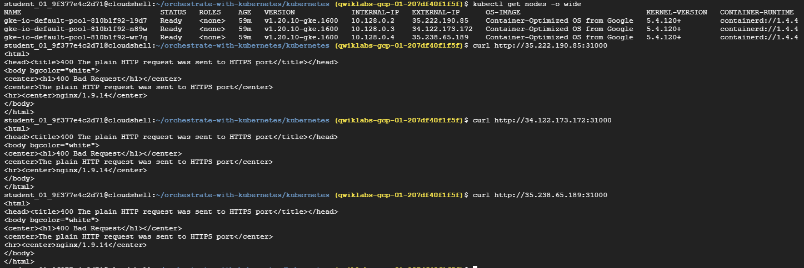
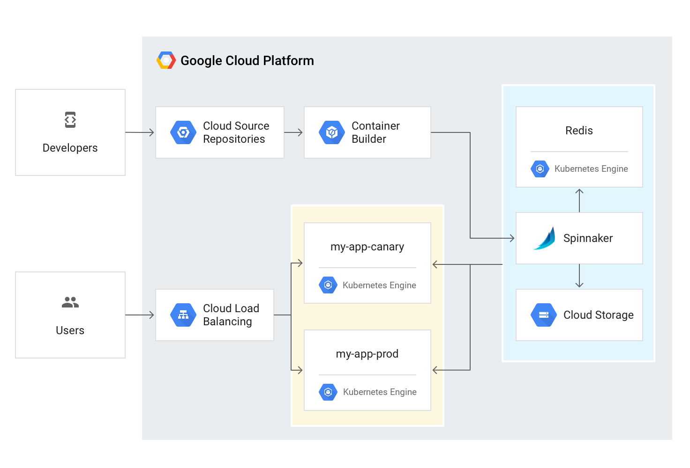
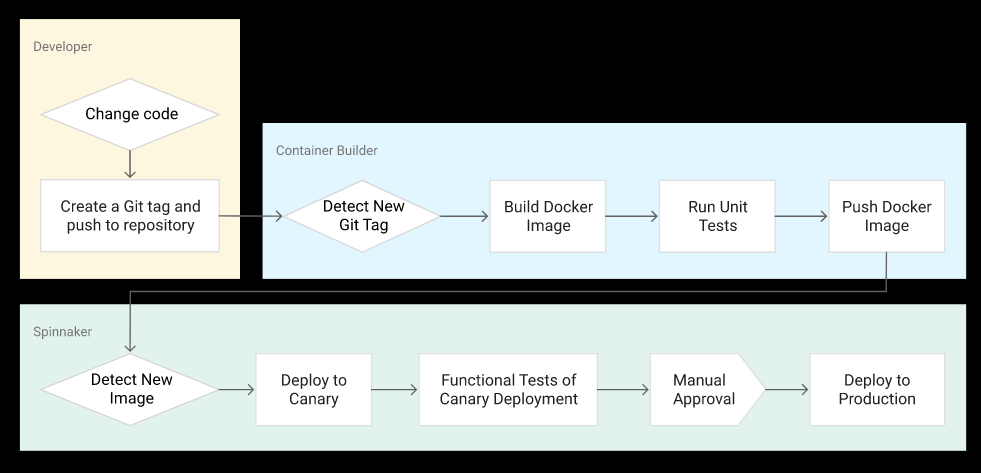
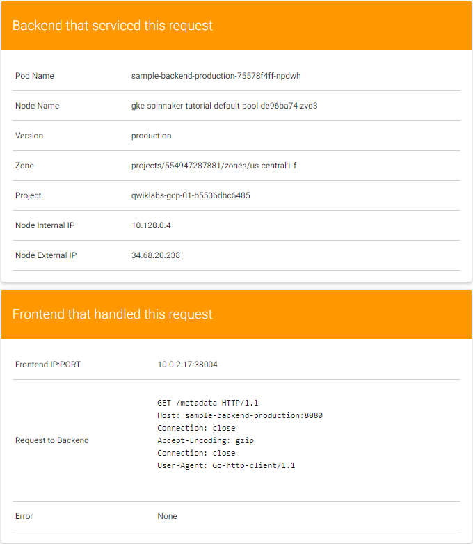

# 9. Cloud Architecture (Qwiklabs Quest)

## Table of Contents

1. LAB: Orchestrating the Cloud with Kubernetes
2. LAB: Continuous Delivery Pipelines with Spinnaker and Kubernetes Engine
3. LAB: Multiple VPC Networks
4. LAB: Troubleshooting Workloads on GKE for Site Reliability Engineers

## 1. LAB: Orchestrating the Cloud with Kubernetes

### 1.1. Get the sample code

```shell
gcloud config set compute/zone us-central1-b
gcloud container clusters create io
gsutil cp -r gs://spls/gsp021/* .
cd orchestrate-with-kubernetes/kubernetes
```

### 1.2. Quick Kubernetes Demo

```shell
kubectl create deployment nginx --image=nginx:1.10.0
kubectl expose deployment nginx --port 80 --type LoadBalancer
kubectl get all
export EXTERNAL_IP=$(kubectl get services nginx -o json | jq -r '.status.loadBalancer.ingress[0].ip')
curl http://$(External_IP)
```


### 1.3. Creating Pods

```yaml
# monolith.yaml

apiVersion: v1
kind: Pod
metadata:
  name: monolith
  labels:
    app: monolith
spec:
  containers:
    - name: monolith
      image: kelseyhightower/monolith:1.0.0
      args:
        - "-http=0.0.0.0:80"
        - "-health=0.0.0.0:81"
        - "-secret=secret"
      ports:
        - name: http
          containerPort: 80
        - name: health
          containerPort: 81
      resources:
        limits:
          cpu: 0.2
          memory: "10Mi"
```

```shell
kubectl apply -f pods/monolith.yaml
```


### 1.4. Interacting with Pods

By default, pods are allocated a private IP address and cannot be reached outside of the cluster.

Use the kubectl port-forward command to map a local port to a port inside the monolith pod.

```shell
kubectl port-forward monolith 10080:80
curl http://127.0.0.1:10080
curl http://127.0.0.1:10080/secure

# authorize in the monolith using password "password" and then save that authorization tole in variable TOKEN and then login back to /secure.
curl -u user http://127.0.0.1:10080/login
TOKEN=$(curl http://127.0.0.1:10080/login -u user|jq -r '.token')
curl -H "Authorization: Bearer $TOKEN" http://127.0.0.1:10080/secure

kubectl logs monolith

# to get a stream of the logs
kubectl logs -f monolith
```

```shell
# o run an interactive shell inside the Monolith Pod
kubectl exec monolith --stdin --tty -c monolith /bin/sh
```

### 1.5. Creating a Service

```yaml
# secure-monolith.yaml

apiVersion: v1
kind: Pod
metadata:
  name: "secure-monolith"
  labels:
    app: monolith
spec:
  containers:
    - name: nginx
      image: "nginx:1.9.14"
      lifecycle:
        preStop:
          exec:
            command: ["/usr/sbin/nginx","-s","quit"]
      volumeMounts:
        - name: "nginx-proxy-conf"
          mountPath: "/etc/nginx/conf.d"
        - name: "tls-certs"
          mountPath: "/etc/tls"
    - name: monolith
      image: "kelseyhightower/monolith:1.0.0"
      ports:
        - name: http
          containerPort: 80
        - name: health
          containerPort: 81
      resources:
        limits:
          cpu: 0.2
          memory: "10Mi"
      livenessProbe:
        httpGet:
          path: /healthz
          port: 81
          scheme: HTTP
        initialDelaySeconds: 5
        periodSeconds: 15
        timeoutSeconds: 5
      readinessProbe:
        httpGet:
          path: /readiness
          port: 81
          scheme: HTTP
        initialDelaySeconds: 5
        timeoutSeconds: 1
  volumes:
    - name: "tls-certs"
      secret:
        secretName: "tls-certs"
    - name: "nginx-proxy-conf"
      configMap:
        name: "nginx-proxy-conf"
        items:
          - key: "proxy.conf"
            path: "proxy.conf"
```

```shell
kubectl create secret generic tls-certs --from-file tls/
kubectl create configmap nginx-proxy-conf --from-file nginx/proxy.conf
kubectl apply -f pods/secure-monolith.yaml
kubectl get all
```


```yaml
kind: Service
apiVersion: v1
metadata:
  name: "monolith"
spec:
  selector:
    app: "monolith"
    secure: "enabled"
  # Now you have to expose the nodeport here because this is how you'll forward external traffic from port 31000 to nginx (on port 443).
  ports:
    - protocol: "TCP"
      port: 443
      targetPort: 443
      nodePort: 31000
  type: NodePort
```

```shell
kubectl apply -f services/monolith.yaml

# to allow traffic to the monolith service on the exposed nodeport:
gcloud compute firewall-rules create allow-monolith-nodeport \
  --allow=tcp:31000

kubectl get services
kubectl get endpoints
```


### 1.6. Adding Labels to Pods

```shell
kubectl get pods -l "app=monolith"
kubectl get pods -l "app=monolith,secure=enabled"
```


```shell
kubectl label pods secure-monolith 'secure=enabled'
kubectl get pods --show-labels
kubectl get pods,endpoints -o=wide
```




### 1.7. Creating Deployments

Behind the scenes Deployments use Replica Sets to manage starting and stopping the Pods.

```yaml
# auth.yaml

apiVersion: apps/v1
kind: Deployment
metadata:
  name: auth
spec:
  selector:
    matchLabels:
      app: auth
  replicas: 1
  template:
    metadata:
      labels:
        app: auth
        track: stable
    spec:
      containers:
        - name: auth
          image: "kelseyhightower/auth:2.0.0"
          ports:
            - name: http
              containerPort: 80
            - name: health
              containerPort: 81
          resources:
            limits:
              cpu: 0.2
              memory: "10Mi"
          livenessProbe:
            httpGet:
              path: /healthz
              port: 81
              scheme: HTTP
            initialDelaySeconds: 5
            periodSeconds: 15
            timeoutSeconds: 5
          readinessProbe:
            httpGet:
              path: /readiness
              port: 81
              scheme: HTTP
            initialDelaySeconds: 5
            timeoutSeconds: 1
```

```shell
kubectl create -f deployments/auth.yaml
kubectl create -f services/auth.yaml

kubectl create -f deployments/hello.yaml
kubectl create -f services/hello.yaml

kubectl create configmap nginx-frontend-conf --from-file=nginx/frontend.conf
kubectl create -f deployments/frontend.yaml
kubectl create -f services/frontend.yaml
```

## 2. LAB: Continuous Delivery Pipelines with Spinnaker and Kubernetes Engine





### 2.1. Set up your environment

```shell
gcloud config set compute/zone us-central1-f
gcloud container clusters create spinnaker-tutorial \
    --machine-type=n1-standard-2
```

Create a service account to delegate permissions to Spinnaker, allowing it to store data in Cloud Storage.

```shell
# Create the service account

gcloud iam service-accounts create spinnaker-account \
    --display-name spinnaker-account
```


```shell
# Store the service account email address and your current project ID in environment variables
export SA_EMAIL=$(gcloud iam service-accounts list \
    --filter="displayName:spinnaker-account" \
    --format='value(email)')
export PROJECT=$(gcloud info --format='value(config.project)')

# Bind the storage.admin role to your service account
gcloud projects add-iam-policy-binding $PROJECT \
    --role roles/storage.admin \
    --member serviceAccount:$SA_EMAIL
```


```shell
# Download the service account key
gcloud iam service-accounts keys create spinnaker-sa.json \
     --iam-account $SA_EMAIL
```

### 2.2. Set up Cloud Pub/Sub to trigger Spinnaker pipelines

```shell
gcloud pubsub topics create projects/$PROJECT/topics/gcr
gcloud pubsub subscriptions create gcr-triggers \
    --topic projects/${PROJECT}/topics/gcr
```

Give Spinnaker's service account permissions to read from the gcr-triggers subscription.

```shell
export SA_EMAIL=$(gcloud iam service-accounts list \
    --filter="displayName:spinnaker-account" \
    --format='value(email)')
gcloud beta pubsub subscriptions add-iam-policy-binding gcr-triggers \
    --role roles/pubsub.subscriber --member serviceAccount:$SA_EMAIL
```

### 2.3. Deploying Spinnaker using Helm

Grant Helm the cluster-admin role in your cluster

```shell
kubectl create clusterrolebinding user-admin-binding \
    --clusterrole=cluster-admin --user=$(gcloud config get-value account)
```

Grant Spinnaker the cluster-admin role so it can deploy resources across all namespaces:

```shell
kubectl create clusterrolebinding --clusterrole=cluster-admin \
    --serviceaccount=default:default spinnaker-admin
```

Add the stable charts deployments to Helm's usable repositories (includes Spinnaker)

```shell
helm repo add stable https://charts.helm.sh/stable
helm repo update
```

Create a bucket for Spinnaker to store its pipeline configuration

```shell
export PROJECT=$(gcloud info \
    --format='value(config.project)')
export BUCKET=$PROJECT-spinnaker-config
gsutil mb -c regional -l us-central1 gs://$BUCKET
```

create a spinnaker-config.yaml file, which describes how Helm should install Spinnaker

```shell
export SA_JSON=$(cat spinnaker-sa.json)
export PROJECT=$(gcloud info --format='value(config.project)')
export BUCKET=$PROJECT-spinnaker-config
# to create a file spinnaker-config.yaml and add all the content b/w <<EOF and EOF to the file
cat > spinnaker-config.yaml <<EOF
gcs:
  enabled: true
  bucket: $BUCKET
  project: $PROJECT
  jsonKey: '$SA_JSON'
dockerRegistries:
- name: gcr
  address: https://gcr.io
  username: _json_key
  password: '$SA_JSON'
  email: 1234@5678.com
# Disable minio as the default storage backend
minio:
  enabled: false
# Configure Spinnaker to enable GCP services
halyard:
  spinnakerVersion: 1.19.4
  image:
    repository: us-docker.pkg.dev/spinnaker-community/docker/halyard
    tag: 1.32.0
    pullSecrets: []
  additionalScripts:
    create: true
    data:
      enable_gcs_artifacts.sh: |-
        \$HAL_COMMAND config artifact gcs account add gcs-$PROJECT --json-path /opt/gcs/key.json
        \$HAL_COMMAND config artifact gcs enable
      enable_pubsub_triggers.sh: |-
        \$HAL_COMMAND config pubsub google enable
        \$HAL_COMMAND config pubsub google subscription add gcr-triggers \
          --subscription-name gcr-triggers \
          --json-path /opt/gcs/key.json \
          --project $PROJECT \
          --message-format GCR
EOF
```

Use the Helm command-line interface to deploy the chart

```shell
helm install -n default cd stable/spinnaker -f spinnaker-config.yaml \
           --version 2.0.0-rc9 --timeout 10m0s --wait
```

Run the following command to set up port forwarding to Spinnaker from Cloud Shell

```shell
export DECK_POD=$(kubectl get pods --namespace default -l "cluster=spin-deck" \
    -o jsonpath="{.items[0].metadata.name}")
kubectl port-forward --namespace default $DECK_POD 8080:9000 >> /dev/null &
```


### 2.4. Building the Docker image

#### Create your source code repository

```shell
# download the sample application source code
gsutil -m cp -r gs://spls/gsp114/sample-app.tar .

# Unpack 
mkdir sample-app
tar -xvf sample-app.tar -C ./sample-app
cd sample-app

# Configure Git and Cloud Source Repo
git config --global user.email "$(gcloud config get-value core/account)"
git config --global user.name "[USERNAME]"
git init
git add .
git commit -m "Initial commit"
gcloud source repos create sample-app
git config credential.helper gcloud.sh
export PROJECT=$(gcloud info --format='value(config.project)')
git remote add origin https://source.developers.google.com/p/$PROJECT/r/sample-app
git push origin master
```


#### Configure your build triggers

Navigation Menu -> Cloud Build -> Triggers -> Create Trigger:

- Name: sample-app-tags
- Event: Push new tag
- Repository: sample-app
- Branch: v1.*
- Build configuration: Cloud Build configuration file
- Cloud Build configuration file location: cloudbuild.yaml
- Create

```yaml
# cloudbuild.yaml

steps:
- name: 'gcr.io/cloud-builders/docker'
  args: ['build', '--tag=gcr.io/$PROJECT_ID/sample-app:$TAG_NAME', '.']
- name: 'gcr.io/cloud-builders/docker'
  args: ['run', 'gcr.io/$PROJECT_ID/sample-app:$TAG_NAME', 'go', 'test']
- name: 'gcr.io/cloud-builders/gsutil'
  args: ['cp', '-r', 'k8s/*', 'gs://$PROJECT_ID-kubernetes-manifests']
images: ['gcr.io/$PROJECT_ID/sample-app:$TAG_NAME']
```

export PROJECT=$(gcloud info --format='value(config.project)')

#### Prepare your Kubernetes Manifests for use in Spinnaker

```shell
export PROJECT=$(gcloud info --format='value(config.project)')
gsutil mb -l us-central1 gs://$PROJECT-kubernetes-manifests
gsutil versioning set on gs://$PROJECT-kubernetes-manifests
# et the correct project ID in your kubernetes deployment manifests
sed -i s/PROJECT/$PROJECT/g k8s/deployments/*
git commit -a -m "Set project ID"
```

```yaml
# sample-backend-production.yaml

kind: Deployment
apiVersion: apps/v1
metadata:
  name: sample-backend-production
  labels:
    app: sample
spec:
  replicas: 4
  selector:
    matchLabels:
      app: sample
  template:
    metadata:
      name: backend
      labels:
        app: sample
        role: backend
        env: production
    spec:
      containers:
      - name: backend
        image: gcr.io/qwiklabs-gcp-01-b5536dbc6485/sample-app
        resources:
          limits:
            memory: "500Mi"
            cpu: "100m"
        imagePullPolicy: Always
        readinessProbe:
          httpGet:
            path: /health
            port: 8080
        env:
        - name: COMPONENT
          value: backend
        - name: VERSION
          value: production
        ports:
        - name: backend
          containerPort: 8080
```

```yaml
# sample-frontend-production.yaml

kind: Deployment
apiVersion: apps/v1
metadata:
  name: sample-frontend-production
  labels:
    app: sample
spec:
  replicas: 4
  selector:
    matchLabels:
      app: sample
  template:
    metadata:
      name: frontend
      labels:
        app: sample
        role: frontend
        env: production
    spec:
      containers:
      - name: frontend
        image: gcr.io/qwiklabs-gcp-01-b5536dbc6485/sample-app
        resources:
          limits:
            memory: "500Mi"
            cpu: "100m"
        imagePullPolicy: Always
        readinessProbe:
          httpGet:
            path: /health
            port: 8080
        env:
        - name: COMPONENT
          value: frontend
        - name: BACKEND_URL
          value: http://sample-backend-production:8080/metadata
        - name: VERSION
          value: production
        ports:
        - name: frontend
          containerPort: 8080
```

```yaml
# sample-backend-prod.yaml

apiVersion: v1
kind: Service
metadata:
  labels:
    app: sample-backend-production
  name: sample-backend-production
spec:
  ports:
  - name: 8080-8080
    port: 8080
    protocol: TCP
    targetPort: 8080
  selector:
    app: sample
    role: backend
  sessionAffinity: None
  type: ClusterIP
```

```yaml
# sample-frontend-prod.yaml

apiVersion: v1
kind: Service
metadata:
  labels:
    app: sample-frontend-production
  name: sample-frontend-production
spec:
  ports:
  - name: http
    port: 80
    protocol: TCP
    targetPort: 8080
  selector:
    app: sample
    role: frontend
  sessionAffinity: None
  type: LoadBalancer
```

#### Build your image

```shell
git tag v1.0.0
git push --tags
```


### 2.5. Configuring your deployment pipelines

#### Install the spin CLI for managing Spinnaker

```shell
curl -LO https://storage.googleapis.com/spinnaker-artifacts/spin/1.14.0/linux/amd64/spin
chmod +x spin
```

#### Create the deployment pipeline

Use spin to create an app called sample in Spinnaker

```shell
./spin application save --application-name sample \
                        --owner-email "$(gcloud config get-value core/account)" \
                        --cloud-providers kubernetes \
                        --gate-endpoint http://localhost:8080/gate
```


Upload an example pipeline to your Spinnaker instance

```shell
export PROJECT=$(gcloud info --format='value(config.project)')
sed s/PROJECT/$PROJECT/g spinnaker/pipeline-deploy.json > pipeline.json
./spin pipeline save --gate-endpoint http://localhost:8080/gate -f pipeline.json
```


#### Manually Trigger and View your pipeline execution

Spinnaker -> Applications -> sample -> Pipelines -> Start Manual Execution

Spinnaker -> Applications -> sample -> Infra -> Load Balacners -> service sample-frontend-production -> Ingress



### 2.6. Triggering your pipeline from code changes

```shell
sed -i 's/blue/black/g' cmd/gke-info/common-service.go
git commit -a -m "Change color to blue"
git tag v1.0.1
git push --tags
```

## 3. LAB: Multiple VPC Networks


The number of interfaces allowed in an instance is dependent on the instance's machine type and the number of vCPUs. The n1-standard-4 allows up to 4 network interfaces.

In a multiple interface instance, every interface gets a route for the subnet that it is in (`ip route`).

You could change this behavior by configuring policy routing as documented here <https://cloud.google.com/vpc/docs/create-use-multiple-interfaces#configuring_policy_routing>.

## 4. LAB: Troubleshooting Workloads on GKE for Site Reliability Engineers

<https://github.com/GoogleCloudPlatform/cloud-ops-sandbox>

```shell
#!/usr/bin/env bash

# start lab provisioning
cd ~

# # Install gcloud
source /root/google-cloud-sdk/completion.bash.inc 
source /root/google-cloud-sdk/path.bash.inc

# Set environment vars here
echo "*** Setting Environment Variables ***"
export PROJECT_ID=$(gcloud config get-value project)
export PROJECT_NUMBER=$(gcloud projects describe $PROJECT_ID --format="value(projectNumber)")
export ZONE="us-central1-c"
export REGION="us-central1"
export KUBECONFIG="${HOME}/.kube/config"

# Begin install of Cloud Ops Sandbox
# Clone specific version of Cloud Ops but only depth of 1 to avoid pulling down history
git clone --depth 1 --branch cloudskillsboost https://github.com/GoogleCloudPlatform/cloud-ops-sandbox.git

# Deploy cloud ops sandbox using create
cd cloud-ops-sandbox/sre-recipes/
./sandboxctl create --project $PROJECT_ID --skip-loadgenerator

## Break the recommendation service then run load against it
./sandboxctl sre-recipes break "recipe3"

# get ops cluster credentials but first determine its zone
export OPS_ZONE=$(gcloud container clusters list --filter="NAME=cloud-ops-sandbox" --format=json | jq -r .[].zone)
gcloud container clusters get-credentials cloud-ops-sandbox --zone $OPS_ZONE

# get ingress IP of loadgenerator cluster
export INGRESS=$(kubectl get svc -o json | jq -c -r '.items[] | select( .metadata.name | contains("frontend-external")) | .status.loadBalancer.ingress[0].ip')

# use curl for now... need to use locust instead...
for i in `seq 1 300`; do curl -o /dev/null -s -w "%{http_code}" http://$INGRESS/product/0PUK6V6EV0; done

yes | gcloud beta runtime-config configs variables set success/startup-vm success --config-name startup-vm-config --project $PROJECT_ID
```
